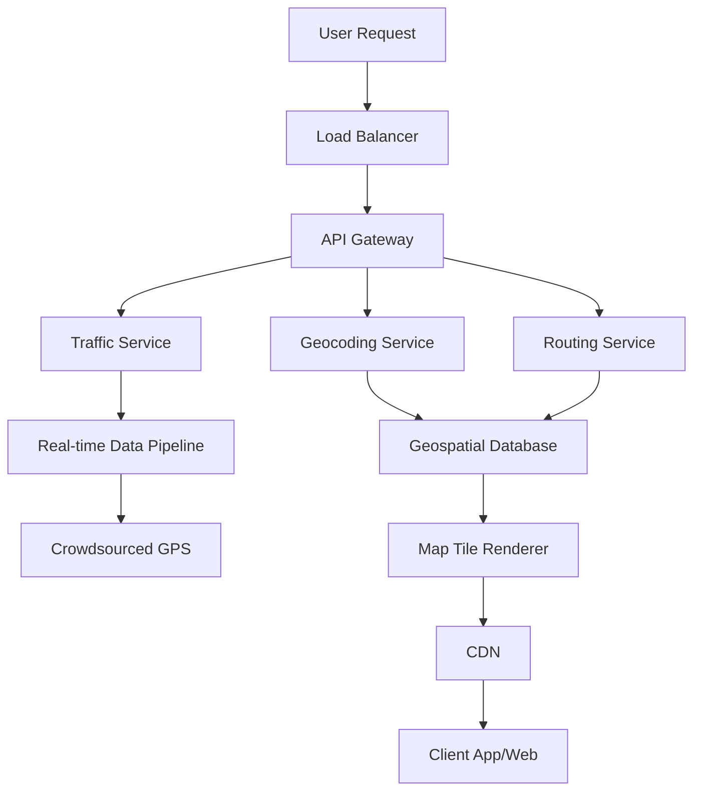

## Overview

Google Maps is a web mapping platform and consumer application developed by Google, offering satellite imagery, aerial photography, street maps, 360° panoramic views, real-time traffic conditions, and route planning. Launched in 2005, it has evolved into a distributed system handling billions of requests daily, integrating components like geocoding, routing, real-time traffic updates, and geospatial data storage. The system is designed for high scalability, low latency, and global coverage, using a combination of proprietary algorithms, machine learning, and vast data infrastructure.

## Detailed Explanation

Google Maps' architecture is a complex, distributed system built on Google's infrastructure, including data centers, edge networks, and AI-driven services. Key components include:

### Core Components

1. **Geocoding Service**: Converts addresses, place names, or coordinates into latitude/longitude pairs. Uses reverse geocoding for the opposite. Leverages machine learning for fuzzy matching and handles multilingual queries.

2. **Routing Engine**: Computes optimal routes for driving, walking, biking, or public transit. Incorporates real-time traffic data, road closures, and user preferences. Employs graph algorithms like Dijkstra or A* on massive road networks.

3. **Traffic Layer**: Aggregates real-time traffic data from crowdsourced GPS signals, sensors, and partnerships. Updates every few minutes, using predictive models for congestion forecasting.

4. **Map Rendering**: Generates map tiles dynamically from vector data. Supports 2D/3D views, satellite imagery, and Street View. Uses WebGL for client-side rendering in browsers.

5. **Places API**: Provides business listings, reviews, and search. Integrates with user-generated content and external data sources.

6. **Street View and Imagery**: Stores and serves panoramic images and 3D models. Uses photogrammetry for 3D reconstruction.

### System Architecture

The backend is primarily written in C++ for performance, with frontends in JavaScript, XML, and Ajax. Data transfer uses protocol buffers for efficiency. The system employs:

- **Distributed Databases**: Geospatial data stored in sharded databases (e.g., Bigtable-like systems) for fast queries. Road networks modeled as graphs with nodes and edges.

- **Caching Layers**: CDN for map tiles, in-memory caches (e.g., Redis) for frequent queries.

- **Microservices**: Modular services for geocoding, routing, etc., deployed on Kubernetes for scalability.

- **Machine Learning**: For traffic prediction, route optimization, and image processing (e.g., blurring faces in Street View).

- **Global Data Centers**: Replicated data across regions for low latency. Edge computing for real-time updates.



### Scalability and Performance

- Handles over 1 billion monthly active users.
- Processes trillions of location queries annually.
- Uses sharding for databases, load balancing, and auto-scaling.
- Real-time traffic updates via streaming pipelines (e.g., Apache Kafka-like systems).

### Data Sources

- Satellite and aerial imagery from Landsat and partners.
- Road data from acquisitions (e.g., Tele Atlas) and crowdsourcing.
- User contributions via Google Local Guides.

## Real-world Examples & Use Cases

- **Navigation Apps**: Integrated into Android Auto, Apple CarPlay, and third-party apps like Uber for real-time routing.
- **Logistics**: Companies like Domino's use Google Maps for delivery optimization, incorporating traffic and route planning.
- **Urban Planning**: Governments use aggregated data for traffic analysis and city planning.
- **Emergency Services**: Real-time traffic helps ambulances and firefighters navigate efficiently.
- **Tourism**: Street View and 3D imagery enhance virtual exploration.

## Code Examples

### Pseudocode for Geocoding

```python
def geocode(address):
    # Query database or API
    result = query_geospatial_db(address)
    if result:
        return result['lat'], result['lng']
    # Fallback to fuzzy matching
    candidates = fuzzy_match(address)
    return select_best_candidate(candidates)
```

### Pseudocode for Routing

```python
def calculate_route(start, end, mode='driving'):
    graph = load_road_graph()
    traffic_data = get_real_time_traffic()
    # Apply traffic weights
    weighted_graph = apply_traffic(graph, traffic_data)
    # Compute shortest path
    path = a_star(weighted_graph, start, end)
    return path, estimate_time(path)
```

### JavaScript Example for Embedding Map

```javascript
function initMap() {
    const map = new google.maps.Map(document.getElementById('map'), {
        center: {lat: -34.397, lng: 150.644},
        zoom: 8
    });
    const marker = new google.maps.Marker({
        position: {lat: -34.397, lng: 150.644},
        map: map
    });
}
```

## References

- [Google Maps - Wikipedia](https://en.wikipedia.org/wiki/Google_Maps)
- [Google Maps Platform Documentation](https://developers.google.com/maps)
- [How Google Makes Money from Maps - High Scalability](https://highscalability.com/blog/2013/10/7/how-google-makes-money-from-maps.html)
- [Google Maps Highly Available - InfoQ](https://www.infoq.com/articles/google-maps-highly-available/)

## Github-README Links & Related Topics

- [Geospatial Databases](../geospatial-databases/README.md)
- [API Design Best Practices](../api-design-best-practices/README.md)
- [Distributed Caching with Redis](../distributed-caching-with-redis/README.md)
- [Event-Driven Architecture](../event-driven-architecture/README.md)
- [Cloud Architecture Patterns](../cloud-architecture-patterns/README.md)

## Common Pitfalls & Edge Cases

- **Geospatial Accuracy**: Coordinate precision and datum differences.
- **Real-time Updates**: Delays in traffic data propagation.
- **Scalability**: Handling billions of requests and cache misses.
- **Privacy**: Anonymizing location data.
- **International Coverage**: Varying data quality by region.

## Tools & Libraries

- **PostGIS**: Geospatial extensions for PostgreSQL.
- **Mapbox GL JS**: Rendering library.
- **OSRM**: Open-source routing machine.
- **Apache Spark**: Large-scale data processing.

## Journey / Sequence

1. **Data Collection**: Satellites and Street View cars gather map data.
2. **Processing**: Convert to vector tiles and build routing graphs.
3. **Storage**: Distribute across global data centers.
4. **Serving**: Client requests tiles/routes via APIs.
5. **Updates**: Integrate real-time traffic and new roads.