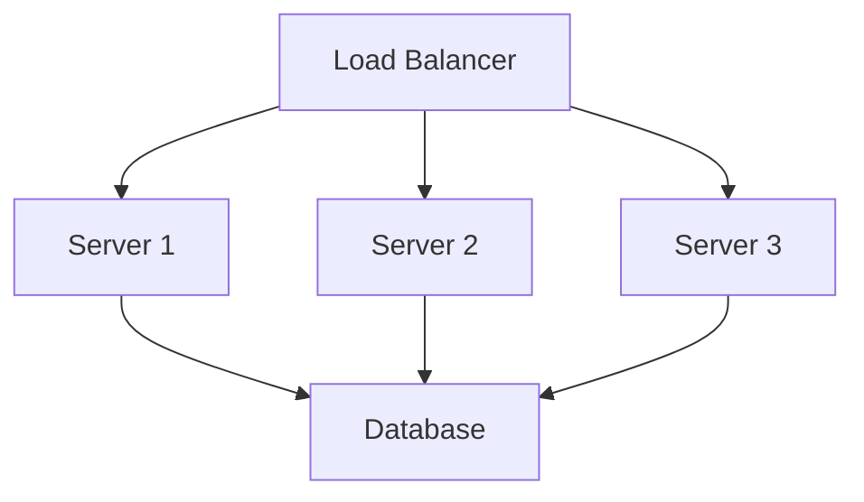
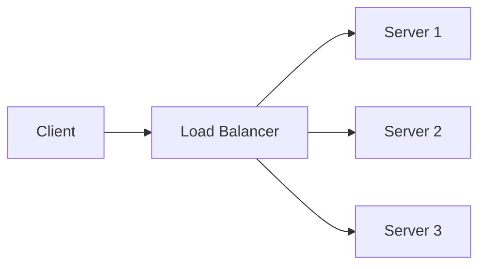
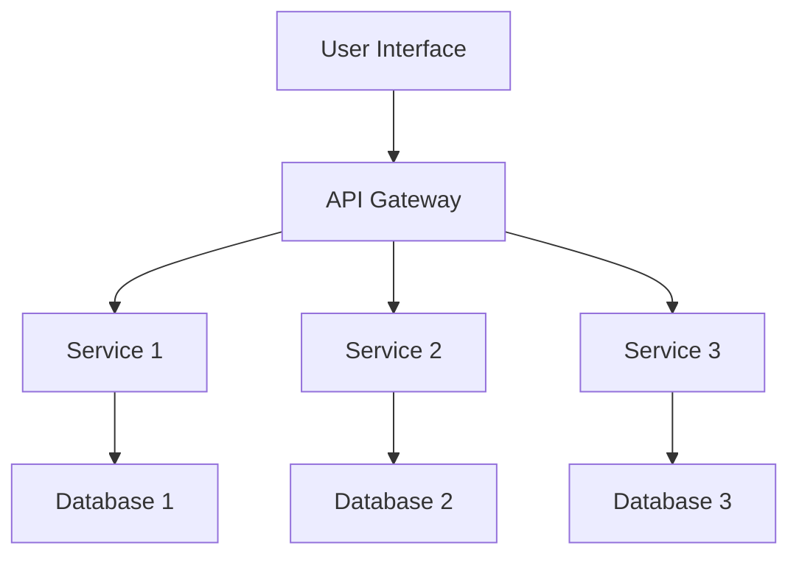
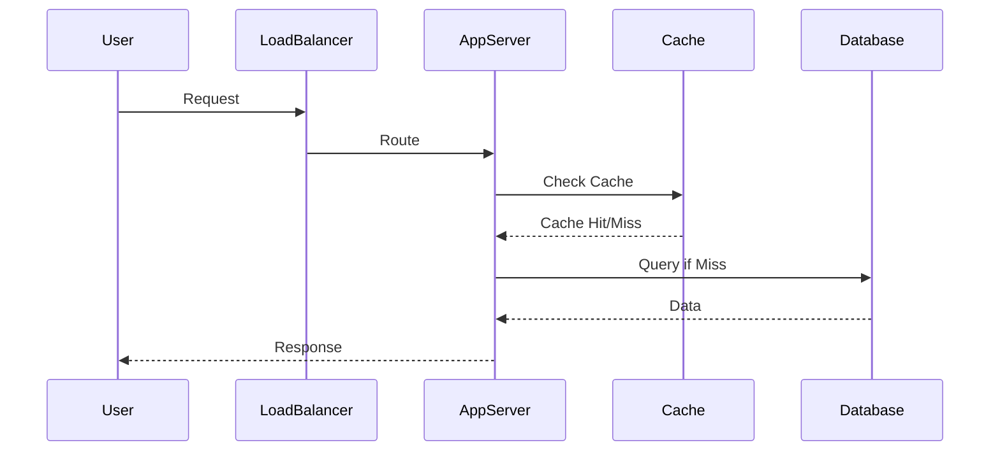

# Overview

High scalability patterns are architectural and design strategies that enable systems to handle growing amounts of work efficiently. Scalability, as defined by Wikipedia, is the property of a system to handle a growing amount of work by adding resources. These patterns address challenges in performance, reliability, and cost as systems grow. Key patterns include horizontal and vertical scaling, load balancing, caching, database sharding, and microservices. They draw from principles in distributed systems, as outlined in the AWS Well-Architected Framework, emphasizing trade-offs between consistency, availability, and partition tolerance (CAP theorem).

# Detailed Explanation

Scalability can be measured across dimensions like administrative, functional, geographic, load, and generation scalability. Patterns are categorized into scaling strategies and supporting techniques.

## Scaling Strategies

### Horizontal Scaling (Scale Out)
Horizontal scaling involves adding more servers or instances to distribute load. This is preferred for cloud-native systems due to its flexibility.

**Pros:**
- Better fault tolerance
- Cost-effective for variable loads
- Easier to implement with containerization

**Cons:**
- Increased complexity in coordination
- Potential for data consistency issues



### Vertical Scaling (Scale Up)
Vertical scaling adds resources (CPU, memory, storage) to existing servers. Suitable for applications with high single-thread performance needs.

**Pros:**
- Simpler management
- No code changes required
- Better for monolithic apps

**Cons:**
- Hardware limits
- Higher cost per unit
- Single point of failure

## Supporting Patterns

### Load Balancing
Distributes incoming traffic across multiple servers to prevent overload.

**Types:**
- Round-robin
- Least connections
- IP hash



### Caching
Stores frequently accessed data in memory for faster retrieval.

**Strategies:**
- In-memory caches (e.g., Redis)
- CDN for static content
- Application-level caching

### Database Sharding
Splits data across multiple databases to improve performance.

**Types:**
- Horizontal sharding (by key)
- Vertical sharding (by table)

### Microservices
Breaks applications into small, independent services communicating via APIs. As described by Martin Fowler, microservices enable decentralized governance and evolutionary design.

**Characteristics:**
- Componentization via services
- Organized around business capabilities
- Decentralized data management



### Auto-Scaling
Automatically adjusts resources based on demand using cloud services like AWS Auto Scaling.

# Real-world Examples & Use Cases

| Pattern | Example | Use Case | Benefits |
|---------|---------|----------|----------|
| Horizontal Scaling | Netflix | Video streaming with millions of users | Handles peak loads during popular shows |
| Load Balancing | Amazon | E-commerce platform | Distributes traffic globally |
| Caching | Twitter | Timeline feeds | Reduces database load for real-time updates |
| Database Sharding | Instagram | User data storage | Manages billions of photos efficiently |
| Microservices | Uber | Ride-sharing app | Independent scaling of booking, payment, and driver services |
| Auto-Scaling | Spotify | Music streaming | Scales during viral song releases |

# Code Examples

## Load Balancing with Python (Simple Round-Robin)

```python
import random

class LoadBalancer:
    def __init__(self, servers):
        self.servers = servers
        self.index = 0

    def get_server(self):
        server = self.servers[self.index]
        self.index = (self.index + 1) % len(self.servers)
        return server

# Usage
lb = LoadBalancer(['server1', 'server2', 'server3'])
print(lb.get_server())  # server1
print(lb.get_server())  # server2
```

## Caching with Redis in Java

```java
import redis.clients.jedis.Jedis;

public class CacheExample {
    public static void main(String[] args) {
        Jedis jedis = new Jedis("localhost");
        jedis.set("key", "value");
        String value = jedis.get("key");
        System.out.println(value);  // value
        jedis.close();
    }
}
```

## Microservice Communication with REST (Python Flask)

```python
from flask import Flask, jsonify

app = Flask(__name__)

@app.route('/service1/data')
def get_data():
    return jsonify({'data': 'from service1'})

if __name__ == '__main__':
    app.run(port=5001)
```

# Common Pitfalls & Edge Cases

- Choosing vertical scaling for applications expecting exponential growth
- Ignoring data consistency issues in horizontal scaling
- Poor load balancer configuration causing uneven load distribution
- Auto-scaling policies that react too slowly to traffic spikes
- Over-provisioning resources leading to high costs

## STAR Summary
**Situation:** An e-commerce platform experienced performance degradation during peak shopping seasons, with response times exceeding 10 seconds.

**Task:** As the scalability engineer, I was tasked with redesigning the architecture to handle 10x traffic growth.

**Action:** Implemented horizontal scaling with load balancers, introduced caching layers, and adopted microservices for independent scaling. Added auto-scaling policies and monitored with Prometheus.

**Result:** System handled 5x peak load with sub-2 second response times, reduced infrastructure costs by 30%, and achieved 99.9% uptime.

## Journey / Sequence


## Data Models / Message Formats
### Scalability Metrics JSON
```json
{
  "scalabilityMetrics": {
    "horizontalScaling": {
      "servers": 10,
      "loadBalancer": "nginx",
      "autoScaling": true
    },
    "caching": {
      "type": "redis",
      "hitRate": 0.85
    },
    "microservices": {
      "services": ["auth", "catalog", "checkout"],
      "communication": "REST/gRPC"
    }
  }
}
```

# Tools & Libraries

- **Horizontal Scaling:** Kubernetes, Docker Swarm, AWS ECS
- **Vertical Scaling:** Cloud VMs (AWS EC2, GCP Compute Engine)
- **Load Balancing:** NGINX, HAProxy, AWS ELB
- **Caching:** Redis, Memcached
- **Monitoring:** Prometheus, Grafana, New Relic

# References

- [Scalability - Wikipedia](https://en.wikipedia.org/wiki/Scalability)
- [Microservices Scalability Patterns](https://microservices.io/patterns/scalability/)
- [Microservices - Martin Fowler](https://martinfowler.com/articles/microservices.html)
- [AWS Well-Architected Framework](https://aws.amazon.com/architecture/well-architected-framework/)

# Github-README Links & Related Topics

- [System Design Basics](../system-design-basics/README.md)
- [Microservices](../microservices/README.md)
- [Load Balancing](../load-balancing-and-routing/README.md)
- [Caching Patterns](../caching-patterns/README.md)
- [Database Sharding Strategies](../database-sharding-strategies/README.md)