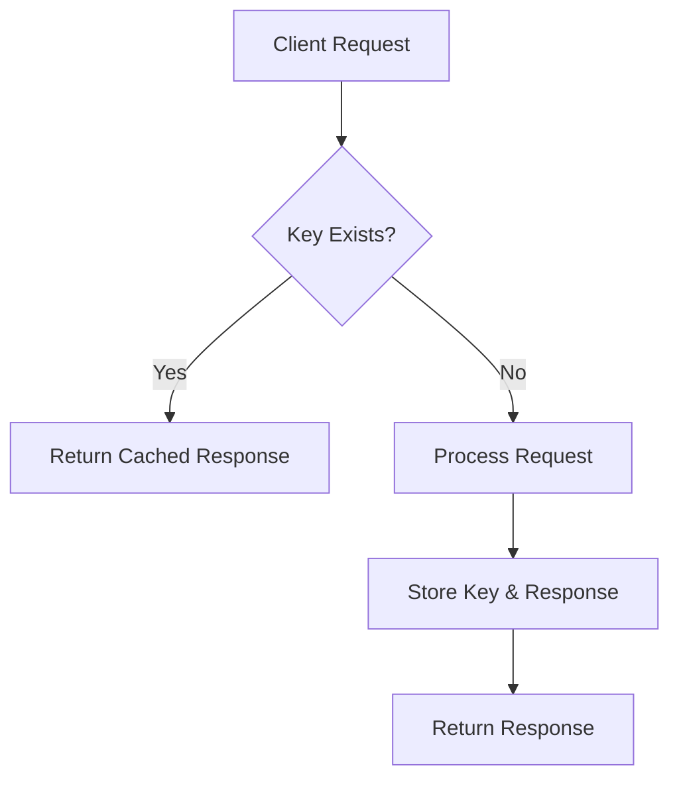
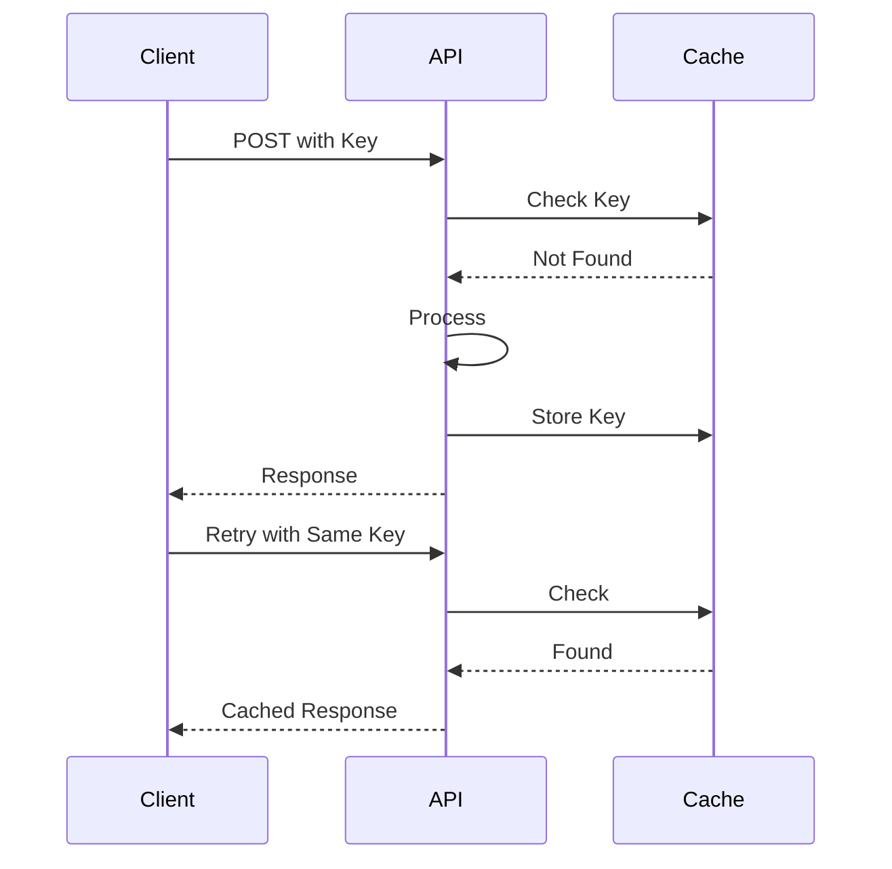

## Overview
Idempotency ensures that multiple identical requests produce the same result, preventing duplicates from retries. Achieved via idempotency keys, stored in DB or cache, checked before processing.

## STAR Summary
**Situation:** Payment API suffered duplicate charges due to network retries.  
**Task:** Make payment endpoint idempotent to avoid overcharging.  
**Action:** Added idempotency-key header, stored keys in Redis with TTL.  
**Result:** Eliminated duplicates, improved reliability for mobile clients.

## Detailed Explanation
- **Idempotency Key:** Unique client-provided ID per operation.
- **Storage:** Cache or DB to track processed keys.
- **Scope:** POST/PUT operations that modify state.

High-Level Design:


Capacity: 1M keys/day, Redis for storage.

Tradeoffs:
- Storage Overhead: Keys consume memory.
- Complexity: Client must generate unique keys.

API Example:
- POST /payments - Include Idempotency-Key header.

Deployment: Stateless services with shared cache.

## Real-world Examples & Use Cases
- Stripe payments API.
- AWS S3 PUT operations.
- Order submissions in e-commerce.

## Code Examples
Java idempotent service:

```java
public class PaymentService {
    private final Cache<String, String> processedKeys = Caffeine.newBuilder()
        .expireAfterWrite(24, TimeUnit.HOURS)
        .build();

    public String processPayment(String idempotencyKey, PaymentRequest req) {
        if (processedKeys.getIfPresent(idempotencyKey) != null) {
            return processedKeys.getIfPresent(idempotencyKey);
        }
        // Process payment
        String result = "Payment processed";
        processedKeys.put(idempotencyKey, result);
        return result;
    }
}
```

## Data Models / Message Formats
| Field | Type | Description |
|-------|------|-------------|
| key   | String | Idempotency key |
| response | String | Cached response |
| ttl   | Long | Expiry |

## Journey / Sequence


## Common Pitfalls & Edge Cases
- Key Collisions: Use UUIDs.
- Expiry: Set appropriate TTL.
- Partial Failures: Ensure atomicity.

Common Interview Questions:
1. How to implement idempotency for payments?
2. Difference between idempotent and safe methods?
3. Handle retries in distributed systems.

## Tools & Libraries
- Redis: For key storage.
- Caffeine: In-memory cache.
- Spring: Idempotency support.

## Github-README Links & Related Topics
Related: [api-design-rest-grpc-openapi](../concepts/api-design-rest-grpc-openapi/), [consistency-models](../concepts/consistency-models/), [circuit-breaker-pattern](../circuit-breaker-pattern/)

## References
- https://stripe.com/docs/api/idempotent_requests
- https://tools.ietf.org/html/rfc7231#section-4.2.2
- https://aws.amazon.com/builders-library/making-retries-safe-with-idempotent-APIs/