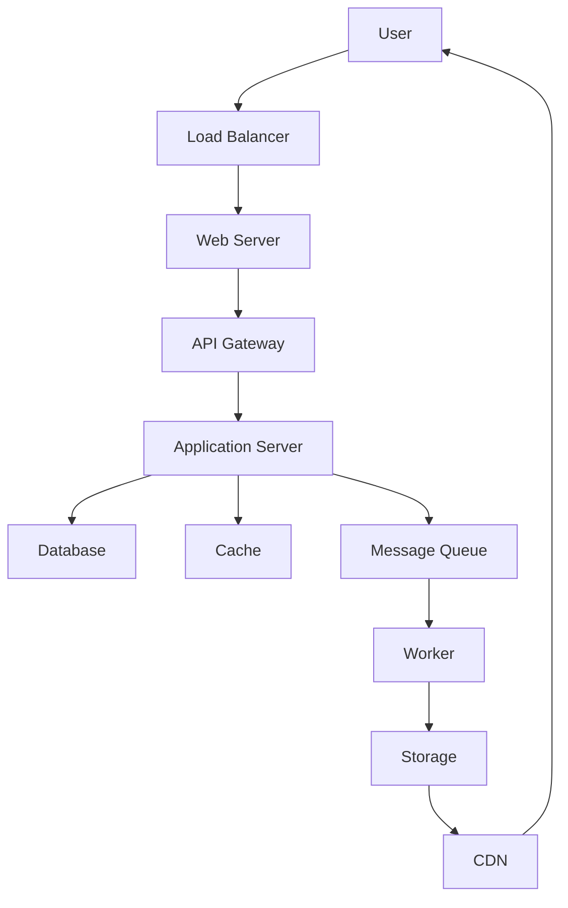

# Instagram System Design — Photo sharing with high availability and scalability

## Overview

Instagram is a photo and video sharing platform that must handle billions of users, photos, and interactions daily. The system design focuses on high availability, scalability, and low latency. Key challenges include storing and serving large volumes of media, generating personalized feeds, and ensuring data consistency across distributed systems.

## Detailed Explanation

### Architecture Overview

The high-level architecture includes:

- **Load Balancers**: Distribute traffic to web servers.
- **Web Servers**: Handle API requests, user authentication, and business logic.
- **Databases**: Relational for metadata, NoSQL for media metadata.
- **Storage**: Distributed file systems or object storage for photos/videos.
- **CDN**: Content Delivery Network for fast media delivery.
- **Caching Layer**: Redis for session data, feed caching.
- **Message Queues**: For asynchronous processing like notifications.



### Components

| Component | Technology | Purpose |
|-----------|------------|---------|
| Web Servers | Nginx/Django | Handle HTTP requests |
| Database | PostgreSQL/Cassandra | Store user data, metadata |
| Storage | S3/Glacier | Store photos/videos |
| CDN | CloudFront | Deliver media globally |
| Cache | Redis | Cache feeds, sessions |

### Scalability

- **Sharding**: Database sharding by user ID.
- **Replication**: Multi-region replication for availability.
- **Auto-scaling**: Scale servers based on load.

### High Availability

- **Redundancy**: Multiple data centers.
- **Failover**: Automatic failover mechanisms.
- **Monitoring**: Real-time monitoring with alerts.

## Real-world Examples & Use Cases

- **Photo Upload**: User uploads photo, resized, stored in S3, metadata in DB.
- **Feed Generation**: Personalized feed using algorithms, cached in Redis.
- **Stories**: Ephemeral content with time-based expiration.
- **Direct Messages**: Real-time messaging with WebSockets.

## Code Examples

### Python: Photo Upload Handler

```python
from flask import Flask, request
import boto3

app = Flask(__name__)
s3 = boto3.client('s3')

@app.route('/upload', methods=['POST'])
def upload_photo():
    file = request.files['photo']
    user_id = request.form['user_id']
    # Resize image (using PIL or similar)
    # Upload to S3
    s3.upload_fileobj(file, 'instagram-bucket', f'{user_id}/{file.filename}')
    # Save metadata to DB
    # return success
    return {'status': 'uploaded'}
```

### Java: Feed Caching

```java
import redis.clients.jedis.Jedis;

public class FeedService {
    private Jedis jedis = new Jedis("localhost");

    public List<Post> getFeed(String userId) {
        String cacheKey = "feed:" + userId;
        String cached = jedis.get(cacheKey);
        if (cached != null) {
            return deserialize(cached);
        }
        // Fetch from DB
        List<Post> feed = fetchFromDB(userId);
        jedis.setex(cacheKey, 3600, serialize(feed));
        return feed;
    }
}
```

## Common Pitfalls & Edge Cases

- **Hot Keys**: Popular users cause cache thrashing; use consistent hashing.
- **Data Consistency**: Eventual consistency in distributed DBs.
- **Rate Limiting**: Prevent abuse with token buckets.
- **Cold Starts**: Pre-warm caches for new users.

## Tools & Libraries

- **Cassandra**: For scalable storage of media metadata.
- **Redis**: In-memory caching.
- **Kafka**: Message queuing for events.
- **Docker/Kubernetes**: Container orchestration.

## References

- [Instagram Engineering Blog](https://engineering.instagram.com/)
- [Scaling Instagram - High Scalability](https://highscalability.com/blog/2012/4/16/instagram-architecture-update-whats-new-with-since-the-last.html)
- [System Design Primer - Instagram](https://github.com/donnemartin/system-design-primer)

## Github-README Links & Related Topics

- [Microservices Architecture](../microservices-architecture/README.md)
- [Caching Strategies](../caching-strategies/README.md)
- [Load Balancing](../load-balancing-and-routing/README.md)
- [Database Sharding](../database-sharding-strategies/README.md)