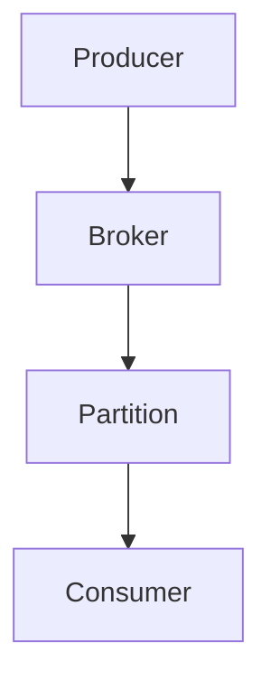

# Overview

Apache Kafka internals cover partitioning, replication, and consumer groups for scalable messaging. In interviews, discuss design for high throughput and fault tolerance.

# STAR Summary

**Situation:** Building event-driven architecture for user activity logs.

**Task:** Handle 1M events/sec with durability.

**Action:** Configured Kafka with 100 partitions, replication factor 3.

**Result:** Achieved 99.99% uptime, <1s latency.

# Detailed Explanation

Topics partitioned for parallelism.

Replication for fault tolerance.

Consumer groups for load balancing.

# Real-world Examples & Use Cases

- Log aggregation.
- Real-time analytics.

# Code Examples

Producer:

```java
Properties props = new Properties();
props.put("bootstrap.servers", "localhost:9092");
Producer<String, String> producer = new KafkaProducer<>(props);
producer.send(new ProducerRecord<>("topic", "key", "value"));
```

# Data Models / Message Formats

Message: {"key": "user1", "value": "login"}

# Journey / Sequence



# Common Pitfalls & Edge Cases

- Partition imbalance.
- Consumer lag.

# Tools & Libraries

- Kafka Streams
- Confluent Platform

# Github-README Links & Related Topics

Related: [[message-queues-and-kafka]], [[event-sourcing-and-cqrs]], [[partitioning-and-sharding]]

# References

- [Kafka Documentation](https://kafka.apache.org/documentation/)