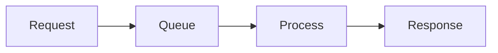

# Overview

This topic covers latency (response time) and throughput (requests per second) from basics to advanced optimization techniques in system design.

# STAR Summary

**SITUATION:** Systems must handle increasing loads while maintaining fast responses.

**TASK:** Optimize for low latency and high throughput.

**ACTION:** Measure metrics, identify bottlenecks, apply optimizations like caching and async processing.

**RESULT:** Scalable systems with excellent performance.

# Detailed Explanation

**Latency:** Time for a single request. Factors: Network, CPU, I/O.

**Throughput:** Requests processed per unit time. Trade-off with latency.

Optimizations: Parallelism, batching, compression.

# Real-world Examples & Use Cases

- **Web Apps:** Optimize API calls for <100ms latency.
- **Streaming:** High throughput for video delivery.

# Message Formats / Data Models

Metrics Log:

```json
{
  "request_id": "abc",
  "latency_ms": 50,
  "throughput_rps": 1000
}
```

# Journey of a Request



# Common Pitfalls & Edge Cases

- **Bottlenecks:** Single-threaded processing.
- **Measurement Errors:** Not accounting for percentiles.

# Tools & Libraries

- **Monitoring:** Prometheus, JMH for benchmarking.

Sample Code (Java - Latency Measurement):

```java
long start = System.nanoTime();
// process
long latency = System.nanoTime() - start;
```

# Github-README Links & Related Topics

[[Performance Optimization Techniques]]
[[Latency Measurement]]

# References

- https://netflixtechblog.com/optimizing-netflix-api/