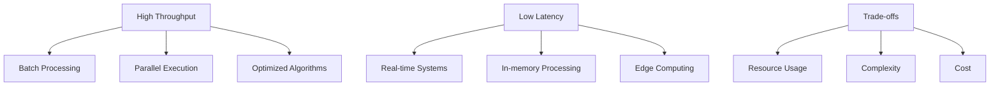

## Overview

Latency and throughput are fundamental performance metrics in system design. Latency measures response time, while throughput measures processing capacity. Understanding their relationship and trade-offs is crucial for building scalable systems.

## Detailed Explanation

### Latency
Latency is the time delay between a request and response.

**Types:**
- **Network Latency**: Time for data to travel
- **Disk Latency**: Time to read/write from storage
- **Processing Latency**: Time to compute results
- **Queue Latency**: Time waiting in queues

**Measurement Units:**
- Milliseconds (ms)
- Microseconds (μs)
- Nanoseconds (ns)

### Throughput
Throughput is the rate of successful operations per unit time.

**Types:**
- **Requests per Second (RPS)**
- **Queries per Second (QPS)**
- **Transactions per Second (TPS)**
- **Bits per Second (bps)**

### Latency vs Throughput Trade-offs



**Key Relationships:**
- **Little's Law**: L = λW (Latency = Throughput × Queue Length)
- **Amdahl's Law**: Theoretical speedup with parallelization
- **Gustafson's Law**: Practical speedup with scaled problems

### Optimization Strategies

#### Reducing Latency
- **Caching**: Store frequently accessed data
- **CDN**: Distribute content geographically
- **Compression**: Reduce data transfer size
- **Async Processing**: Non-blocking operations

#### Increasing Throughput
- **Horizontal Scaling**: Add more servers
- **Load Balancing**: Distribute requests
- **Batch Processing**: Group operations
- **Parallel Processing**: Concurrent execution

## Real-world Examples & Use Cases

### Low Latency Systems
- **High-Frequency Trading**: Sub-millisecond latency
- **Real-time Gaming**: <100ms response time
- **VoIP Services**: Minimal audio delay
- **Autonomous Vehicles**: Real-time sensor processing

### High Throughput Systems
- **Data Analytics**: Process billions of records
- **Video Streaming**: Serve millions of concurrent users
- **Batch Processing**: ETL pipelines
- **Log Processing**: Ingest millions of events per second

### Balancing Both
- **E-commerce**: Fast page loads with high concurrent users
- **Social Media**: Real-time feeds with massive scale
- **Search Engines**: Sub-second results for billions of queries

## Code Examples

### Measuring Latency (Java)
```java
import java.time.Duration;
import java.time.Instant;

public class LatencyMeter {
    public static void measureLatency(Runnable operation) {
        Instant start = Instant.now();
        operation.run();
        Instant end = Instant.now();
        
        long latencyMs = Duration.between(start, end).toMillis();
        System.out.println("Latency: " + latencyMs + " ms");
    }
}

// Usage
LatencyMeter.measureLatency(() -> {
    // Simulate operation
    try { Thread.sleep(50); } catch (InterruptedException e) {}
});
```

### Throughput Testing (Python)
```python
import time
import threading
import requests

def worker(worker_id, url, requests_per_worker):
    for i in range(requests_per_worker):
        start_time = time.time()
        response = requests.get(url)
        latency = time.time() - start_time
        print(f"Worker {worker_id}, Request {i}: {latency:.3f}s, Status: {response.status_code}")

def measure_throughput(url, num_workers=10, requests_per_worker=100):
    start_time = time.time()
    
    threads = []
    for i in range(num_workers):
        t = threading.Thread(target=worker, args=(i, url, requests_per_worker))
        threads.append(t)
        t.start()
    
    for t in threads:
        t.join()
    
    total_time = time.time() - start_time
    total_requests = num_workers * requests_per_worker
    throughput = total_requests / total_time
    
    print(f"Total Requests: {total_requests}")
    print(f"Total Time: {total_time:.2f}s")
    print(f"Throughput: {throughput:.2f} RPS")

# Usage
measure_throughput("http://example.com/api")
```

### Async Processing for Better Throughput (Node.js)
```javascript
const express = require('express');
const app = express();

// Synchronous (blocking)
app.get('/sync', (req, res) => {
    // Simulate slow operation
    const result = heavyComputation();
    res.json({ result });
});

// Asynchronous (non-blocking)
app.get('/async', async (req, res) => {
    const result = await heavyComputationAsync();
    res.json({ result });
});

async function heavyComputationAsync() {
    return new Promise((resolve) => {
        setTimeout(() => {
            resolve("Computed result");
        }, 100);
    });
}
```

## Common Pitfalls & Edge Cases

- **Latency Spikes**: Intermittent high latency under load
- **Throughput Saturation**: System reaches maximum capacity
- **Queue Buildup**: Requests pile up during peak loads
- **Resource Contention**: CPU, memory, or I/O bottlenecks
- **Measurement Bias**: Testing in unrealistic conditions

## Tools & Libraries

- **Apache JMeter**: Load testing and performance measurement
- **Locust**: Distributed load testing
- **Prometheus**: Metrics collection and monitoring
- **Grafana**: Visualization of latency and throughput metrics
- **New Relic**: Application performance monitoring

## References

- [Latency vs Throughput](https://aws.amazon.com/builders-library/latency-vs-throughput/)
- [Little's Law](https://en.wikipedia.org/wiki/Little%27s_law)
- [Performance Testing Guide](https://martinfowler.com/articles/performance-testing.html)
- [System Performance](https://www.brendangregg.com/systems-performance-2nd-edition-book.html)

## Github-README Links & Related Topics

- [monitoring-and-logging](../monitoring-and-logging/)
- [load-balancing-and-strategies](../load-balancing-and-strategies/)
- [caching](../caching/)
- [high-scalability-patterns](../high-scalability-patterns/)