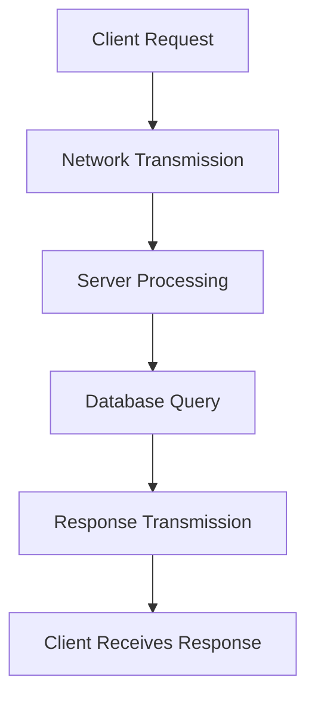
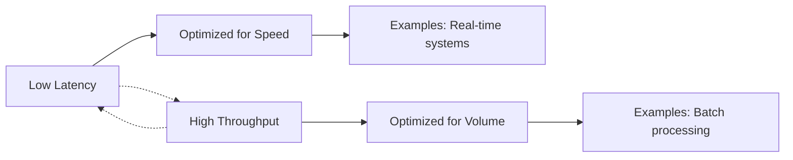

# Latency and Throughput

## Overview

Latency and throughput are fundamental metrics in system design and performance engineering. Latency refers to the time delay between initiating a request and receiving a response, often measured in milliseconds or microseconds. Throughput, on the other hand, measures the rate at which operations are completed, typically expressed as operations per second (ops/sec) or requests per second (RPS). These metrics are interconnected; optimizing for one often impacts the other, requiring careful balancing based on system requirements.

## Detailed Explanation

### Latency

Latency is the total time for a single operation to complete. It includes various components:



Key types of latency:
- **Network Latency**: Time for data to travel over the network (e.g., round-trip time).
- **Disk Latency**: Time to read/write from storage devices.
- **Processing Latency**: CPU time to execute operations.
- **Queueing Latency**: Time spent waiting in queues during high load.

Measurement techniques:
- Use tools like `ping` for network latency.
- Application-level: Instrument code with timers.
- Distributed tracing for end-to-end latency.

### Throughput

Throughput quantifies system capacity. Common metrics:
- Requests per second (RPS)
- Transactions per second (TPS)
- Data transfer rate (Mbps, Gbps)

Factors affecting throughput:
- Hardware limitations (CPU, memory, I/O)
- Concurrency levels
- Bottlenecks in the system

### Trade-offs and Optimization

There's often a trade-off between latency and throughput. High concurrency can increase throughput but may introduce queueing delays, raising latency.



| Optimization Strategy | Latency Impact | Throughput Impact | Use Case |
|-----------------------|----------------|-------------------|----------|
| Caching | Decrease | Increase | Read-heavy workloads |
| Batching | Increase | Increase | Bulk operations |
| Compression | Increase | Increase | Data transfer |
| Parallelization | Variable | Increase | CPU-bound tasks |
| Load Balancing | Decrease | Increase | High-traffic services |

## Real-world Examples & Use Cases

### Web Services
- **CDN Usage**: Reduces latency by serving content from edge locations, potentially increasing throughput via reduced server load.
- **HTTP/2 vs HTTP/1.1**: HTTP/2 multiplexing reduces latency for multiple requests, improving throughput.

### Databases
- **In-memory Databases (e.g., Redis)**: Sub-millisecond latency for simple operations, high throughput for caching.
- **Disk-based Databases (e.g., PostgreSQL)**: Higher latency but scalable throughput with proper indexing.

### Networking
- **Fiber Optics vs Copper Cables**: Fiber offers lower latency and higher throughput for long distances.
- **5G Networks**: Lower latency (~1ms) compared to 4G, enabling higher throughput for IoT and real-time applications.

### Streaming Services
- **Netflix**: Optimizes for low latency streaming while maintaining high throughput for millions of concurrent users.
- **Kafka**: High throughput message processing with configurable latency trade-offs.

## Code Examples

### Measuring Latency in Python

```python
import time
import requests

def measure_latency(url):
    start_time = time.time()
    response = requests.get(url)
    end_time = time.time()
    latency_ms = (end_time - start_time) * 1000
    return latency_ms, response.status_code

# Example usage
latency, status = measure_latency('https://api.example.com/data')
print(f"Latency: {latency:.2f} ms, Status: {status}")
```

### Measuring Throughput in Java

```java
import java.util.concurrent.*;
import java.util.concurrent.atomic.AtomicLong;

public class ThroughputMeasurer {
    private final ExecutorService executor = Executors.newFixedThreadPool(10);
    private final AtomicLong operations = new AtomicLong(0);

    public void performOperation() {
        // Simulate some work
        try {
            Thread.sleep(10); // 10ms operation
        } catch (InterruptedException e) {
            Thread.currentThread().interrupt();
        }
        operations.incrementAndGet();
    }

    public double measureThroughput(int durationSeconds) throws InterruptedException {
        long startTime = System.currentTimeMillis();
        long endTime = startTime + (durationSeconds * 1000);

        while (System.currentTimeMillis() < endTime) {
            executor.submit(this::performOperation);
        }

        executor.shutdown();
        executor.awaitTermination(durationSeconds + 1, TimeUnit.SECONDS);

        long totalOperations = operations.get();
        return (double) totalOperations / durationSeconds;
    }

    public static void main(String[] args) throws InterruptedException {
        ThroughputMeasurer measurer = new ThroughputMeasurer();
        double throughput = measurer.measureThroughput(10);
        System.out.println("Throughput: " + throughput + " ops/sec");
    }
}
```

### Optimizing Latency with Caching (Python)

```python
from functools import lru_cache
import time

@lru_cache(maxsize=128)
def expensive_operation(n):
    time.sleep(0.1)  # Simulate delay
    return n * n

# First call: slow
start = time.time()
result1 = expensive_operation(5)
print(f"First call: {time.time() - start:.3f}s")

# Second call: fast (cached)
start = time.time()
result2 = expensive_operation(5)
print(f"Second call: {time.time() - start:.3f}s")
```

## References

- [Latency (engineering) - Wikipedia](https://en.wikipedia.org/wiki/Latency_(engineering))
- [Throughput - Wikipedia](https://en.wikipedia.org/wiki/Throughput)
- [What is Latency? - AWS](https://aws.amazon.com/what-is/latency/)
- [Measuring Latency and Throughput - Google Cloud](https://cloud.google.com/architecture/measuring-latency-and-throughput)
- [Latency vs Throughput - Nginx Blog](https://www.nginx.com/blog/latency-vs-throughput/)
- [System Performance: Enterprise and the Cloud - Brendan Gregg](https://www.brendangregg.com/systems-performance-2nd-edition-book.html)

## Github-README Links & Related Topics

- [Latency Measurement](../latency-measurement/README.md)
- [Low Latency Systems](../low-latency-systems/README.md)
- [Rate Limiting Algorithms](../rate-limiting-algorithms/README.md)
- [Load Balancing and Routing](../load-balancing-and-routing/README.md)
- [Caching Strategies](../caching-strategies/README.md)
- [Performance Tuning and Profiling](../../java/performance-tuning-and-profiling/README.md)
- [JVM Performance Tuning](../../java/jvm-performance-tuning/README.md)