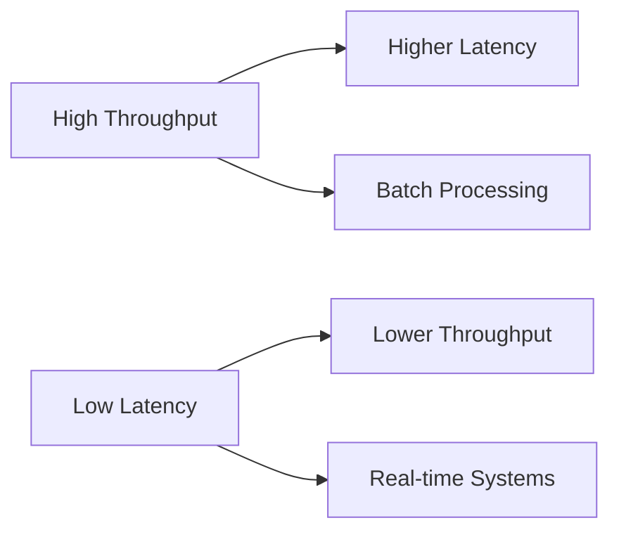

# Overview

Latency and throughput are key performance metrics in system design. Latency measures the time delay for an operation to complete, while throughput quantifies the rate at which operations are processed. Understanding their relationship, trade-offs, and optimization techniques is crucial for building scalable, responsive systems. This topic covers from basic concepts to advanced patterns like zero-copy and async processing.

# Detailed Explanation

## Latency Types
- **Network Latency**: Time for data to travel across networks (e.g., RTT - Round Trip Time).
- **Disk Latency**: Access time for storage devices (SSD: ~0.1ms, HDD: ~10ms).
- **Processing Latency**: CPU time for computations.
- **Queueing Latency**: Wait time in buffers or queues.

## Throughput
- Measured in operations per second (ops/sec), requests per second (RPS), or data transfer rates (Mbps).
- Influenced by parallelism, resource utilization, and bottlenecks.

## Trade-offs (Little's Law)
Little's Law: L = λ * W, where L is average queue length, λ is arrival rate, W is average wait time. Highlights the inverse relationship between latency and throughput under load.



## Optimization Techniques
- **Caching**: Reduce latency by serving from fast storage.
- **Async Processing**: Decouple operations to improve throughput.
- **Compression**: Trade CPU for reduced network latency.
- **Zero-Copy**: Minimize data copying in memory for high-throughput I/O.

# Real-world Examples & Use Cases

| Scenario | Latency Focus | Throughput Focus | Example |
|----------|----------------|------------------|---------|
| Real-time Chat | <100ms | Moderate | WhatsApp messaging |
| Video Streaming | <1s buffering | High (Mbps) | Netflix |
| Batch Analytics | High (minutes) | Massive (TB/day) | Hadoop jobs |
| E-commerce Checkout | <500ms | High during peaks | Amazon |

# Code Examples

## Measuring Latency in Java

```java
import java.time.Instant;

public class LatencyExample {
    public static void main(String[] args) {
        Instant start = Instant.now();
        // Simulate operation
        try { Thread.sleep(100); } catch (InterruptedException e) {}
        Instant end = Instant.now();
        long latency = java.time.Duration.between(start, end).toMillis();
        System.out.println("Latency: " + latency + " ms");
    }
}
```

## Throughput with Async in Python

```python
import asyncio
import time

async def process_request(id):
    await asyncio.sleep(0.1)  # Simulate processing
    return f"Processed {id}"

async def main():
    start = time.time()
    tasks = [process_request(i) for i in range(100)]
    results = await asyncio.gather(*tasks)
    end = time.time()
    throughput = len(results) / (end - start)
    print(f"Throughput: {throughput:.2f} ops/sec")

asyncio.run(main())
```

# References

- [Latency vs Throughput - AWS](https://aws.amazon.com/builders-library/latency-vs-throughput/)
- [Little's Law - Wikipedia](https://en.wikipedia.org/wiki/Little%27s_law)
- "Designing Data-Intensive Applications" by Martin Kleppmann

# Github-README Links & Related Topics

- [Load Balancing and Strategies](../load-balancing-and-strategies/README.md)
- [Monitoring and Logging](../monitoring-and-logging/README.md)
- [Low Latency Systems](../low-latency-systems/README.md)
- [High Scalability Patterns](../high-scalability-patterns/README.md)