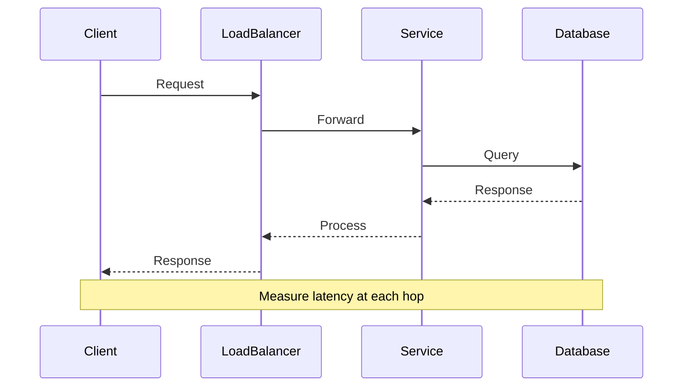

# Overview

Latency measurement involves quantifying the time delays in system operations, from network transmission to processing and response. In system design interviews, candidates are expected to discuss techniques for measuring, monitoring, and optimizing latency to meet performance requirements. This topic covers instrumentation strategies, microbenchmarking tools, and real-time observability patterns essential for building low-latency systems.

# STAR Summary

**Situation:** During a system design interview for a real-time analytics platform, I was asked to design latency monitoring for a data pipeline processing millions of events per second.

**Task:** Implement comprehensive latency measurement across the entire stack, including ingestion, processing, and delivery.

**Action:** Integrated OpenTelemetry for distributed tracing, used JMH for microbenchmarking critical code paths, and deployed Prometheus with Grafana for dashboards. Added percentile-based metrics (P50, P95, P99) to detect outliers.

**Result:** Achieved sub-100ms P99 latency, reduced incident response time by 50%, and provided actionable insights for optimization.

# Detailed Explanation

Latency is the elapsed time between a stimulus and response. Key components include:

- **Network Latency:** Propagation delay, serialization overhead.
- **Processing Latency:** CPU time for computation.
- **Queueing Latency:** Time spent in buffers or queues.
- **I/O Latency:** Disk or network I/O operations.

Measurement techniques:

- **Instrumentation:** Embedding measurement code in applications using libraries like Micrometer or OpenTelemetry.
- **Microbenchmarking:** Isolated performance testing with tools like JMH to avoid JVM optimizations skewing results.
- **Distributed Tracing:** End-to-end request tracking across services.
- **Monitoring:** Continuous collection of metrics with systems like Prometheus.

Common metrics: Average, percentiles (P95, P99), histograms.

# Real-world Examples & Use Cases

- **High-Frequency Trading:** Measure round-trip latency for order execution; target <1ms.
- **E-commerce Platforms:** Track page load latency; optimize for <2s user experience.
- **Streaming Services:** Monitor video buffering latency; ensure <100ms for smooth playback.
- **APIs:** Measure API response times; use for SLA enforcement.

# Code Examples

Use JMH for microbenchmarking in Java:

```java
import org.openjdk.jmh.annotations.*;

@State(Scope.Thread)
public class LatencyBenchmark {

    @Benchmark
    @BenchmarkMode(Mode.AverageTime)
    @OutputTimeUnit(TimeUnit.MICROSECONDS)
    public void measureSimpleOperation() {
        // Simulate operation
        int sum = 0;
        for (int i = 0; i < 1000; i++) {
            sum += i;
        }
    }
}
```

Run with Maven:

```xml
<dependency>
    <groupId>org.openjdk.jmh</groupId>
    <artifactId>jmh-core</artifactId>
    <version>1.37</version>
</dependency>
```

Command: `mvn clean install && java -jar target/benchmarks.jar`

For instrumentation with Micrometer:

```java
import io.micrometer.core.instrument.MeterRegistry;
import io.micrometer.core.instrument.Timer;

public class Service {
    private final Timer timer;

    public Service(MeterRegistry registry) {
        this.timer = Timer.builder("service.latency")
                .publishPercentiles(0.5, 0.95, 0.99)
                .register(registry);
    }

    public void process() {
        timer.record(() -> {
            // business logic
        });
    }
}
```

**Distributed Tracing with OpenTelemetry:**

```java
import io.opentelemetry.api.trace.Span;
import io.opentelemetry.api.trace.Tracer;

public class TracedService {
    private final Tracer tracer;

    public void handleRequest() {
        Span span = tracer.spanBuilder("handleRequest").startSpan();
        try {
            // business logic
        } finally {
            span.end();
        }
    }
}
```

# Data Models / Message Formats

Metrics payload (Prometheus format):

```
# HELP service_latency_seconds Latency of service operations
# TYPE service_latency_seconds histogram
service_latency_seconds_bucket{le="0.1"} 120
service_latency_seconds_bucket{le="1.0"} 150
service_latency_seconds_bucket{le="+Inf"} 160
service_latency_seconds_count 160
service_latency_seconds_sum 45.5
```

Tracing span (JSON):

```json
{
  "traceId": "abc123",
  "spanId": "def456",
  "operation": "processOrder",
  "startTime": 1638360000000,
  "duration": 15000000,
  "tags": {"service": "order-service"}
}
```

# Journey / Sequence



# Common Pitfalls & Edge Cases

- **Coordinated Omission:** Ignoring slow requests leads to underestimating latency.
- **GC Pauses:** JVM garbage collection can spike latency; monitor with -XX:+PrintGCDetails.
- **Network Jitter:** Variable network conditions; use percentiles over averages.
- **Measurement Overhead:** Instrumentation can add latency; profile carefully.
- **Clock Skew:** In distributed systems, synchronize clocks with NTP.

# Tools & Libraries

- **JMH:** Java Microbenchmark Harness for accurate profiling.
- **OpenTelemetry:** Distributed tracing and metrics.
- **Prometheus:** Time-series database for metrics.
- **Grafana:** Visualization dashboards.
- **Micrometer:** Vendor-neutral metrics facade.

# Github-README Links & Related Topics

Related: [low-latency-systems](../low-latency-systems/), [distributed-tracing-and-observability](../distributed-tracing-and-observability/), [observability-logs-metrics-traces](../observability-logs-metrics-traces/), [performance-tuning-and-profiling](../../java/profiling/performance-tuning-and-profiling/), [system-design-basics](../system-design-basics/)

# References

- [JMH User Guide](https://openjdk.org/projects/code-tools/jmh/)
- [OpenTelemetry Documentation](https://opentelemetry.io/docs/)
- [Prometheus Metrics](https://prometheus.io/docs/concepts/metric_types/)
- [Micrometer Documentation](https://micrometer.io/docs)