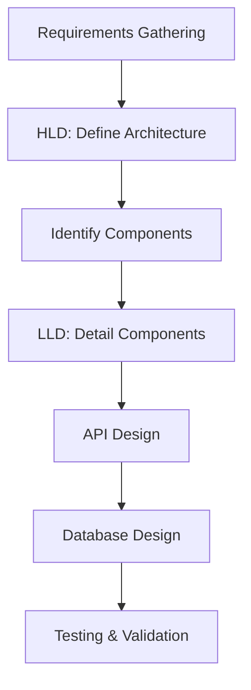

# Overview

This topic provides foundational knowledge on Low-Level Design (LLD) and High-Level Design (HLD) in system design. LLD focuses on detailed component design, while HLD outlines the overall system architecture, ensuring scalability, maintainability, and efficiency.

# STAR Summary

**SITUATION:** System design requires balancing high-level architecture with detailed implementation to meet functional and non-functional requirements.

**TASK:** Differentiate and apply LLD and HLD appropriately in design processes.

**ACTION:** Use LLD for class diagrams, APIs, and data models; HLD for system components, data flow, and scalability strategies.

**RESULT:** Produce comprehensive designs that are implementable and scalable, reducing development risks.

# Detailed Explanation

**High-Level Design (HLD):** Defines the system's overall structure, including major components (e.g., servers, databases, load balancers), their interactions, and high-level data flow. It addresses scalability, fault tolerance, and technology choices without delving into code details.

**Low-Level Design (LLD):** Provides detailed specifications for individual components, such as class hierarchies, database schemas, API endpoints, algorithms, and error handling. It ensures that the HLD is realizable through precise implementation plans.

Key principles:

- **Modularity:** Break systems into independent modules.
- **Abstraction:** Hide complexity in interfaces.
- **Scalability:** Design for growth (e.g., horizontal scaling).
- **Security:** Incorporate authentication, authorization, and data protection.
- **Performance:** Optimize for latency, throughput, and resource usage.

Differences: HLD is about "what" (architecture), LLD is about "how" (implementation).

# Real-world Examples & Use Cases

- **HLD Example:** For a web application, HLD includes frontend servers, backend APIs, database clusters, and CDN.
- **LLD Example:** Detailed API design with endpoints like POST /users, including request/response schemas and validation rules.
- **Use Case:** In e-commerce, HLD covers order processing flow; LLD details the Order class with attributes and methods.

# Message Formats / Data Models

Example API Message (JSON):

```json
{
  "user_id": 123,
  "action": "create_order",
  "items": [
    {"product_id": 456, "quantity": 2}
  ],
  "timestamp": "2025-09-26T10:00:00Z"
}
```

Database Schema Example:

| Table | Field | Type | Key |
|-------|-------|------|-----|
| users | id | INT | PK |
| users | name | VARCHAR | - |
| orders | id | INT | PK |
| orders | user_id | INT | FK |

# Journey of a Design Process



This flowchart shows the iterative process from requirements to detailed design.

# Common Pitfalls & Edge Cases

- **Over-Designing:** Adding unnecessary complexity in LLD.
- **Under-Designing HLD:** Missing scalability in early stages.
- **Ignoring Constraints:** Not accounting for budget, time, or team skills.
- **Edge Cases:** Handling concurrent users, data migrations, and failure scenarios.

# Tools & Libraries

- **Diagramming:** Draw.io, Lucidchart for HLD diagrams.
- **Modeling:** UML tools like PlantUML for LLD class diagrams.
- **Code:** Java with Spring for implementation.

Sample Code Snippet (Java - Simple LLD Class):

```java
public class Order {
    private int id;
    private User user;
    private List<Item> items;

    public Order(User user, List<Item> items) {
        this.user = user;
        this.items = items;
    }

    public double calculateTotal() {
        return items.stream().mapToDouble(Item::getPrice).sum();
    }
}
```

# Github-README Links & Related Topics

[[Popular Systems Design LLD and HLD]]
[[Microservices Architecture]]
[[Database Design Principles]]

# References

- https://www.geeksforgeeks.org/low-level-design-ll-d-high-level-design-hld/
- https://martinfowler.com/bliki/BoundedContext.html