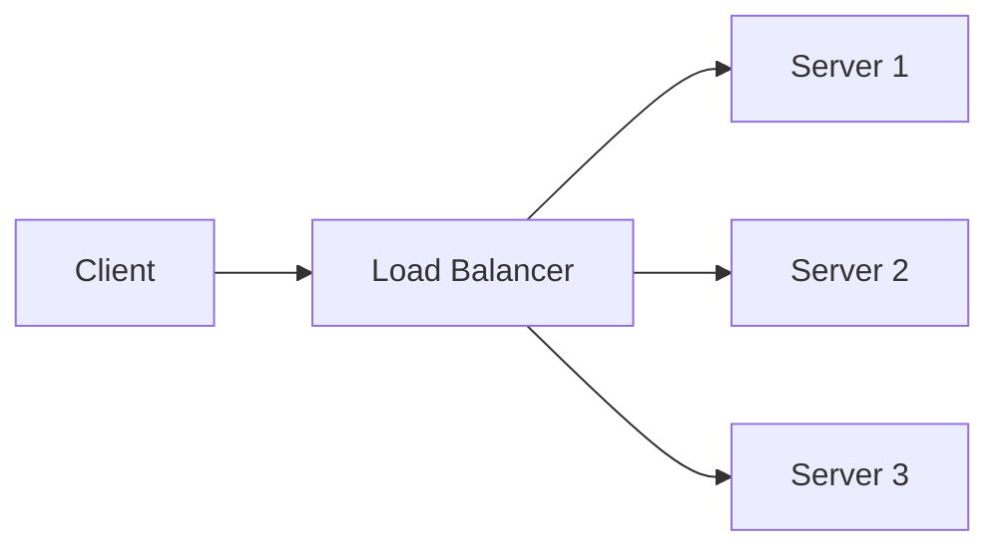

## Overview
Load balancing distributes traffic across servers to ensure reliability and performance. Routing directs requests to appropriate services. Key for high-availability systems.

## STAR Summary
**Situation:** E-commerce site faced downtime during peak sales.  
**Task:** Distribute load evenly.  
**Action:** Implemented round-robin load balancer.  
**Result:** Reduced response time by 50%, zero downtime.

## Detailed Explanation
- **Algorithms:** Round-robin, least connections, IP hash, weighted.
- **Types:** Hardware (F5), Software (NGINX, HAProxy).
- **Routing:** URL-based, header-based, geo-based.
- **Health Checks:** Monitor server status.

## Real-world Examples
- AWS ELB: Elastic Load Balancing.
- CDN routing based on location.

## Code Examples
### Round-Robin Load Balancer
```java
import java.util.List;
import java.util.concurrent.atomic.AtomicInteger;

class RoundRobinLB {
    private List<String> servers;
    private AtomicInteger counter = new AtomicInteger(0);

    public String selectServer() {
        return servers.get(counter.getAndIncrement() % servers.size());
    }
}
```

## Data Models


## Journey Sequence
1. Assess traffic patterns.
2. Choose algorithm based on needs.
3. Configure health checks.
4. Test failover scenarios.
5. Monitor performance.

## Common Pitfalls
- Sticky sessions causing uneven load.
- Ignoring session affinity needs.
- Poor health check configurations.

## Tools & Libraries
- NGINX: For HTTP load balancing.
- HAProxy: Advanced features.

## Related Topics
- [system-design-basics](../system-design-basics/)
- [networking-tcp-ip-http2-tls](../networking-tcp-ip-http2-tls/)

## Common Interview Questions
- Explain the difference between Layer 4 and Layer 7 load balancing.
- How does round-robin load balancing work and its drawbacks?
- What is sticky sessions and when to use them?
- Describe how NGINX implements load balancing.
- How to handle health checks in a load balancer?

## References
- NGINX Load Balancing documentation.
- AWS ELB guide.
- https://en.wikipedia.org/wiki/Load_balancing_(computing)