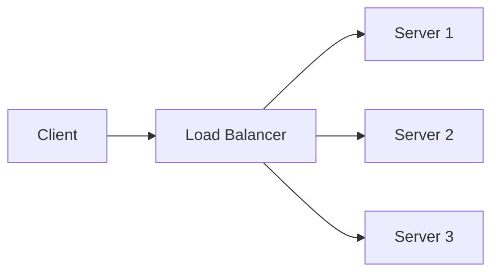
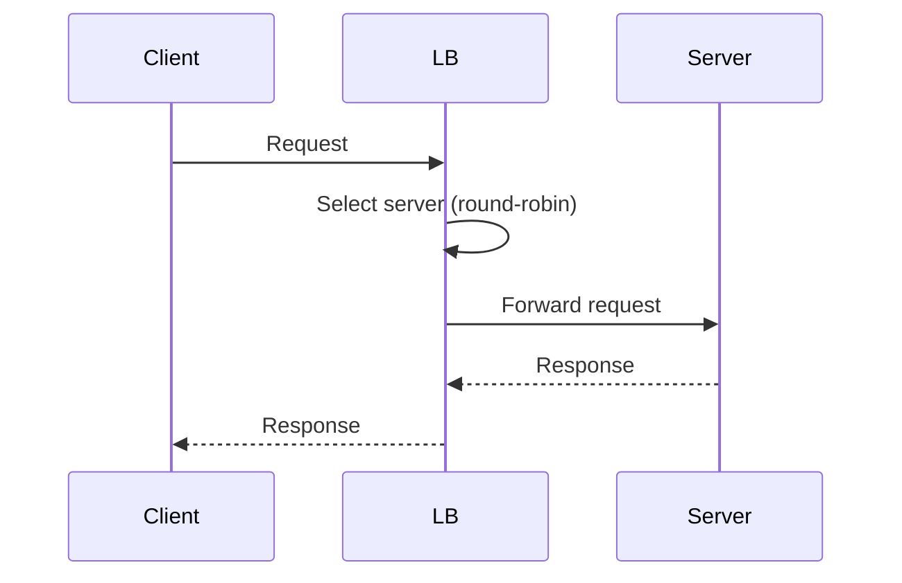

## Overview
Load balancing distributes traffic across servers to ensure reliability and performance. Routing directs requests to appropriate services. Key for high-availability systems.

## STAR Summary
**Situation:** E-commerce site faced downtime during peak sales.  
**Task:** Distribute load evenly.  
**Action:** Implemented round-robin load balancer.  
**Result:** Reduced response time by 50%, zero downtime.

## Detailed Explanation
- **Algorithms:** Round-robin, least connections, IP hash, weighted.
- **Types:** Hardware (F5), Software (NGINX, HAProxy).
- **Routing:** URL-based, header-based, geo-based.
- **Health Checks:** Monitor server status.

## Real-world Examples & Use Cases
- AWS ELB: Elastic Load Balancing for auto-scaling.
- CDN routing based on location for content delivery.
- Use case: E-commerce peak traffic distribution to prevent overload.

## Code Examples
### Round-Robin Load Balancer
```java
import java.util.List;
import java.util.concurrent.atomic.AtomicInteger;

class RoundRobinLB {
    private List<String> servers;
    private AtomicInteger counter = new AtomicInteger(0);

    public String selectServer() {
        return servers.get(counter.getAndIncrement() % servers.size());
    }
}
```

## Data Models / Message Formats


| Field | Type | Description |
|-------|------|-------------|
| server_id | string | Unique server identifier |
| health_status | enum | UP/DOWN |
| load | int | Current connections |

## Journey / Sequence


## Common Pitfalls & Edge Cases
- Sticky sessions causing uneven load; edge case: server failure with sticky sessions.
- Ignoring session affinity needs.
- Poor health check configurations; edge case: false positives leading to cascading failures.

## Tools & Libraries
- NGINX: For HTTP load balancing.
- HAProxy: Advanced features.

## Github-README Links & Related Topics
Related: [[system-design-basics]], [[networking-tcp-ip-http2-tls]]

## Common Interview Questions
- Explain the difference between Layer 4 and Layer 7 load balancing.
- How does round-robin load balancing work and its drawbacks?
- What is sticky sessions and when to use them?
- Describe how NGINX implements load balancing.
- How to handle health checks in a load balancer?

## Common Interview Questions
- Explain Layer 4 vs Layer 7 load balancing.
- How does round-robin work and its limitations?
- What are health checks and why are they important?
- Describe geo-based routing.
- How to handle session persistence in load balancers?

## References
- NGINX Load Balancing documentation.
- AWS ELB guide.
- https://en.wikipedia.org/wiki/Load_balancing_(computing)