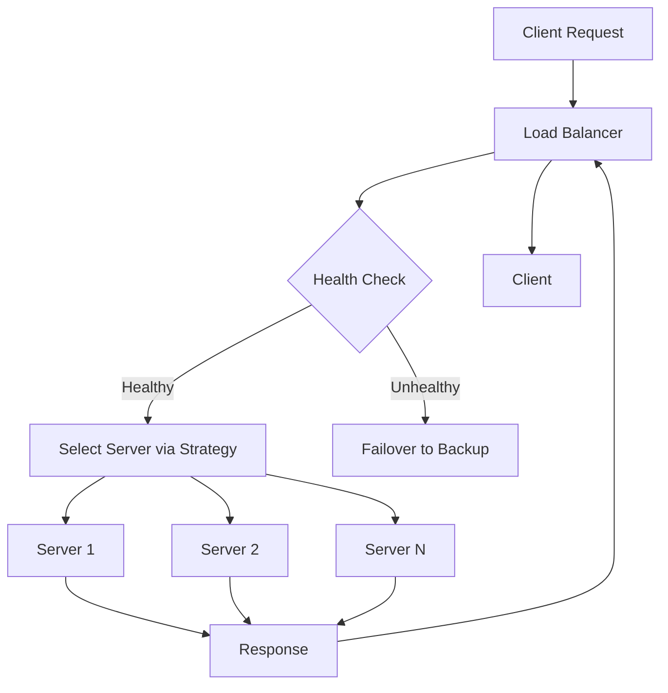
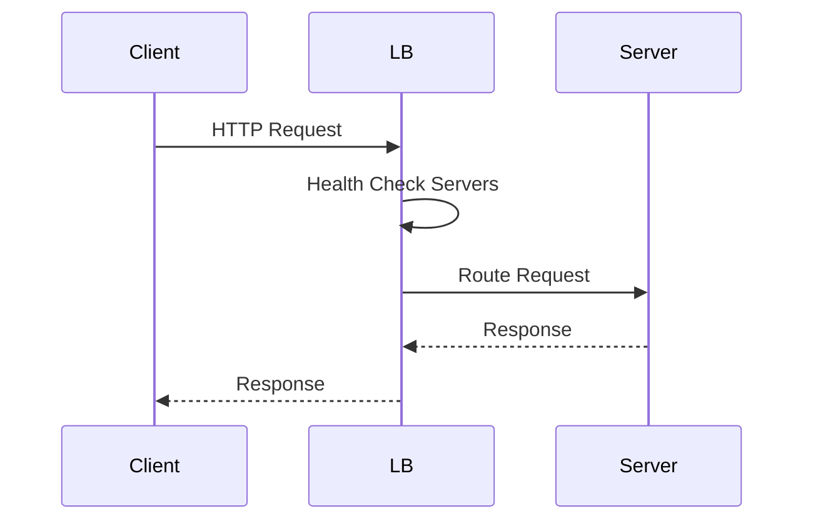

# Load Balancing and Strategies

## Overview

Load balancing distributes incoming network traffic across multiple servers to ensure no single server becomes overwhelmed. It improves reliability, scalability, and performance by optimizing resource utilization and providing fault tolerance. Strategies range from simple round-robin to advanced algorithms considering server health and load.

## Detailed Explanation

Load balancers act as intermediaries between clients and servers, routing requests based on predefined rules. They can operate at Layer 4 (transport) or Layer 7 (application) of the OSI model. Key components include health checks, session persistence, and failover mechanisms.

### Common Strategies

| Strategy          | Description                                                                 | Pros                          | Cons                          | Use Case                  |
|--------------------|-----------------------------------------------------------------------------|-------------------------------|-------------------------------|---------------------------|
| **Round Robin**    | Cycles through servers sequentially.                                        | Simple, even distribution     | Ignores server load/health    | Basic setups              |
| **Least Connections** | Routes to server with fewest active connections.                         | Balances load dynamically     | Requires connection tracking  | Variable load apps        |
| **IP Hash**        | Uses client IP to determine server.                                         | Session persistence           | Uneven distribution if IPs cluster | Stateful apps             |
| **Weighted Round Robin** | Assigns weights to servers for uneven distribution.                     | Prioritizes powerful servers  | Manual weight tuning          | Heterogeneous servers     |
| **Least Response Time** | Routes to server with fastest response.                                  | Optimizes performance         | Requires metrics collection   | Latency-sensitive apps    |
| **Random**         | Randomly selects a server.                                                 | Simple, no state              | Uneven distribution possible  | Testing/low-traffic       |

### Architecture Diagram



### Layer Differences

- **Layer 4**: Routes based on IP/port; faster but less intelligent.
- **Layer 7**: Inspects application data (e.g., HTTP headers); enables content-based routing.

## Real-world Examples & Use Cases

- **Web Services**: AWS ELB distributes traffic across EC2 instances for scalability.
- **CDNs**: Akamai uses load balancing to serve content from nearest edge servers.
- **Databases**: ProxySQL load balances MySQL queries across replicas.
- **Microservices**: Kubernetes Ingress controllers balance traffic to pods.
- **Gaming**: Load balancers handle player connections in multiplayer games.

## Code Examples

### Nginx: Round Robin Load Balancing

nginx.conf:
```nginx
upstream backend {
    server backend1.example.com;
    server backend2.example.com;
    server backend3.example.com;
}

server {
    listen 80;
    location / {
        proxy_pass http://backend;
    }
}
```

### HAProxy: Least Connections

haproxy.cfg:
```haproxy
frontend http_front
    bind *:80
    default_backend http_back

backend http_back
    balance leastconn
    server server1 192.168.1.1:80 check
    server server2 192.168.1.2:80 check
    server server3 192.168.1.3:80 check
```

### Python: Simple Round Robin Load Balancer

```python
import itertools

class RoundRobinLoadBalancer:
    def __init__(self, servers):
        self.servers = servers
        self.iterator = itertools.cycle(servers)

    def get_server(self):
        return next(self.iterator)

# Usage
lb = RoundRobinLoadBalancer(['server1', 'server2', 'server3'])
print(lb.get_server())  # server1
print(lb.get_server())  # server2
```

### Java: Weighted Load Balancer

```java
import java.util.List;
import java.util.Random;

public class WeightedLoadBalancer {
    private final List<Server> servers;
    private final Random random = new Random();

    public WeightedLoadBalancer(List<Server> servers) {
        this.servers = servers;
    }

    public Server selectServer() {
        int totalWeight = servers.stream().mapToInt(Server::getWeight).sum();
        int randomWeight = random.nextInt(totalWeight);
        for (Server server : servers) {
            randomWeight -= server.getWeight();
            if (randomWeight <= 0) {
                return server;
            }
        }
        return servers.get(0);
    }

    static class Server {
        String name;
        int weight;

        Server(String name, int weight) {
            this.name = name;
            this.weight = weight;
        }

        int getWeight() { return weight; }
    }
}

// Usage
List<Server> servers = List.of(
    new Server("server1", 3),
    new Server("server2", 1),
    new Server("server3", 2)
);
WeightedLoadBalancer lb = new WeightedLoadBalancer(servers);
System.out.println(lb.selectServer().name);
```

## STAR Summary

- **Situation**: E-commerce site experienced downtime during peak traffic.
- **Task**: Implement load balancing to distribute load.
- **Action**: Deployed AWS ELB with health checks and auto-scaling.
- **Result**: 99.9% uptime, improved response times by 40%.

## Journey / Sequence



## Data Models / Message Formats

Server configuration in JSON:

```json
{
  "servers": [
    {
      "id": "server1",
      "ip": "192.168.1.1",
      "port": 80,
      "weight": 3,
      "health": "up"
    },
    {
      "id": "server2",
      "ip": "192.168.1.2",
      "port": 80,
      "weight": 1,
      "health": "up"
    }
  ],
  "strategy": "weighted_round_robin"
}
```

## Common Pitfalls & Edge Cases

- **Sticky Sessions**: Can cause uneven load; use carefully for stateless apps.
- **Health Check Failures**: False positives lead to unnecessary failovers; tune checks.
- **Thundering Herd**: All servers recover simultaneously; implement gradual recovery.
- **SSL Termination**: Offloading at LB can improve performance but adds complexity.
- **Global Load Balancing**: DNS-based may have propagation delays; use anycast for speed.

## Tools & Libraries

- **Hardware**: F5 BIG-IP, Citrix ADC.
- **Software**: Nginx, HAProxy, Envoy.
- **Cloud**: AWS ELB, Google Cloud Load Balancing, Azure Load Balancer.
- **Libraries**: Netflix Ribbon (Java), LoadBalancer (Go).

## References

- [Load Balancing - Wikipedia](https://en.wikipedia.org/wiki/Load_balancing_(computing))
- [AWS Elastic Load Balancing](https://aws.amazon.com/elasticloadbalancing/)
- [Nginx Load Balancing](https://nginx.org/en/docs/http/load_balancing.html)
- [HAProxy Documentation](http://www.haproxy.org/)

## Github-README Links & Related Topics

- [Load Balancing and Routing](load-balancing-and-routing/README.md)
- [High Scalability Patterns](high-scalability-patterns/README.md)
- [Fault Tolerance Patterns](fault-tolerance-patterns/README.md)
- [Microservices Architecture](microservices-architecture/README.md)