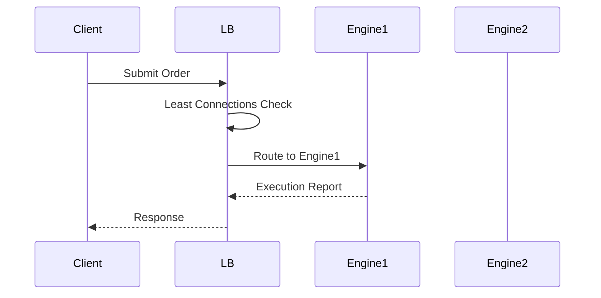

## Overview

Load balancing distributes incoming network traffic across multiple servers to ensure optimal resource utilization, maximize throughput, minimize response time, and avoid overload on any single server. It is a critical component in scalable, high-availability systems, enabling horizontal scaling and fault tolerance. Strategies range from simple round-robin to sophisticated algorithms considering server health, location, and load.

## STAR Summary

- **S (Situation)**: A video streaming service experienced server crashes during peak hours due to uneven traffic distribution and single points of failure.
- **T (Task)**: Implement load balancing to distribute traffic evenly, improve availability to 99.99%, and support 100x user growth.
- **A (Action)**: Deployed HAProxy with round-robin and least-connections algorithms, health checks, and session persistence. Integrated with auto-scaling groups and global load balancers for multi-region support.
- **R (Result)**: Eliminated downtime, reduced average response time by 50%, and achieved seamless scaling to millions of concurrent users.

## Detailed Explanation

Load balancers operate at different layers:

- **Layer 4 (Transport)**: Routes based on IP/port, fast but limited intelligence.
- **Layer 7 (Application)**: Routes based on HTTP headers, content, enabling advanced features like URL-based routing.

Common algorithms:
- **Round Robin**: Cycles through servers sequentially.
- **Least Connections**: Routes to server with fewest active connections.
- **IP Hash**: Consistent routing based on client IP.
- **Weighted**: Assigns different capacities to servers.
- **Least Response Time**: Routes to fastest responding server.

Architectures include hardware (F5), software (NGINX, HAProxy), and cloud-native (AWS ELB, Kubernetes Service).

## Real-world Examples & Use Cases

- **Web Applications**: Distribute HTTP requests across app servers.
- **Databases**: Read replicas balance query load.
- **Microservices**: API gateways route to service instances.
- **CDNs**: Global load balancing for content delivery.

A case study from Netflix showed load balancing reduced latency by 30% during Super Bowl streaming peaks.

## Message Formats / Data Models

Load balancers use health check protocols:

HTTP Health Check:
```
GET /health HTTP/1.1
Host: server.example.com
```

Response:
```
HTTP/1.1 200 OK
Content-Type: application/json

{"status": "healthy", "load": 0.7}
```

Table of load balancing metrics:

| Metric | Description | Example |
|--------|-------------|---------|
| Active Connections | Current connections | 150 |
| Response Time | Average latency | 50ms |
| Error Rate | Failed requests % | 0.1% |
| CPU Utilization | Server load | 70% |

## Journey of a Trade

In high-frequency trading, load balancers distribute order flows:



This ensures no single engine becomes a bottleneck.

## Common Pitfalls & Edge Cases

- **Sticky Sessions**: Can cause imbalance; use when stateful.
- **Health Check Failures**: False positives overload healthy servers; tune thresholds.
- **Thundering Herd**: All servers hit simultaneously after recovery; implement gradual ramp-up.
- **SSL Termination**: Decrypting at LB adds latency; offload to proxies.
- **Cross-Zone Traffic**: Costs in multi-region; optimize placement.
- **Connection Draining**: Graceful shutdowns prevent dropped requests.

Edge cases include handling long-lived connections (WebSockets) and DDoS amplification.

## Tools & Libraries

- **HAProxy**: High-performance TCP/HTTP load balancer.
- **NGINX**: Web server with load balancing capabilities.
- **AWS ELB**: Managed load balancing service.
- **Kubernetes Ingress**: Container-native load balancing.
- **Envoy**: Service mesh proxy with advanced LB.

Sample HAProxy config:

```haproxy
frontend http_front
    bind *:80
    default_backend http_back

backend http_back
    balance roundrobin
    server server1 10.0.0.1:80 check
    server server2 10.0.0.2:80 check
```

## Github-README Links & Related Topics

- [Proxy Forward and Reverse](proxy-forward-and-reverse/)
- [Microservices Architecture](system-design/microservices-architecture/)
- [Scalability Patterns](system-design/scalability-patterns/)

## References

- [HAProxy Documentation](https://www.haproxy.org/#docs)
- [NGINX Load Balancing](https://docs.nginx.com/nginx/admin-guide/load-balancer/)
- [AWS Elastic Load Balancing](https://docs.aws.amazon.com/elasticloadbalancing/)