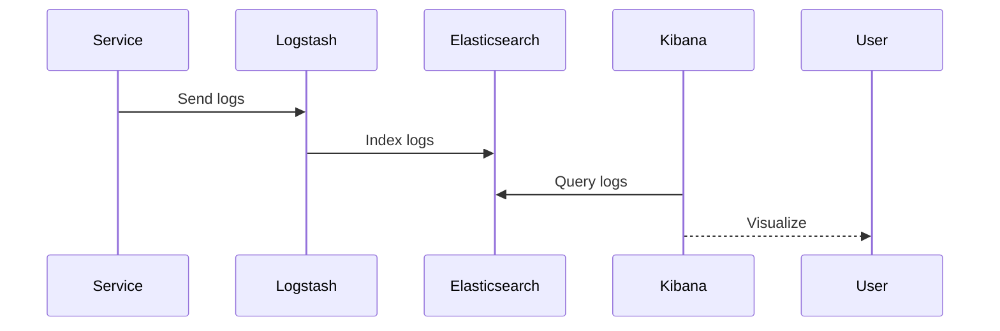

## Overview
Logging and monitoring provide visibility into system health, performance, and issues. Logging captures events, while monitoring tracks metrics and alerts. The ELK stack (Elasticsearch, Logstash, Kibana) and Prometheus are common tools for aggregating and visualizing data.

## STAR Summary
**Situation:** Debugging production issues in a distributed system with 50 services, taking hours to correlate logs.  
**Task:** Implement centralized logging and monitoring.  
**Action:** Deployed ELK stack for logs, Prometheus for metrics, with Grafana dashboards.  
**Result:** Reduced MTTR by 70%, proactive issue detection via alerts.

## Detailed Explanation
- **Logging:** Structured logs (JSON) with levels (INFO, ERROR). Centralized aggregation prevents log scattering.
- **Monitoring:** Metrics (CPU, latency), traces, and health checks. Push vs pull models.
- **Tools:** ELK for logs, Prometheus + Grafana for metrics.

Best practices: Log levels, sampling, retention policies.

## Real-world Examples & Use Cases
- Troubleshooting microservices failures.
- Performance monitoring in high-traffic apps.
- Compliance auditing.

## Code Examples
### Logback Configuration (Spring Boot)
```xml
<configuration>
    <appender name="CONSOLE" class="ch.qos.logback.core.ConsoleAppender">
        <encoder>
            <pattern>%d{HH:mm:ss.SSS} [%thread] %-5level %logger{36} - %msg%n</pattern>
        </encoder>
    </appender>
    <root level="INFO">
        <appender-ref ref="CONSOLE" />
    </root>
</configuration>
```

### Prometheus Metrics (Micrometer)
```java
@RestController
public class MetricsController {
    private final Counter requestCounter = Metrics.counter("requests_total");

    @GetMapping("/api/data")
    public String getData() {
        requestCounter.increment();
        return "data";
    }
}
```

Run: Integrate with Spring Boot Actuator.

## Data Models / Message Formats
| Field | Type | Description |
|-------|------|-------------|
| timestamp | ISO8601 | Event time |
| level | string | Log level |
| message | string | Log content |
| service | string | Source service |

Sample log:
```json
{
  "timestamp": "2023-09-25T10:00:00Z",
  "level": "ERROR",
  "message": "Database connection failed",
  "service": "user-service"
}
```

## Journey / Sequence


## Common Pitfalls & Edge Cases
- **Log volume:** Sampling to avoid overload.
- **Sensitive data:** Sanitize logs.
- **Alert fatigue:** Tune thresholds.
- **Distributed tracing:** Correlate across services.

## Tools & Libraries
- **ELK Stack:** Elasticsearch, Logstash, Kibana.
- **Prometheus:** Metrics collection.
- **Grafana:** Dashboards.
- **Jaeger:** Distributed tracing.

## Github-README Links & Related Topics
Related: [distributed-tracing-and-observability](../distributed-tracing-and-observability/), [observability-logs-metrics-traces](../observability-logs-metrics-traces/), [fault-tolerance-patterns](../fault-tolerance-patterns/)

## References
- https://www.elastic.co/elk-stack
- https://prometheus.io/docs/introduction/overview/