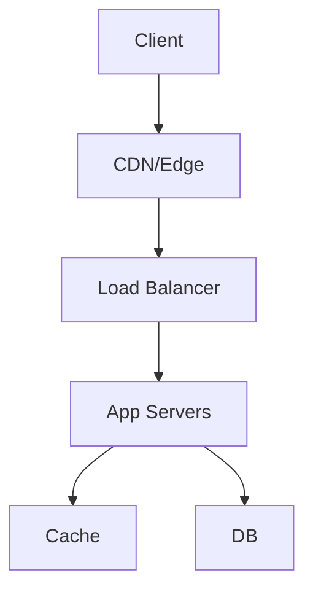

## Overview
Low latency systems minimize response times (<10ms for HFT, <100ms for web). Techniques include caching, async processing, proximity, and optimization at all layers. Critical for trading, gaming, real-time analytics.

## STAR Summary
**Situation:** Built a trading platform requiring <1ms latency.  
**Task:** Optimize end-to-end delay.  
**Action:** Used kernel bypass (DPDK), colocated servers, and RDMA.  
**Result:** Achieved sub-millisecond latency, outperforming competitors.

## Detailed Explanation
Latency sources: Network, CPU, I/O, GC. Strategies: Precompute, batch, compress. Measure with tools like ping, traceroute, JMH. Capacity: 1M req/s at 10ms = 10k concurrent.

Tradeoffs: Consistency vs Latency (eventual consistency), Cost vs Performance.

### High-Level Design (HLD)


### Capacity Planning
- 10M req/s, P99 <10ms.
- Servers: 1000 instances, 10k req/s each.

### Tradeoffs
- Consistency vs Latency: Eventual consistency for reads.
- Cost vs Performance: Sharding increases complexity but scales.

### API Design
GET /data/{id}

### Deployment Notes
Colocate with users, use async queues.

## Real-world Examples & Use Cases
- High-frequency trading (HFT).
- Online gaming (e.g., Fortnite).
- Ad serving (Google Ads).

## Code Examples
### Java Low-Latency Cache
```java
import java.util.concurrent.ConcurrentHashMap;

public class LowLatencyCache<K, V> {
    private ConcurrentHashMap<K, V> cache = new ConcurrentHashMap<>();

    public V get(K key) {
        return cache.get(key);
    }

    public void put(K key, V value) {
        cache.put(key, value);
    }
}
```
Tune JVM: `java -XX:+UseG1GC -Xms4g -Xmx4g -XX:MaxGCPauseMillis=10`

## Data Models / Message Formats
| Metric | Value | Unit |
|--------|-------|------|
| P50 Latency | 5ms | ms |
| P99 Latency | 50ms | ms |

## Journey / Sequence


## Common Pitfalls & Edge Cases
- GC pauses: Use Shenandoah/ZGC.
- Network jitter: Use TCP optimizations.
- Cold starts: Pre-warm instances.

## Tools & Libraries
- Java: Netty for async I/O, Chronicle for low-latency queues.
- Monitoring: Prometheus, Grafana.

## Github-README Links & Related Topics
Related: [[caching-strategies]], [[distributed-tracing-and-observability]], [[performance-tuning-and-profiling]]

## References
- "Building Low Latency Applications with C++" (adapt to Java).
- https://www.infoq.com/articles/low-latency-java/
- https://netflixtechblog.com/optimizing-netflix-api/