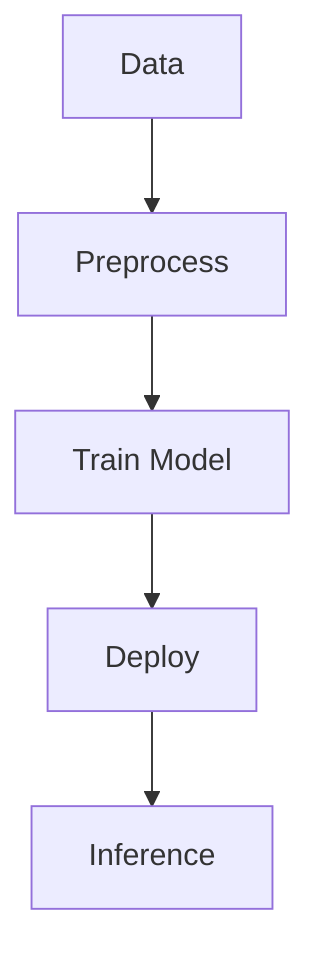

## Overview
ML infrastructure supports training, serving, and inference of models at scale. It includes GPUs, distributed computing, and pipelines for data processing and deployment.

## STAR Summary
**Situation:** Model training took days, inference was slow.  
**Task:** Build scalable ML infra for real-time predictions.  
**Action:** Used Kubernetes for serving, GPUs for training, CI/CD for pipelines.  
**Result:** Training in hours, inference in ms, 10x throughput.

## Detailed Explanation
- **Training:** Distributed on GPUs.
- **Serving:** REST APIs with auto-scaling.
- **Pipelines:** Data ingestion, feature engineering, deployment.

## Real-world Examples & Use Cases
- Recommendation systems at Netflix.
- Fraud detection at banks.

## Code Examples
### TensorFlow Serving
```python
import tensorflow as tf
model = tf.keras.models.load_model('model.h5')
# Serve via TF Serving
```

## Data Models / Message Formats
| Field | Type | Description |
|-------|------|-------------|
| input | Array | Feature vector |
| prediction | Float | Output |

## Journey / Sequence


## Common Pitfalls & Edge Cases
- Model drift.
- Cold starts.
- Resource contention.

## Tools & Libraries
- TensorFlow, Kubernetes, SageMaker.

## Github-README Links & Related Topics
Related: [[low-latency-systems]], [[distributed-tracing-and-observability]]

## References
- https://aws.amazon.com/machine-learning/infrastructure/