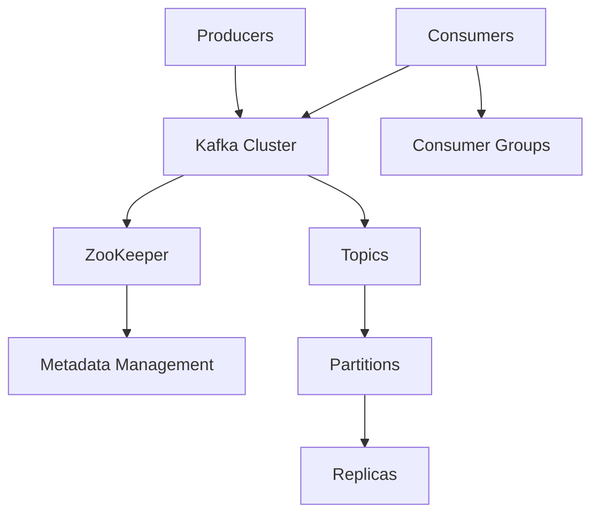
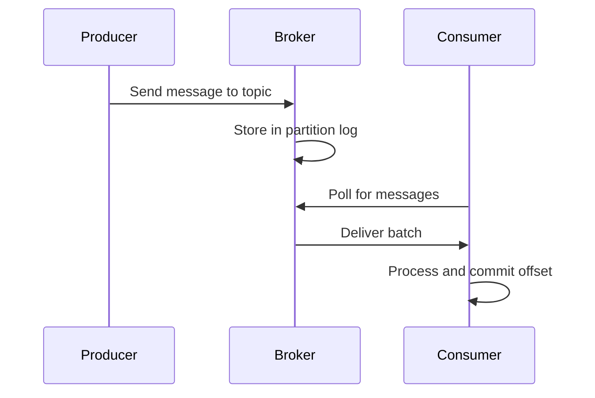

## Overview
Message queues enable asynchronous communication between services, decoupling producers and consumers. Apache Kafka is a high-throughput, fault-tolerant distributed streaming platform used for event-driven architectures. It's essential for building scalable systems and a staple in system design interviews.

## STAR Summary
**Situation:** A microservices architecture suffered from tight coupling, causing cascading failures during traffic spikes.  
**Task:** Implement reliable inter-service communication with buffering.  
**Action:** Introduced Kafka for event streaming, with topics for different event types and consumer groups for load distribution.  
**Result:** Improved system resilience, reduced latency by 30%, and enabled real-time analytics.

## Detailed Explanation
- **Components:** Producers, Brokers, Consumers, Topics, Partitions, Offsets.
- **Guarantees:** At-least-once, exactly-once delivery.
- **Scaling:** Partitioning for parallelism, replication for fault tolerance.
- **Tradeoffs:** Throughput vs. latency, durability vs. performance; complexity in exactly-once semantics.

### High-Level Design (HLD)


### Capacity and Throughput Targets
- **Throughput:** 1M messages/sec per cluster; 100K/sec per partition.
- **Dimensioning:** 10 brokers, 100 partitions per topic for high throughput.
- **Latency:** <10ms for local, <100ms for cross-region.

### API Design Examples
- `POST /topics/{topic}/messages` - Produce message
- `GET /topics/{topic}/messages?group=consumer-group` - Consume messages

### Deployment and Scaling Strategies
- Deploy on Kubernetes with Helm charts; scale brokers horizontally; use KRaft for metadata.

## Real-world Examples & Use Cases
- **Logging:** Centralized log aggregation in ELK stack.
- **Event Sourcing:** Storing events in Kafka for CQRS.
- **Real-time Analytics:** Stream processing in LinkedIn.

## Code Examples
### Kafka Producer in Java
```java
import org.apache.kafka.clients.producer.*;
import java.util.Properties;

public class KafkaProducerExample {
    public static void main(String[] args) {
        Properties props = new Properties();
        props.put("bootstrap.servers", "localhost:9092");
        props.put("key.serializer", "org.apache.kafka.common.serialization.StringSerializer");
        props.put("value.serializer", "org.apache.kafka.common.serialization.StringSerializer");

        Producer<String, String> producer = new KafkaProducer<>(props);
        ProducerRecord<String, String> record = new ProducerRecord<>("topic", "key", "value");
        producer.send(record);
        producer.close();
    }
}
```

## Data Models / Message Formats
| Field     | Type   | Description |
|-----------|--------|-------------|
| key       | String | Partition key |
| value     | JSON   | Message payload |
| timestamp | Long   | Event time    |
| headers   | Map    | Metadata     |

## Journey / Sequence


## Common Pitfalls & Edge Cases
- Message ordering in partitions.
- Consumer lag causing backlogs.
- Edge case: Broker failure during rebalancing.

## Common Interview Questions
- How does Kafka ensure fault tolerance?
- Explain consumer groups and partitions.
- When to use Kafka vs. RabbitMQ?
- Design a notification system using Kafka.

## Tools & Libraries
- **Kafka Clients:** Java, Python libraries.
- **Alternatives:** RabbitMQ, ActiveMQ.
- **Ecosystem:** Kafka Streams for processing.

## Github-README Links & Related Topics
- [event-sourcing-and-cqrs](../event-sourcing-and-cqrs/README.md)
- [distributed-tracing-and-observability](../distributed-tracing-and-observability/README.md)
- [consistency-and-availability](../consistency-and-availability/README.md)

## References
- Kafka Documentation: https://kafka.apache.org/documentation/
- "Kafka: The Definitive Guide" by Neha Narkhede
- Confluent Platform: https://docs.confluent.io/</content>
</xai:function_call ><xai:function_call name="todowrite">
<parameter name="todos">[{"content":"Write comprehensive README.md for message-queues-and-kafka topic","status":"completed","priority":"high","id":"write_message_queues"}]