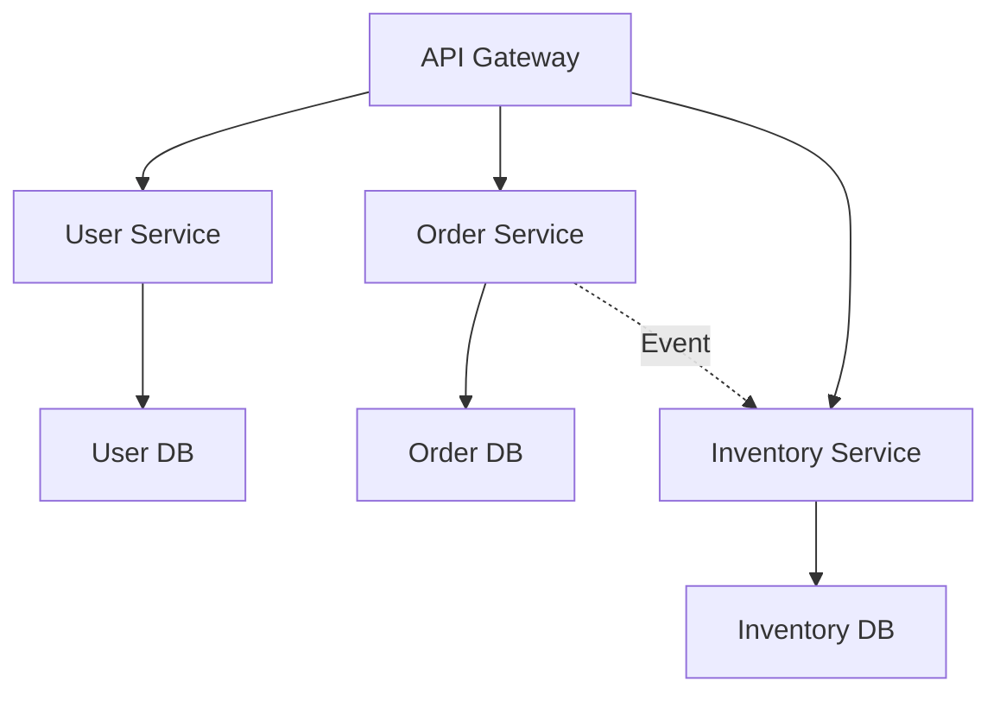
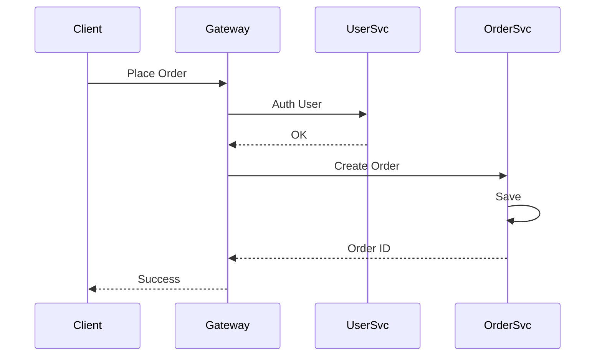

## Overview
Microservices architecture decomposes applications into small, independent services communicating via APIs. Each service owns its data and logic, enabling scalability, resilience, and team autonomy. Key principles include single responsibility, API-first design, and decentralized data management.

## STAR Summary
**Situation:** Monolithic e-commerce app struggled with scaling and deployment frequency.  
**Task:** Migrate to microservices to improve agility and fault isolation.  
**Action:** Decomposed into user, inventory, and order services with REST APIs and event-driven communication.  
**Result:** Reduced deployment time from weeks to hours, increased uptime to 99.95%, and enabled independent scaling.

## Detailed Explanation
- **Decomposition Strategies:** By business capability, subdomain, or transaction boundaries.
- **Communication Patterns:** Synchronous (REST/gRPC) for queries, asynchronous (events) for updates.
- **Data Management:** Each service has its own DB; use sagas for distributed transactions.
- **Challenges:** Service discovery, API versioning, distributed tracing.

High-Level Design:


Capacity: 100 services, 10k req/s each, total 1M req/s. Use Kubernetes for orchestration.

Tradeoffs:
- Complexity vs Scalability: More services increase operational overhead but improve modularity.
- Latency vs Consistency: Async communication reduces coupling but complicates debugging.

API Design:
- GET /users/{id} - User service.
- POST /orders - Order service calls inventory via events.

Deployment: Containerize with Docker, orchestrate with Kubernetes, monitor with Prometheus.

## Real-world Examples & Use Cases
- Netflix: Hundreds of microservices for streaming.
- Amazon: Service-oriented architecture evolution.
- Uber: Ride, payment, and driver services.

## Code Examples
Java Spring Boot microservice snippet:

```java
@RestController
public class UserController {
    @Autowired
    private UserService userService;

    @GetMapping("/users/{id}")
    public User getUser(@PathVariable Long id) {
        return userService.findById(id);
    }
}

// Application.yml
server:
  port: 8081
spring:
  datasource:
    url: jdbc:h2:mem:userdb
```

Maven for multi-module:
```xml
<modules>
    <module>user-service</module>
    <module>order-service</module>
</modules>
```

## Data Models / Message Formats
| Service | Entity | Fields |
|---------|--------|--------|
| User | User | id, name, email |
| Order | Order | id, userId, items |

Event example:
```json
{
  "event": "OrderPlaced",
  "orderId": 123,
  "userId": 456,
  "items": [{"id": 789, "qty": 2}]
}
```

## Journey / Sequence


## Common Pitfalls & Edge Cases
- Tight Coupling: Avoid shared DBs.
- Service Failures: Implement circuit breakers.
- Data Consistency: Use event sourcing.

Common Interview Questions:
1. How to decompose a monolith?
2. Compare microservices vs SOA.
3. Handle inter-service communication.

## Tools & Libraries
- Spring Cloud: Service discovery, config.
- Kubernetes: Orchestration.
- Istio: Service mesh.

## Github-README Links & Related Topics
Related: [[api-design-rest-grpc-openapi]], [[event-sourcing-and-cqrs]], [[service-mesh-istio]]

## References
- https://microservices.io/
- https://martinfowler.com/microservices/
- https://spring.io/projects/spring-cloud