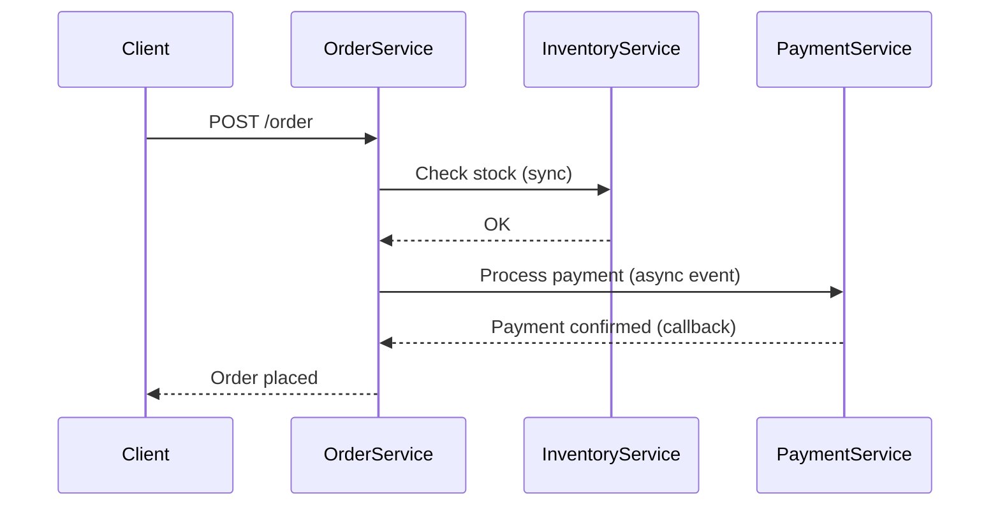

## Overview
Microservices communication patterns define how services interact in a distributed architecture. Key patterns include synchronous (REST, gRPC) and asynchronous (message queues, events) communication, each with tradeoffs in coupling, scalability, and reliability.

## STAR Summary
**Situation:** In a high-traffic e-commerce platform, order processing required decoupling inventory and payment services.  
**Task:** Implement async communication to handle spikes without blocking.  
**Action:** Adopted event-driven messaging with Kafka for order events, reducing latency by 40%.  
**Result:** Improved throughput and fault isolation.

## Detailed Explanation
- **Synchronous Patterns:** Direct calls (REST/gRPC) ensure immediate responses but increase coupling and failure risk.
- **Asynchronous Patterns:** Event-driven or queue-based decouple services, enabling scalability but complicating debugging.
- Tradeoffs: Sync for simplicity/low latency; async for resilience/high throughput.

## Real-world Examples & Use Cases
- E-commerce: Async order fulfillment to prevent stockouts.
- Banking: Sync for real-time balance checks; async for transaction logging.
- IoT: Event streaming for sensor data aggregation.

## Code Examples
Java REST client with Spring Boot:
```java
@RestController
public class OrderController {
    @Autowired
    private RestTemplate restTemplate;

    @PostMapping("/order")
    public ResponseEntity<String> createOrder(@RequestBody Order order) {
        // Sync call to inventory service
        ResponseEntity<String> response = restTemplate.postForEntity("http://inventory-service/check", order, String.class);
        if (response.getStatusCode().is2xxSuccessful()) {
            // Process order
            return ResponseEntity.ok("Order created");
        }
        return ResponseEntity.badRequest().body("Inventory check failed");
    }
}
```

Kafka producer for async:
```java
@Autowired
private KafkaTemplate<String, OrderEvent> kafkaTemplate;

public void publishOrder(OrderEvent event) {
    kafkaTemplate.send("order-topic", event);
}
```

Run with Maven: `mvn spring-boot:run`

## Data Models / Message Formats
| Field | Type | Description |
|-------|------|-------------|
| orderId | String | Unique order identifier |
| items | List<Item> | Ordered items |
| total | Double | Order total |

Sample JSON payload:
```json
{
  "orderId": "12345",
  "items": [{"id": "item1", "qty": 2}],
  "total": 99.99
}
```

## Journey / Sequence


## Common Pitfalls & Edge Cases
- Tight coupling in sync calls leading to cascading failures.
- Message duplication in async; use idempotency.
- Network partitions; implement retries and circuit breakers.

## Tools & Libraries
- Spring Cloud for service calls.
- Apache Kafka for messaging.
- gRPC for high-performance sync.

## Github-README Links & Related Topics
Related: [[api-design-rest-grpc-openapi]], [[message-queues-and-kafka]], [[event-driven-architecture]]

## References
- https://microservices.io/patterns/communication-style/
- https://docs.spring.io/spring-cloud/docs/current/reference/html/