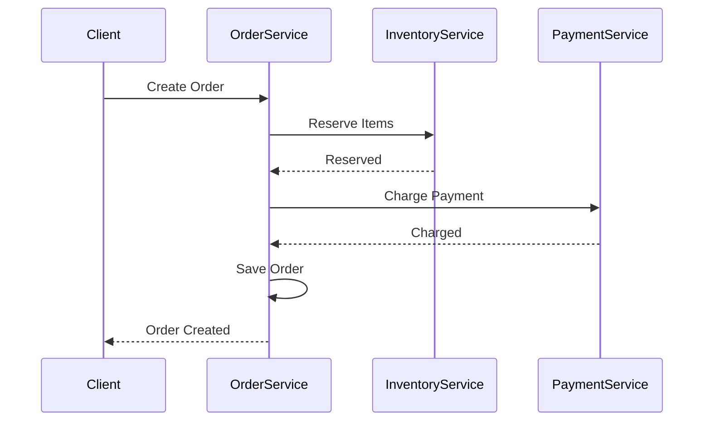

# Microservices Design Patterns

## Overview

Microservices design patterns provide architectural solutions for building scalable, maintainable, and resilient distributed systems. These patterns address challenges like service decomposition, communication, data consistency, and fault tolerance in microservices architectures.

## Detailed Explanation

### Decomposition Patterns

- **Decompose by Business Capability**: Split services based on business domains.
- **Decompose by Subdomain**: Align with Domain-Driven Design (DDD) subdomains.

### Communication Patterns

- **API Gateway**: Single entry point for client requests, routing to appropriate services.
- **Service Mesh**: Manages service-to-service communication, providing observability and security.
- **Event-Driven Communication**: Asynchronous messaging using events.

### Data Management Patterns

- **Database per Service**: Each service owns its data store.
- **Saga Pattern**: Manages distributed transactions across services.
- **CQRS (Command Query Responsibility Segregation)**: Separates read and write operations.

### Observability and Resilience Patterns

- **Circuit Breaker**: Prevents cascading failures.
- **Bulkhead**: Isolates failures to specific parts of the system.
- **Health Check**: Monitors service availability.

### Cross-Cutting Concerns

- **External Configuration**: Centralized config management.
- **Service Discovery**: Automatic registration and discovery of services.

| Category                  | Patterns                                                                 |
|---------------------------|--------------------------------------------------------------------------|
| Decomposition             | Decompose by Business Capability, Decompose by Subdomain                 |
| Communication             | API Gateway, Service Mesh, Event-Driven Communication                    |
| Data Management           | Database per Service, Saga, CQRS                                        |
| Observability & Resilience| Circuit Breaker, Bulkhead, Health Check                                  |
| Cross-Cutting             | External Configuration, Service Discovery                                |



## Real-world Examples & Use Cases

- **E-commerce**: Amazon uses microservices for product catalog, orders, and payments, employing API Gateway and Saga patterns.
- **Streaming Services**: Netflix decomposes by business capabilities, using circuit breakers for resilience.
- **Banking**: Financial institutions use database per service for regulatory compliance and data isolation.

## Code Examples

### API Gateway with Spring Cloud Gateway (Java)

```java
@Configuration
public class GatewayConfig {
    @Bean
    public RouteLocator customRouteLocator(RouteLocatorBuilder builder) {
        return builder.routes()
            .route("user-service", r -> r.path("/users/**")
                .uri("lb://user-service"))
            .route("order-service", r -> r.path("/orders/**")
                .uri("lb://order-service"))
            .build();
    }
}
```

### Saga Pattern Implementation (Simplified)

```java
public class OrderSaga {
    public void createOrder(Order order) {
        // Step 1: Reserve inventory
        inventoryService.reserve(order.getItems());
        
        // Step 2: Process payment
        try {
            paymentService.charge(order.getTotal());
        } catch (Exception e) {
            // Compensate: release inventory
            inventoryService.release(order.getItems());
            throw e;
        }
        
        // Step 3: Create order
        orderService.save(order);
    }
}
```

### Circuit Breaker with Resilience4j

```java
@CircuitBreaker(name = "inventoryService", fallbackMethod = "fallbackInventory")
public List<Item> getInventory() {
    return inventoryClient.getItems();
}

public List<Item> fallbackInventory(Throwable t) {
    return Collections.emptyList();
}
```

## References

- [Microservices Patterns Book](https://microservices.io/patterns/)
- [Spring Cloud Documentation](https://spring.io/projects/spring-cloud)
- [Martin Fowler on Microservices](https://martinfowler.com/articles/microservices.html)

## Github-README Links & Related Topics

- [Microservices Architecture](microservices-architecture/README.md)
- [CQRS Pattern](cqrs-pattern/README.md)
- [Event-Driven Systems](event-driven-systems/README.md)
- [Service Mesh Patterns](service-mesh-patterns/README.md)