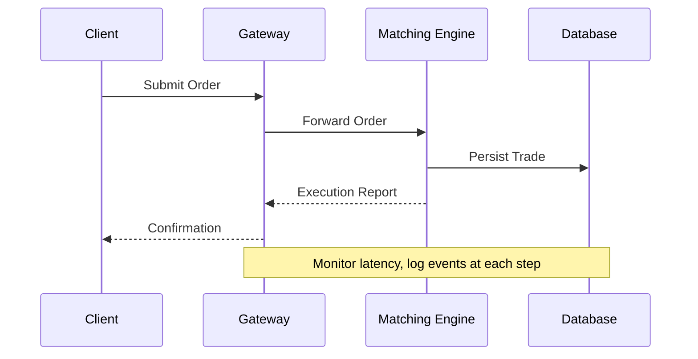

## Overview

Monitoring and logging are foundational practices in DevOps and system design that enable teams to observe, analyze, and maintain the health and performance of applications and infrastructure. Monitoring involves collecting and analyzing metrics, traces, and alerts to detect anomalies and ensure system reliability. Logging captures detailed records of events, errors, and transactions for debugging, auditing, and compliance. Together, they form the core of observability, allowing engineers to proactively address issues and optimize performance in complex, distributed systems.

## STAR Summary

- **S (Situation)**: In a high-traffic e-commerce platform, intermittent service outages were causing revenue loss and poor user experience due to undetected performance bottlenecks.
- **T (Task)**: Implement a comprehensive monitoring and logging strategy to achieve 99.9% uptime and reduce mean time to resolution (MTTR) for incidents.
- **A (Action)**: Deployed Prometheus for metrics collection, Grafana for visualization, and the ELK stack (Elasticsearch, Logstash, Kibana) for centralized logging. Configured alerts for key metrics like CPU usage, error rates, and latency thresholds. Integrated structured logging with JSON formats across all services.
- **R (Result)**: Achieved 99.95% uptime, reduced MTTR from 2 hours to 15 minutes, and identified 40% of issues proactively through alerts, leading to a 25% improvement in system performance.

## Detailed Explanation

Monitoring focuses on real-time data collection to provide insights into system behavior. Key components include:

- **Metrics**: Quantitative measurements such as CPU utilization, memory usage, request latency, throughput, and error rates. Metrics are typically collected at regular intervals and stored in time-series databases.
- **Alerts**: Automated notifications triggered when metrics exceed predefined thresholds, enabling proactive issue resolution.
- **Tracing**: Distributed tracing tracks requests across microservices to identify bottlenecks in complex architectures.

Logging, on the other hand, involves recording discrete events for later analysis. Effective logging practices include:

- **Log Levels**: Standard levels like DEBUG, INFO, WARN, ERROR, and FATAL to categorize the severity and importance of messages.
- **Structured Logging**: Using consistent formats (e.g., JSON) with key-value pairs for easy parsing and querying.
- **Centralized Aggregation**: Collecting logs from multiple sources into a single system for correlation and analysis.

Best practices include defining service-level objectives (SLOs), implementing redundancy in monitoring tools, and ensuring logs are immutable and securely stored. In distributed systems, monitoring must account for eventual consistency and network partitions.

## Real-world Examples & Use Cases

- **Microservices Architecture**: A Netflix-like streaming service uses monitoring to track API response times and logging to correlate user requests with backend errors, enabling rapid rollback of faulty deployments.
- **Financial Trading Systems**: High-frequency trading platforms monitor latency in microseconds and log every trade event for regulatory compliance and post-mortem analysis.
- **E-commerce Platform**: During Black Friday sales, monitoring detects traffic spikes and scales resources automatically, while logging captures fraud attempts and payment failures for investigation.

In a case study, a major bank implemented monitoring with Prometheus, reducing incident response time by 60% and saving millions in potential losses from undetected failures.

## Message Formats / Data Models

### Log Formats
Logs are often structured as JSON for machine readability:

```json
{
  "timestamp": "2025-09-26T12:00:00Z",
  "level": "ERROR",
  "service": "payment-service",
  "message": "Payment processing failed",
  "user_id": "12345",
  "transaction_id": "txn-67890",
  "error_code": "PAYMENT_DECLINED",
  "stack_trace": "..."
}
```

### Metrics Formats
Prometheus uses a simple text-based format:

```
# HELP http_requests_total Total number of HTTP requests
# TYPE http_requests_total counter
http_requests_total{method="GET",status="200"} 1024
```

Tables for common fields:

| Field | Description | Example |
|-------|-------------|---------|
| timestamp | ISO 8601 timestamp | 2025-09-26T12:00:00Z |
| level | Log severity | ERROR |
| service | Source service name | payment-service |
| message | Human-readable description | Payment processing failed |
| tags/labels | Key-value metadata | method=GET, status=200 |

## Journey of a Trade

While not directly applicable to trading, in a financial system, monitoring and logging track the end-to-end journey of a trade:



Alerts on high latency in the Matching Engine prevent slippage, while logs enable auditing of trade sequences.

## Common Pitfalls & Edge Cases

- **Over-logging**: Excessive logs can overwhelm storage and processing, leading to performance degradation. Mitigate by sampling logs or using conditional logging.
- **Alert Fatigue**: Too many false positives desensitize teams. Tune thresholds based on historical data and use alert suppression.
- **Distributed Tracing Gaps**: In microservices, missing spans in traces make debugging difficult. Ensure all services propagate trace IDs.
- **Security Risks**: Logs may contain sensitive data like PII. Implement log sanitization and access controls.
- **Clock Skew**: Inconsistent timestamps across services complicate correlation. Use NTP for synchronization.
- **Race Conditions in Monitoring**: Concurrent metric updates can lead to inaccuracies; use atomic operations or locks.

Edge cases include handling log rotation during high-volume events and ensuring monitoring works during network outages.

## Tools & Libraries

- **ELK Stack**: Elasticsearch for storage, Logstash for ingestion, Kibana for visualization. Open-source, widely used for centralized logging.
- **Prometheus**: Time-series database for metrics, with alerting via Alertmanager.
- **Grafana**: Dashboard tool for visualizing metrics and logs.
- **Splunk**: Enterprise logging and monitoring platform with advanced analytics.
- **OpenTelemetry**: Framework for collecting traces, metrics, and logs in a vendor-neutral way.
- **Fluentd**: Log aggregator for collecting and forwarding logs.

Sample code for structured logging in Python:

```python
import logging
import json

logger = logging.getLogger(__name__)

def log_payment_error(user_id, transaction_id, error_code):
    logger.error(json.dumps({
        "event": "payment_failed",
        "user_id": user_id,
        "transaction_id": transaction_id,
        "error_code": error_code
    }))
```

## Github-README Links & Related Topics

- [Async Logging](async-logging/)
- [Load Balancing and Strategies](system-design/load-balancing-and-strategies/)
- [Distributed Tracing And Observability](system-design/distributed-tracing-and-observability/)
- [Rate Limiting](system-design/rate-limiting/)

## References

- [Prometheus Documentation](https://prometheus.io/docs/)
- [ELK Stack Guide](https://www.elastic.co/guide/en/elastic-stack/current/elastic-stack.html)
- [Google SRE Book: Monitoring](https://sre.google/sre-book/monitoring/)
- [OpenTelemetry Specification](https://opentelemetry.io/docs/)