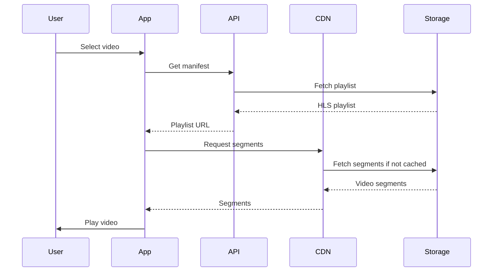

## Overview
Netflix is a global video streaming platform that delivers high-quality video content to millions of users. Its architecture handles massive scale, personalization, and adaptive bitrate streaming.

## Detailed Explanation
### Key Components
- **Content Delivery Network (CDN):** Akamai and others for global distribution.
- **Microservices:** API Gateway, User Service, Content Service, etc.
- **Data Pipeline:** For recommendations using machine learning.
- **Encoding:** Multiple bitrates for adaptive streaming.
- **Storage:** S3 for video storage.

### Streaming Protocol
Uses HLS (HTTP Live Streaming) for adaptive bitrate.

## Real-world Examples & Use Cases
- On-demand video streaming.
- Live events.
- Personalized recommendations.

## Code Examples
### Simple Video Player in JavaScript (for web)
```javascript
const video = document.getElementById('video');
const source = document.createElement('source');
source.src = 'https://example.com/video.m3u8'; // HLS playlist
source.type = 'application/x-mpegURL';
video.appendChild(source);
video.play();
```

### Java API for Content Retrieval
```java
import org.springframework.http.MediaType;
import org.springframework.http.ResponseEntity;
import org.springframework.web.bind.annotation.GetMapping;
import org.springframework.web.bind.annotation.PathVariable;
import org.springframework.web.bind.annotation.RestController;

@RestController
public class ContentController {
    @GetMapping("/content/{id}")
    public ResponseEntity<byte[]> getContent(@PathVariable String id) {
        // Fetch from storage
        byte[] data = contentService.getContent(id);
        return ResponseEntity.ok().contentType(MediaType.APPLICATION_OCTET_STREAM).body(data);
    }
}
```

## Journey / Sequence


## Data Models / Message Formats
### Video Metadata
| Field | Type | Description |
|-------|------|-------------|
| id | String | Unique ID |
| title | String | Video title |
| duration | Int | In seconds |
| bitrates | Array | Available bitrates |
| genres | Array | Genres |

## Common Pitfalls & Edge Cases
- Buffering due to network issues.
- DRM for content protection.
- Scalability during peak times.

## Tools & Libraries
- FFmpeg for encoding.
- AWS services for storage and CDN.
- Kafka for event streaming.

## Github-README Links & Related Topics
- [cdn-architecture](../cdn-architecture/)
- [microservices-architecture](../microservices-architecture/)
- [recommendation-systems](../recommendation-systems/)

## References
- Netflix Tech Blog: https://netflixtechblog.com/
- Adaptive Streaming: https://en.wikipedia.org/wiki/Adaptive_bitrate_streaming