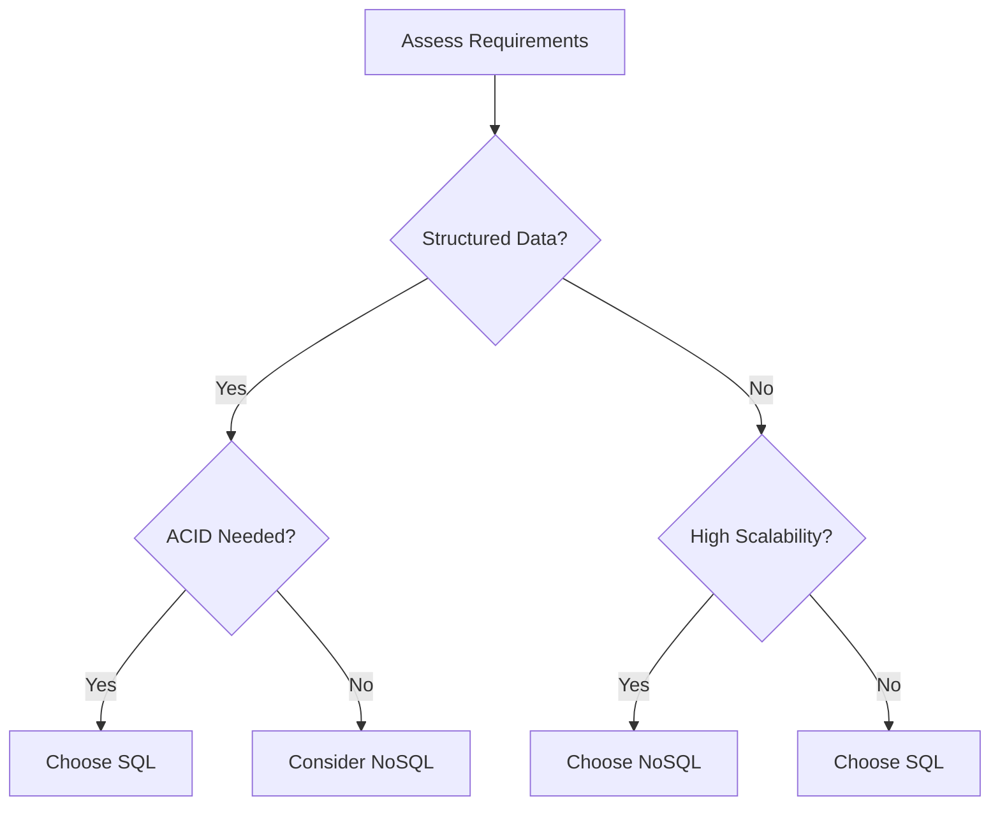

## Overview
SQL databases (relational) excel in structured data with ACID guarantees, while NoSQL databases prioritize scalability, flexibility, and performance for unstructured or high-volume data. Choice depends on consistency, scalability, and query needs.

## STAR Summary
**Situation:** A social media app struggled with scaling user timelines under 1M daily active users.  
**Task:** Evaluate database options for read-heavy workloads.  
**Action:** Adopted NoSQL (DynamoDB) for user feeds, kept SQL for user profiles.  
**Result:** Improved read latency by 80%, handled 10x traffic growth without sharding.

## Detailed Explanation
- **SQL (Relational):** Fixed schema, joins, ACID. Best for complex queries, transactions. Tradeoff: Scalability limits.
- **NoSQL Types:** Key-value (Redis), Document (MongoDB), Column-family (Cassandra), Graph (Neo4j). Flexible schema, BASE consistency. Tradeoff: Eventual consistency, no joins.
- **Tradeoffs:** Consistency vs Availability (CAP), Schema rigidity vs Flexibility, Performance vs Rich queries.

## Real-world Examples & Use Cases
- **SQL:** Banking (transactions), ERP systems.
- **NoSQL:** Social networks (user data), IoT (time-series), E-commerce (product catalogs).

## Code Examples
Java with JDBC (SQL):

```java
// PostgreSQL query
String sql = "SELECT * FROM users WHERE id = ?";
try (PreparedStatement stmt = conn.prepareStatement(sql)) {
    stmt.setInt(1, userId);
    ResultSet rs = stmt.executeQuery();
    // Process result
}
```

Java with MongoDB (NoSQL):

```java
// MongoDB document
Document user = collection.find(eq("id", userId)).first();
// Access fields: user.getString("name")
```

## Data Models / Message Formats
SQL Table:

| id | name | email |
|----|------|-------|
| 1  | John | john@example.com |

NoSQL Document (JSON):

```json
{
  "id": 1,
  "name": "John",
  "email": "john@example.com",
  "preferences": {"theme": "dark"}
}
```

## Journey / Sequence


## Common Pitfalls & Edge Cases
- **Schema Evolution:** NoSQL allows easy changes; SQL requires migrations.
- **Joins:** NoSQL lacks native joins; denormalize data.
- **Consistency:** NoSQL may have stale reads; use SQL for critical data.
- **Edge Case:** Hybrid systems (Polyglot persistence) add complexity.

## Tools & Libraries
- **SQL:** PostgreSQL, MySQL, Oracle
- **NoSQL:** MongoDB, Cassandra, Redis, DynamoDB
- **Java:** JDBC, MongoDB Driver, Hibernate

## Github-README Links & Related Topics
Related: [[database-design-and-indexing]], [[consistency-models]], [[partitioning-and-sharding]], [[caching-strategies]]

## References
- https://en.wikipedia.org/wiki/NoSQL
- https://www.mongodb.com/nosql-explained
- https://aws.amazon.com/nosql/