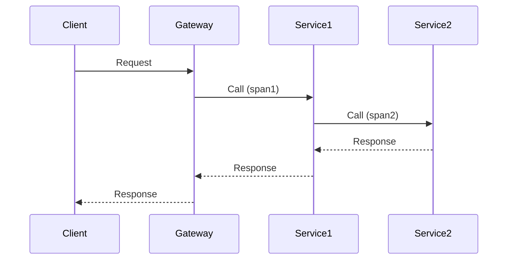

# Overview

Observability enables understanding system behavior through logs, metrics, and traces. Critical for debugging distributed systems.

# STAR Summary

**Situation:** Production outages in a distributed system with poor visibility.  
**Task:** Implement observability to reduce MTTR.  
**Action:** Added structured logging, Prometheus metrics, Jaeger tracing.  
**Result:** MTTR decreased by 60%, uptime improved to 99.9%.

# Detailed Explanation

Logs: Structured events for debugging.  
Metrics: Time-series data (counters, gauges, histograms).  
Traces: Request paths across services.

# Real-world Examples & Use Cases

- E-commerce: Track order fulfillment latency.  
- Microservices: Debug cascading failures.

# Code Examples

**Java Logging with SLF4J:**

```java
import org.slf4j.Logger;
import org.slf4j.LoggerFactory;

public class OrderService {
    private static final Logger logger = LoggerFactory.getLogger(OrderService.class);

    public void processOrder(Order order) {
        logger.info("Processing order: {}", order.getId());
        // process
        logger.error("Failed to process order: {}", order.getId(), exception);
    }
}
```

**Metrics with Micrometer:**

```java
import io.micrometer.core.instrument.MeterRegistry;

@Service
public class OrderService {
    private final Counter ordersProcessed;

    public OrderService(MeterRegistry registry) {
        this.ordersProcessed = registry.counter("orders.processed");
    }

    public void processOrder(Order order) {
        ordersProcessed.increment();
    }
}
```

# Data Models / Message Formats

**Log Entry:**

```json
{
  "timestamp": "2023-09-25T10:00:00Z",
  "level": "INFO",
  "service": "order-service",
  "message": "Order processed",
  "orderId": 123
}
```

**Trace Span:**

JSON with span ID, parent ID, duration.

# Journey / Sequence



# Common Pitfalls & Edge Cases

- Log levels: Avoid excessive DEBUG in prod.  
- Metric cardinality: High cardinality causes performance issues.  
- Trace sampling: Balance detail vs overhead.

# Tools & Libraries

- ELK Stack (Elasticsearch, Logstash, Kibana)  
- Prometheus  
- Jaeger/OpenTelemetry

# Github-README Links & Related Topics

[[distributed-tracing-and-observability]], [[low-latency-systems]]

# References

- https://opentelemetry.io/
- https://prometheus.io/docs/
- https://www.jaegertracing.io/