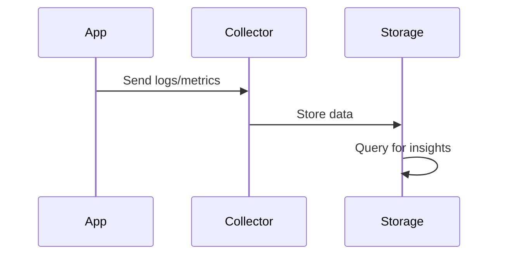

# Overview

Observability enables understanding system behavior through logs, metrics, and traces, crucial for debugging and monitoring distributed systems.

# STAR Summary

**Situation:** Frequent outages with slow MTTR.

**Task:** Enhance monitoring for proactive issue detection.

**Action:** Implemented logs, metrics, traces with ELK and Prometheus.

**Result:** MTTR reduced by 60%, improved reliability.

# Detailed Explanation

Pillars:

- **Logs:** Structured records of events.

- **Metrics:** Numerical data like CPU usage.

- **Traces:** Request paths across services.

Patterns: Centralized logging, time-series metrics, distributed tracing.

# Real-world Examples & Use Cases

- Microservices: Trace requests across services.

- Cloud apps: Monitor resource usage.

- E-commerce: Track user journeys.

# Code Examples

Java logging with SLF4J:

```java
import org.slf4j.Logger;
import org.slf4j.LoggerFactory;

Logger logger = LoggerFactory.getLogger(MyClass.class);
logger.info("User {} logged in", userId);
```

Metrics with Micrometer:

```java
Counter.builder("requests_total").register(meterRegistry).increment();
```

# Data Models / Message Formats

Log entry:

```json
{
  "timestamp": "2023-09-25T10:00:00Z",
  "level": "INFO",
  "message": "User logged in",
  "service": "auth-service",
  "traceId": "abc123"
}
```

# Journey / Sequence



# Common Pitfalls & Edge Cases

- Log volume overwhelming storage.

- Sensitive data in logs.

- Trace sampling for performance.

# Tools & Libraries

- ELK Stack: Elasticsearch, Logstash, Kibana.

- Prometheus: Metrics collection.

- Jaeger: Distributed tracing.

# Github-README Links & Related Topics

Related: [[distributed-tracing-and-observability]], [[observability-logs-metrics-traces]], [[low-latency-systems]]

# References

- https://prometheus.io/docs/

- https://www.elastic.co/guide/en/elastic-stack/current/elastic-stack.html