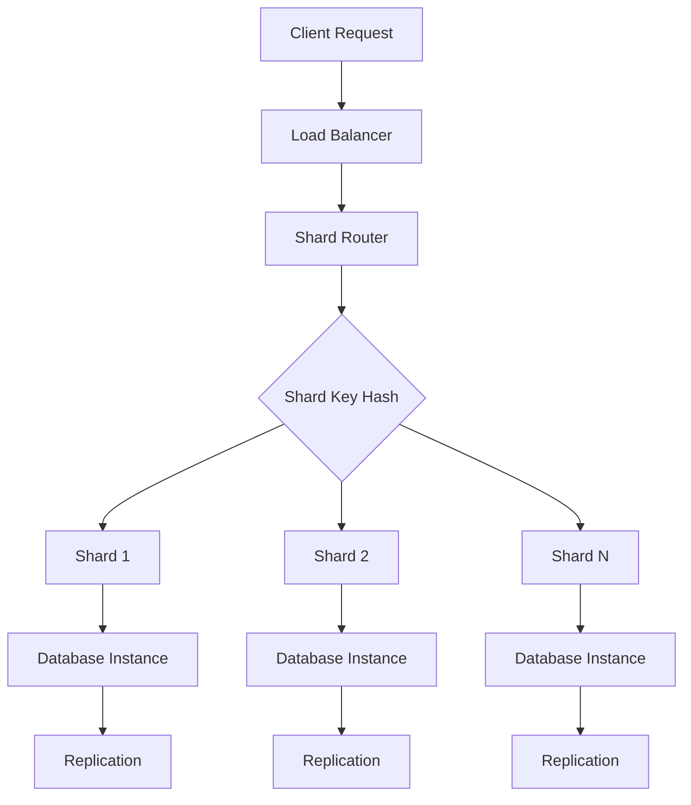
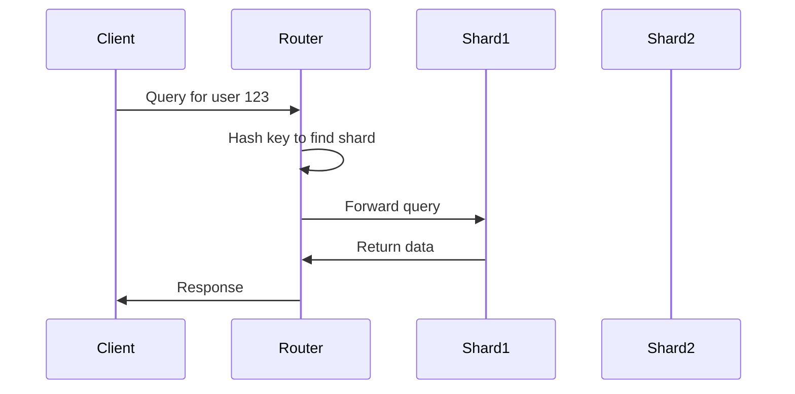

## Overview
Partitioning and sharding are techniques to distribute data across multiple storage units for improved performance, scalability, and availability. Partitioning divides a dataset into smaller, manageable pieces, while sharding distributes these partitions across different servers. This is essential for handling large-scale data in distributed systems and is a common interview topic for designing scalable databases.

## STAR Summary
**Situation:** An e-commerce platform with a monolithic database experienced slow queries and downtime during peak traffic (1M+ users).  
**Task:** Scale the database to support 10x growth in users and data volume without compromising performance.  
**Action:** Implemented horizontal sharding using consistent hashing, with automatic rebalancing and replication.  
**Result:** Reduced average query latency from 500ms to 200ms, achieved 99.9% uptime, and supported seamless scaling to 100M users.

## Detailed Explanation
- **Partitioning Types:** Range (e.g., by date), Hash (modulo on key), List (explicit lists).
- **Sharding Strategies:** Directory-based (lookup table), Consistent Hashing (ring-based for even distribution).
- **Key Concepts:** Shard key selection, rebalancing, cross-shard queries, replication for fault tolerance.
- **Tradeoffs:** Increased complexity vs. linear scalability; potential for uneven load (hot shards); consistency challenges in distributed writes.

### High-Level Design (HLD)


### Capacity and Throughput Targets
- **Read/Write Throughput:** Target 10,000 ops/sec per shard; total system 100,000 ops/sec with 10 shards.
- **Dimensioning:** For 1TB data, 100GB per shard; scale horizontally by adding shards.
- **Latency:** <10ms for local shard queries; <50ms for cross-shard.

### API Design Examples
Sample endpoints for a sharded user service:
- `GET /users/{id}` - Route to shard based on hash(id)
- `POST /users` - Assign shard, insert data
- `PUT /users/{id}` - Update on specific shard

### Deployment and Scaling Strategies
- Deploy shards on Kubernetes with auto-scaling pods.
- Use rolling updates for rebalancing; monitor shard load and trigger splits.

## Real-world Examples & Use Cases
- **Social Networks:** Sharding user data by user ID in Facebook's TAO system.
- **E-commerce:** Product catalogs sharded by category in Amazon DynamoDB.
- **Analytics:** Time-series data partitioned by timestamp in InfluxDB.

## Code Examples
### Consistent Hashing Implementation in Java
```java
import java.util.*;

class ConsistentHashing {
    private SortedMap<Integer, String> ring = new TreeMap<>();
    private int replicas = 3;

    public void addNode(String node) {
        for (int i = 0; i < replicas; i++) {
            int hash = (node + i).hashCode();
            ring.put(hash, node);
        }
    }

    public String getNode(String key) {
        if (ring.isEmpty()) return null;
        int hash = key.hashCode();
        if (!ring.containsKey(hash)) {
            SortedMap<Integer, String> tailMap = ring.tailMap(hash);
            hash = tailMap.isEmpty() ? ring.firstKey() : tailMap.firstKey();
        }
        return ring.get(hash);
    }
}
```

## Data Models / Message Formats
| Shard ID | Range Start | Range End | Server | Replicas |
|----------|-------------|-----------|--------|----------|
| 1        | 0           | 999       | server1| server2, server3 |
| 2        | 1000        | 1999      | server2| server1, server3 |

## Journey / Sequence


## Common Pitfalls & Edge Cases
- Hot shards from poor key distribution.
- Rebalancing during peak load causing downtime.
- Cross-shard joins requiring application-level logic.
- Edge case: Single shard failure affecting availability if not replicated.

## Common Interview Questions
- How do you choose a shard key to avoid hotspots?
- Explain consistent hashing and its benefits.
- What are the tradeoffs between partitioning and sharding?
- Design a sharding strategy for a global e-commerce platform.

## Tools & Libraries
- **Databases:** Cassandra (automatic partitioning), MongoDB (sharding).
- **Libraries:** Apache Commons ConsistentHash, Netflix's Dynomite for sharding.
- **Frameworks:** Spring Data with sharding support.

## Github-README Links & Related Topics
- [[database-design-and-indexing]]
- [[load-balancing-and-routing]]
- [[caching-strategies]]
- [[distributed-tracing-and-observability]]

## References
- MongoDB Sharding Documentation: https://docs.mongodb.com/manual/sharding/
- Cassandra Partitioning: https://cassandra.apache.org/doc/latest/cassandra/architecture/overview.html
- "Designing Data-Intensive Applications" by Martin Kleppmann</content>
</xai:function_call ><xai:function_call name="todowrite">
<parameter name="todos">[{"content":"Write comprehensive README.md for partitioning-and-sharding topic","status":"completed","priority":"high","id":"write_partitioning"}]