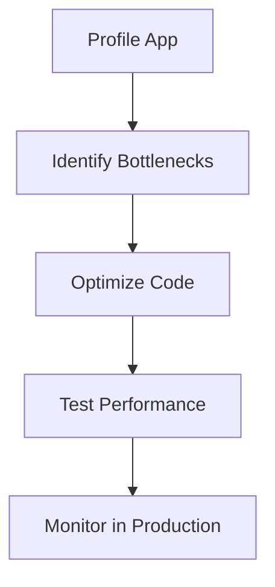

## Overview

Performance optimization in Java focuses on improving speed, memory usage, and scalability. Techniques include profiling, algorithm improvements, and JVM tuning.

## Detailed Explanation

Strategies:

- **Profiling**: Use tools like VisualVM, JProfiler to identify bottlenecks.
- **Memory Management**: Optimize GC, reduce object creation.
- **Concurrency**: Efficient threading, avoid locks.
- **I/O Optimization**: Buffering, asynchronous operations.

JVM flags: -Xmx, -Xms for heap; GC tuners like G1GC.



## Real-world Examples & Use Cases

- **High-Traffic Web Apps**: Optimize database queries, caching.
- **Big Data Processing**: Parallel streams, efficient algorithms.
- **Gaming**: Real-time rendering optimizations.

## Code Examples

### Efficient Looping

```java
// Avoid in loops
for (int i = 0; i < list.size(); i++) { // size() called each time
    // ...
}

// Better
int size = list.size();
for (int i = 0; i < size; i++) {
    // ...
}
```

### Using Streams Efficiently

```java
List<String> filtered = list.stream()
    .filter(s -> s.length() > 5)
    .collect(Collectors.toList()); // Parallel if large
```

## References

- [Java Performance Tuning Guide](https://docs.oracle.com/javase/8/docs/technotes/guides/vm/gctuning/)
- [Profiling Tools](../profiling-tools/README.md)

## Github-README Links & Related Topics

- [GC Tuning](../gc-tuning/README.md)
- [Multithreading & Concurrency in Java](../multithreading-and-concurrency-in-java/README.md)
- [Latency and Throughput](../latency-and-throughput/README.md)