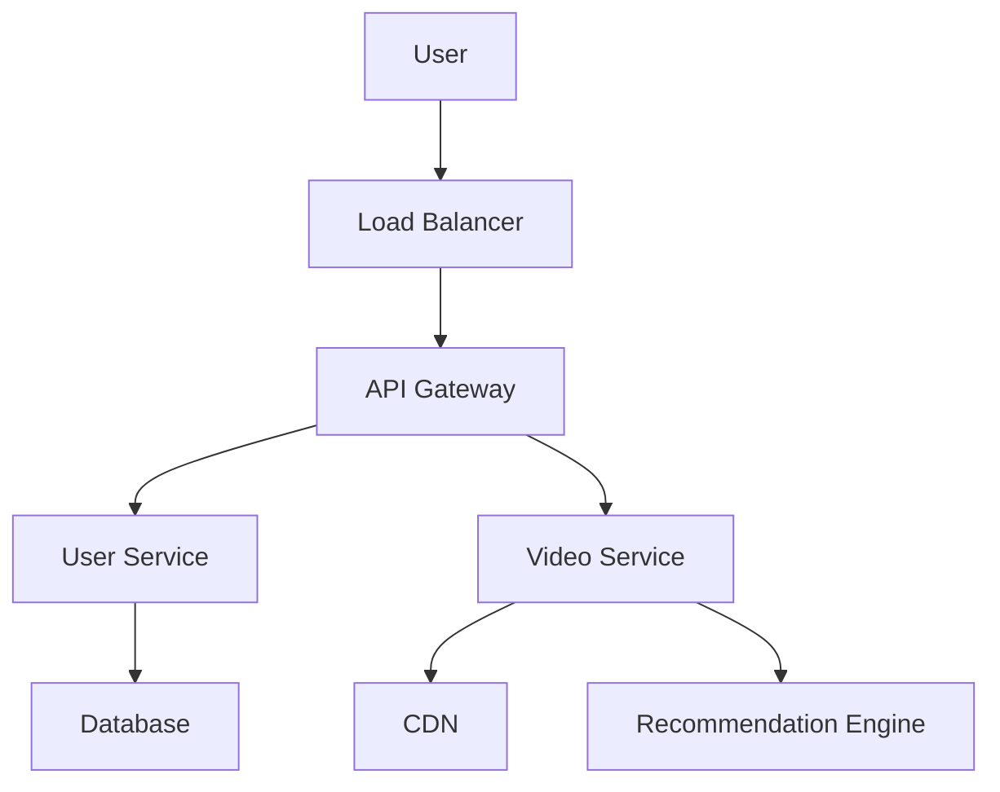

# Popular Systems Design, LLD and HLD

## Overview

This section explores popular system design problems, encompassing both Low Level Design (LLD) and High Level Design (HLD). LLD delves into the detailed design of individual components, such as classes and algorithms, while HLD provides a high-level view of the system's architecture, including services, data flow, and scalability considerations.

## Detailed Explanation

### Low Level Design (LLD)
LLD focuses on the micro-level aspects of system design. It involves defining classes, interfaces, data structures, and algorithms for specific functionalities. Key considerations include:
- Object-oriented principles (encapsulation, inheritance, polymorphism)
- Design patterns (Singleton, Factory, Observer)
- Data modeling and relationships
- Error handling and edge cases

### High Level Design (HLD)
HLD outlines the macro-level architecture. It includes:
- System components and their interactions
- Database schema and storage strategies
- API design and communication protocols
- Scalability, reliability, and performance metrics

### Popular Systems
Common system design problems include:
- URL Shorteners (e.g., TinyURL)
- Video Streaming Platforms (e.g., Netflix)
- Social Media Feeds (e.g., Facebook News Feed)
- Ride-Sharing Services (e.g., Uber)
- E-commerce Platforms (e.g., Amazon)

## Real-world Examples & Use Cases

### URL Shortener
- **Use Case**: Convert long URLs to short, trackable links.
- **LLD**: Design URL encoding/decoding logic, database for mappings.
- **HLD**: Load balancer, multiple servers, database sharding.

### Netflix
- **Use Case**: Stream videos to millions of users globally.
- **LLD**: Video player component, recommendation algorithm.
- **HLD**: CDN for content delivery, microservices for user management, big data for analytics.

### Facebook News Feed
- **Use Case**: Display personalized content feed.
- **LLD**: Ranking algorithm, post rendering.
- **HLD**: Distributed databases, real-time processing with Kafka.

### Uber
- **Use Case**: Match riders with drivers.
- **LLD**: Location tracking, matching algorithm.
- **HLD**: Geospatial databases, real-time messaging.

### Amazon E-commerce
- **Use Case**: Online shopping with recommendations.
- **LLD**: Product catalog, shopping cart.
- **HLD**: Multi-region deployment, recommendation engine.

### Google Search
- **Use Case**: Index and search the web efficiently.
- **LLD**: Page ranking algorithm (e.g., PageRank), query processing and tokenization.
- **HLD**: Distributed web crawlers, inverted index storage, load balancing across data centers.

### YouTube
- **Use Case**: Video upload, streaming, and personalized recommendations.
- **LLD**: Video encoding pipeline, recommendation algorithm using collaborative filtering.
- **HLD**: Global CDN for content delivery, microservices architecture, big data for analytics and views tracking.

### Slack
- **Use Case**: Real-time messaging and team collaboration.
- **LLD**: Message threading, user presence indicators, channel management.
- **HLD**: WebSocket for real-time connections, message queues (e.g., Kafka), database sharding for scalability.

### Instagram
- **Use Case**: Photo/video sharing with stories and reels.
- **LLD**: Image processing, feed ranking algorithm.
- **HLD**: Distributed storage for media, graph database for relationships, event-driven architecture.

## Code Examples

### URL Shortener LLD (Java)
```java
import java.util.HashMap;
import java.util.Map;
import java.util.UUID;

public class UrlShortener {
    private Map<String, String> shortToLong = new HashMap<>();
    private Map<String, String> longToShort = new HashMap<>();
    private static final String BASE_URL = "http://short.ly/";

    public String shortenUrl(String longUrl) {
        if (longToShort.containsKey(longUrl)) {
            return BASE_URL + longToShort.get(longUrl);
        }
        String shortKey = generateShortKey();
        shortToLong.put(shortKey, longUrl);
        longToShort.put(longUrl, shortKey);
        return BASE_URL + shortKey;
    }

    public String expandUrl(String shortUrl) {
        String shortKey = shortUrl.replace(BASE_URL, "");
        return shortToLong.get(shortKey);
    }

    private String generateShortKey() {
        return UUID.randomUUID().toString().substring(0, 8);
    }
}
```

### Netflix HLD Diagram


## References
- [System Design Primer](https://github.com/donnemartin/system-design-primer)
- [Designing Data-Intensive Applications](https://www.amazon.com/Designing-Data-Intensive-Applications-Reliable-Maintainable/dp/1449373321)
- [Grokking the System Design Interview](https://www.educative.io/courses/grokking-the-system-design-interview)

## Github-README Links & Related Topics
- [URL Shortener Design](../url-shortener-design/README.md)
- [Netflix System Design](../netflix-system-design/README.md)
- [Facebook News Feed](../facebook-news-feed/README.md)
- [Uber System Design](../uber-system-design/README.md)
- [Twitter System Design](../twitter-system-design/README.md)
- [Instagram System Design](../instagram-system-design/README.md)
- [Google Search Engine](../google-search-engine/README.md)
- [Slack Messaging System](../slack-messaging-system/README.md)
- [System Design Basics](../system-design-basics/README.md)
- [LLD HLD Basics](../lld-hld-basics/README.md)