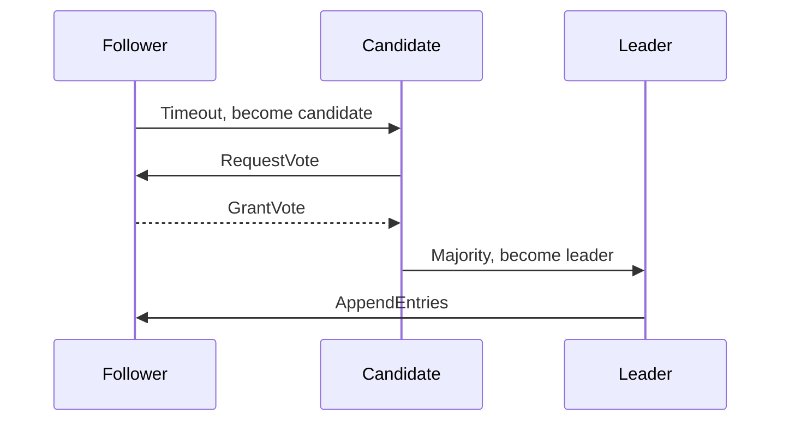

# Overview

Raft is a consensus algorithm for managing replicated logs in distributed systems, ensuring fault tolerance and consistency. Leader election is the process of selecting a primary node to coordinate operations. In MAANG interviews, expect deep dives into Raft's phases, failure modes, and implementations like etcd or ZooKeeper.

# STAR Summary

**Situation:** Designing a distributed key-value store for a microservices architecture.

**Task:** Implement consensus for data replication across 5 nodes.

**Action:** Chose Raft over Paxos for simplicity; implemented leader election with heartbeats and log replication.

**Result:** Achieved strong consistency with 99.9% uptime, handling 2 node failures gracefully.

# Detailed Explanation

Raft divides time into terms, elects leaders, and replicates logs.

Phases: Leader Election, Log Replication, Safety.

Leader Election: Candidates request votes; majority wins.

Failure Modes: Network partitions, node crashes.

# Real-world Examples & Use Cases

- etcd: Kubernetes configuration store.
- Consul: Service discovery.
- CockroachDB: Distributed SQL database.

# Code Examples

Simple Raft state in Java:

```java
enum State { FOLLOWER, CANDIDATE, LEADER }

public class RaftNode {
    private State state = State.FOLLOWER;
    private int term = 0;

    public void startElection() {
        state = State.CANDIDATE;
        term++;
        // Send vote requests
    }
}
```

# Data Models / Message Formats

VoteRequest: {"term": 1, "candidateId": "node1"}

AppendEntries: {"term": 1, "leaderId": "node1", "entries": [...]}

# Journey / Sequence



# Common Pitfalls & Edge Cases

- Split brain in partitions.
- Log inconsistencies.
- Leader without majority.

# Tools & Libraries

- etcd
- Apache ZooKeeper

# Github-README Links & Related Topics

Related: [[consistency-and-availability]], [[distributed-tracing-and-observability]], [[raft-consensus-and-leader-election]], [[system-design-basics]]

# References

- [Raft Paper](https://raft.github.io/raft.pdf)
- [etcd Raft](https://etcd.io/docs/v3.5/learning/raft/)