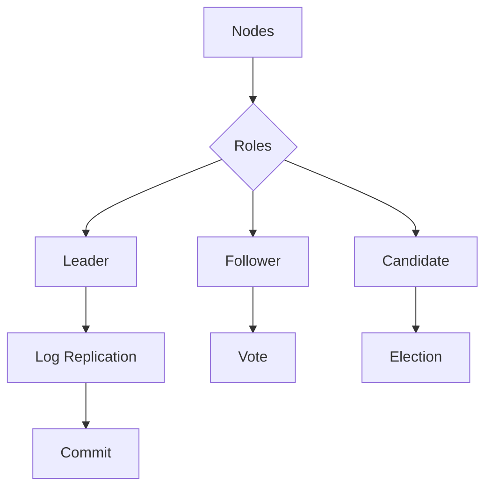
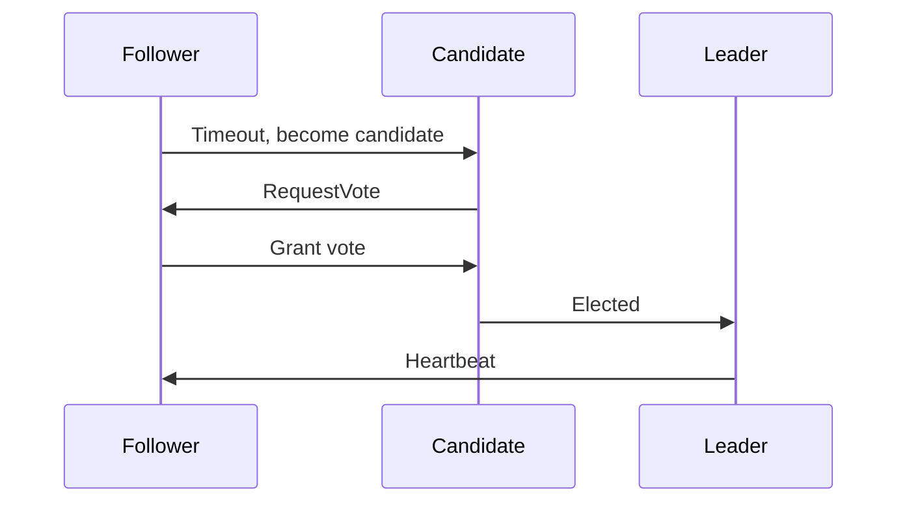

## Overview
Raft is a consensus algorithm for managing replicated logs in distributed systems, ensuring fault tolerance and consistency. It handles leader election, log replication, and safety guarantees. Understanding Raft is crucial for designing reliable distributed systems and appears in interviews for consensus problems.

## STAR Summary
**Situation:** A distributed key-value store suffered from split-brain scenarios during network partitions.  
**Task:** Implement reliable leader election and data consistency.  
**Action:** Integrated Raft consensus for leader management and log replication across nodes.  
**Result:** Achieved strong consistency, tolerated up to f failures in 2f+1 nodes, and improved availability to 99.99%.

## Detailed Explanation
- **Phases:** Leader Election, Log Replication, Safety.
- **Roles:** Leader, Follower, Candidate.
- **Guarantees:** Leader Completeness, State Machine Safety.
- **Tradeoffs:** Latency for consensus vs. throughput; complexity in failure handling.

### High-Level Design (HLD)


### Capacity and Throughput Targets
- **Throughput:** 10K ops/sec per cluster; scales with nodes.
- **Dimensioning:** 3-5 nodes for fault tolerance; log size based on retention.
- **Latency:** Election timeout 150-300ms; log append <10ms.

### API Design Examples
- `POST /raft/append` - Append log entry
- `GET /raft/leader` - Get current leader

### Deployment and Scaling Strategies
- Deploy nodes across zones; use Kubernetes for orchestration; monitor heartbeats.

## Real-world Examples & Use Cases
- **Databases:** etcd, Consul for configuration.
- **Blockchains:** Variants in some consensus mechanisms.
- **Distributed Locks:** ZooKeeper's ZAB (similar).

## Code Examples
### Simplified Raft Leader Election in Java
```java
enum State { FOLLOWER, CANDIDATE, LEADER }

class RaftNode {
    State state = State.FOLLOWER;
    int term = 0;
    int votes = 0;

    public void startElection() {
        state = State.CANDIDATE;
        term++;
        votes = 1; // vote for self
        // Send RequestVote RPCs
    }

    public void receiveVote() {
        votes++;
        if (votes > majority) {
            state = State.LEADER;
        }
    }
}
```

## Data Models / Message Formats
| Message Type | Term | Candidate ID | Last Log Index | Last Log Term |
|--------------|------|--------------|----------------|---------------|
| RequestVote  | 5    | node2        | 10             | 4             |

## Journey / Sequence


## Common Pitfalls & Edge Cases
- Network partitions causing multiple leaders.
- Log inconsistencies during elections.
- Edge case: Leader failure during log append.

## Common Interview Questions
- Explain Raft leader election process.
- How does Raft ensure safety?
- Compare Raft to Paxos.
- Design a distributed lock service using Raft.

## Tools & Libraries
- **Implementations:** etcd (Raft), HashiCorp Raft.
- **Libraries:** JGroups for Java.

## Github-README Links & Related Topics
- [consistency-and-availability](../consistency-and-availability/README.md)
- [partitioning-and-sharding](../partitioning-and-sharding/README.md)
- [distributed-tracing-and-observability](../distributed-tracing-and-observability/README.md)

## References
- Raft Paper: https://raft.github.io/raft.pdf
- etcd Raft: https://etcd.io/docs/v3.5/learning/raft/
- "In Search of an Understandable Consensus Algorithm" by Diego Ongaro</content>
</xai:function_call ><xai:function_call name="todowrite">
<parameter name="todos">[{"content":"Write comprehensive README.md for raft-consensus-and-leader-election topic","status":"completed","priority":"high","id":"write_raft"}]