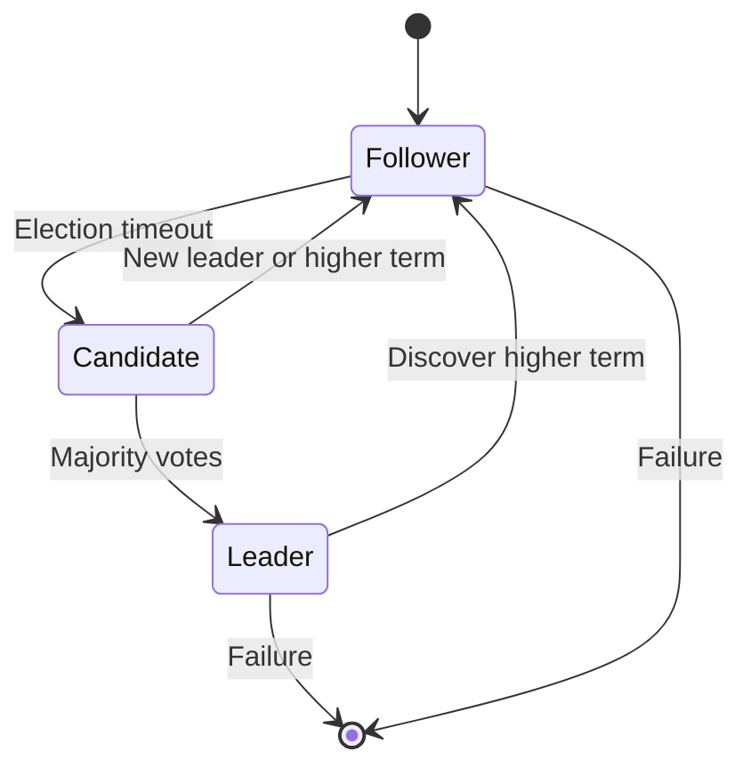

# Raft Consensus

## Overview

Raft is a consensus algorithm designed to be easy to understand and implement. It manages a replicated log and ensures that all nodes in a cluster agree on the log's contents, even in the presence of failures. Raft elects a leader to manage the log replication, simplifying the process compared to Paxos.

## Detailed Explanation

Raft divides the consensus problem into three subproblems: Leader Election, Log Replication, and Safety.

### Key Concepts

- **Leader**: Handles client requests and replicates log entries.
- **Follower**: Passive, responds to leaders and candidates.
- **Candidate**: Seeks votes to become leader during elections.

### Phases

1. **Leader Election**: When no leader exists, nodes become candidates and request votes.
2. **Log Replication**: Leader sends log entries to followers; commits when majority acknowledge.
3. **Safety**: Ensures committed entries are not lost and only one leader per term.

### Safety Properties

- Election Safety: Only one leader per term.
- Leader Append-Only: Leaders never overwrite or delete log entries.
- Log Matching: If two logs have entries with the same index and term, they are identical.
- Leader Completeness: Committed entries are present in future leaders.
- State Machine Safety: If a server has applied a log entry, no other server will apply a different one for the same index.



## Real-world Examples & Use Cases

- **etcd**: Kubernetes' key-value store uses Raft for consensus.
- **Consul**: Service discovery tool with Raft-based consensus.
- **CockroachDB**: Distributed SQL database using Raft for replication.
- **InfluxDB**: Time-series database with Raft for cluster coordination.

## Code Examples

### Simplified Raft Pseudocode

```go
type Raft struct {
    currentTerm int
    votedFor    int
    log         []LogEntry
    commitIndex int
    state       State // Follower, Candidate, Leader
}

func (r *Raft) RequestVote(term int, candidateId int) (voteGranted bool) {
    if term > r.currentTerm {
        r.currentTerm = term
        r.votedFor = candidateId
        return true
    }
    return false
}

func (r *Raft) AppendEntries(term int, leaderId int, entries []LogEntry) (success bool) {
    if term >= r.currentTerm {
        r.state = Follower
        // Append entries to log
        return true
    }
    return false
}
```

## Journey / Sequence

1. **Initialization**: All nodes start as followers.
2. **Election Timeout**: A follower becomes a candidate and starts an election.
3. **Vote Request**: Candidate sends RequestVote RPCs to other nodes.
4. **Vote Response**: Nodes grant votes if term is higher.
5. **Leader Election**: Candidate becomes leader if majority votes received.
6. **Heartbeat**: Leader sends AppendEntries RPCs (heartbeats) to maintain leadership.
7. **Log Replication**: Leader replicates client commands via AppendEntries.
8. **Commitment**: Leader commits entries when majority acknowledge.
9. **Failure Handling**: If leader fails, new election occurs.

## Common Pitfalls & Edge Cases

- **Network Partitions**: Can lead to multiple leaders in different partitions; Raft requires majority for decisions.
- **Clock Skew**: Raft assumes synchronized clocks; large skews can cause issues.
- **Log Inconsistencies**: Handled by leader forcing followers to match its log.
- **Split Votes**: Elections can fail if votes split; timeouts help.
- **Leader Lease**: In some implementations, leaders have leases to prevent stale reads.

## Tools & Libraries

- **etcd**: Distributed key-value store with Raft.
- **Consul**: Service mesh with Raft consensus.
- **Raft library for Go**: https://github.com/hashicorp/raft
- **Apache Kafka**: Uses Raft for controller election in KRaft mode.

## References

- [In Search of an Understandable Consensus Algorithm](https://raft.github.io/raft.pdf)
- [Raft Consensus Algorithm](https://en.wikipedia.org/wiki/Raft_(algorithm))
- [etcd Raft Documentation](https://etcd.io/docs/v3.5/learning/why/)

## Github-README Links & Related Topics

- [paxos-algorithm](../paxos-algorithm/README.md)
- [consensus-algorithms](../consensus-algorithms/README.md)
- [distributed-consensus](../distributed-consensus/README.md)