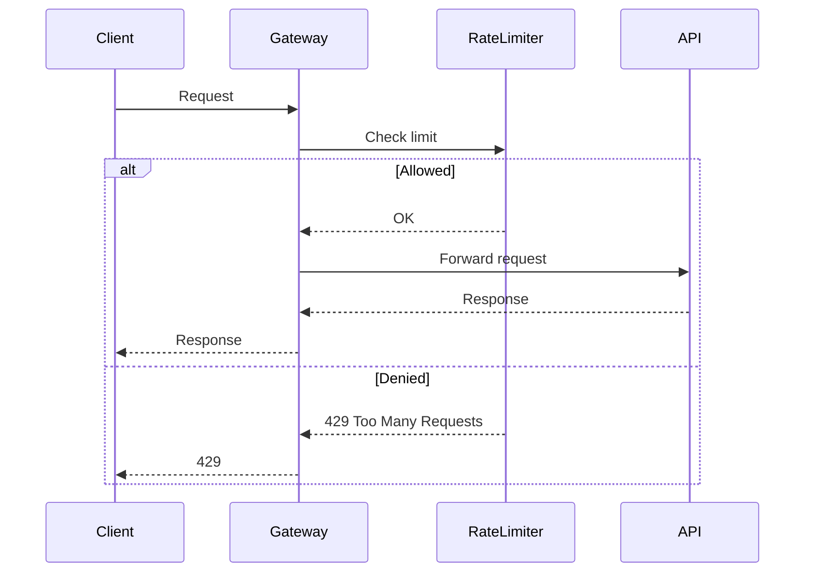

## Overview
Rate limiting controls the number of requests a client can make to an API within a time window, preventing abuse, ensuring fair resource allocation, and protecting against denial-of-service attacks. It's crucial for scalable systems handling high traffic.

## STAR Summary
**Situation:** At a fintech startup, our payment API was overwhelmed by bots during a promotional event, causing 50% downtime.  
**Task:** Implement robust rate limiting to handle 10k RPS while maintaining availability.  
**Action:** Deployed a distributed token bucket algorithm using Redis, with per-user and global limits.  
**Result:** Reduced abusive traffic by 95%, improved uptime to 99.9%, and enabled fair access for legitimate users.

## Detailed Explanation
Rate limiting algorithms manage request rates using different strategies:

- **Token Bucket:** Tokens are added to a bucket at a fixed rate; requests consume tokens. Allows bursts up to bucket size.
- **Leaky Bucket:** Requests are processed at a constant rate; excess requests are queued or dropped.
- **Fixed Window:** Counts requests in fixed time windows (e.g., 1 minute); resets at window end.
- **Sliding Window:** Uses rolling time windows for smoother rate enforcement.

In distributed systems, use shared storage like Redis for consistency across instances.

## Real-world Examples & Use Cases
- **APIs:** Twitter limits tweets per hour; Stripe limits API calls per second.
- **CDNs:** Cloudflare uses rate limiting to mitigate DDoS.
- **Microservices:** Prevent cascading failures by limiting inter-service calls.

## Code Examples
Java implementation of Token Bucket using Guava:

```java
import com.google.common.util.concurrent.RateLimiter;

public class TokenBucketRateLimiter {
    private final RateLimiter rateLimiter;

    public TokenBucketRateLimiter(double permitsPerSecond) {
        this.rateLimiter = RateLimiter.create(permitsPerSecond);
    }

    public boolean allowRequest() {
        return rateLimiter.tryAcquire();
    }
}

// Usage
TokenBucketRateLimiter limiter = new TokenBucketRateLimiter(10.0); // 10 req/sec
if (limiter.allowRequest()) {
    // Process request
} else {
    // Reject with 429
}
```

For distributed: Use Redis with Lua scripts for atomic operations.

## Data Models / Message Formats
Request log table:

| Field       | Type     | Description                  |
|-------------|----------|------------------------------|
| user_id     | string   | Client identifier            |
| timestamp   | long     | Request time (epoch ms)      |
| endpoint    | string   | API endpoint                 |
| status      | int      | HTTP status code             |

Rate limit response headers:
```
X-RateLimit-Limit: 100
X-RateLimit-Remaining: 50
X-RateLimit-Reset: 1634567890
```

## Journey / Sequence


## Common Pitfalls & Edge Cases
- **Clock Skew:** In distributed systems, synchronize clocks to avoid inconsistent windows.
- **Bursty Traffic:** Token bucket handles bursts better than leaky bucket.
- **Global vs Per-User:** Balance fairness with resource protection.
- **Edge Case:** Requests at window boundary; sliding window mitigates.

## Tools & Libraries
- **Java:** Guava RateLimiter, Resilience4j
- **Distributed:** Redis, Hazelcast
- **Frameworks:** Spring Cloud Gateway, Nginx

## Github-README Links & Related Topics
Related: [caching-strategies](../caching-strategies/), [load-balancing-and-routing](../load-balancing-and-routing/), [circuit-breaker-pattern](../circuit-breaker-pattern/), [microservices-architecture](../microservices-architecture/)

## References
- https://en.wikipedia.org/wiki/Rate_limiting
- https://stripe.com/docs/rate-limits
- https://redis.io/commands/INCR