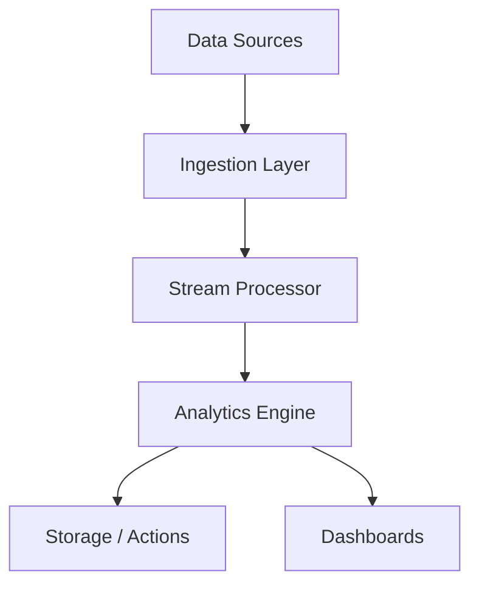

# Real-time Analytics

## Overview

Real-time analytics involves processing and analyzing data streams as they are generated, enabling immediate insights and actions without storing data first.

## Detailed Explanation

Real-time analytics processes data in motion using streaming platforms. Key components:

- **Data Ingestion**: Collecting from sources like IoT, logs.
- **Stream Processing**: Tools like Apache Kafka, Apache Flink.
- **Analytics Engine**: Real-time queries and ML.
- **Visualization**: Dashboards for immediate feedback.

Benefits: Faster decision-making, anomaly detection.

### Data Flow Diagram



## Real-world Examples & Use Cases

- **Fraud Detection**: Banks analyze transactions instantly.
- **E-commerce**: Personalized recommendations.
- **Social Media**: Trend analysis and content moderation.
- **IoT Monitoring**: Real-time sensor data analysis.

## Code Examples

### Apache Kafka Producer (Java)

```java
import org.apache.kafka.clients.producer.*;
import java.util.Properties;

public class KafkaProducerExample {
    public static void main(String[] args) {
        Properties props = new Properties();
        props.put("bootstrap.servers", "localhost:9092");
        props.put("key.serializer", "org.apache.kafka.common.serialization.StringSerializer");
        props.put("value.serializer", "org.apache.kafka.common.serialization.StringSerializer");

        Producer<String, String> producer = new KafkaProducer<>(props);
        ProducerRecord<String, String> record = new ProducerRecord<>("analytics-topic", "key", "Real-time data");
        producer.send(record);
        producer.close();
    }
}
```

### Simple Stream Processing (Python with Kafka)

```python
from kafka import KafkaConsumer

consumer = KafkaConsumer('analytics-topic', bootstrap_servers=['localhost:9092'])
for message in consumer:
    data = message.value.decode('utf-8')
    # Process data
    print(f"Processed: {data}")
    # Perform analytics
    if 'anomaly' in data:
        alert("Anomaly detected")
```

## References

- [Apache Kafka Documentation](https://kafka.apache.org/documentation/)
- [Real-time Analytics with Apache Spark](https://spark.apache.org/docs/latest/streaming-programming-guide.html)
- [AWS Kinesis](https://aws.amazon.com/kinesis/)
- [Google Cloud Dataflow](https://cloud.google.com/dataflow)

## Github-README Links & Related Topics

- [Event Streaming with Apache Kafka](event-streaming-with-apache-kafka/README.md)
- [Message Queues and Brokers](message-queues-and-brokers/README.md)
- [Monitoring and Logging](monitoring-and-logging/README.md)
- [Machine Learning in System Design](machine-learning-in-system-design/README.md)