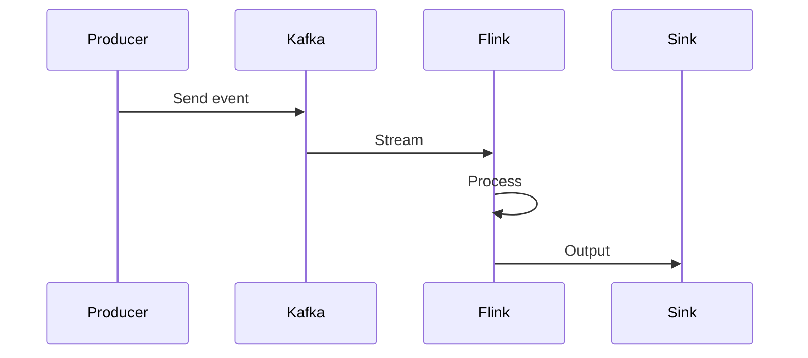

## Overview
Real-time data processing handles continuous data streams for immediate insights. Technologies like Kafka for messaging and Flink for computation enable low-latency analytics.

## STAR Summary
**Situation:** Batch processing delayed fraud detection by hours.  
**Task:** Implement real-time processing for sub-second alerts.  
**Action:** Used Kafka for ingestion, Flink for stream processing, alerting on anomalies.  
**Result:** Fraud detection in <1s, reduced losses by 30%.

## Detailed Explanation
- **Ingestion:** Kafka collects events.
- **Processing:** Flink applies transformations.
- **Storage:** Persist to databases or lakes.

## Real-world Examples & Use Cases
- Uber: Real-time ride matching.
- Netflix: Recommendation updates.

## Code Examples
### Kafka Producer in Java
```java
import org.apache.kafka.clients.producer.*;

Properties props = new Properties();
props.put("bootstrap.servers", "localhost:9092");
Producer<String, String> producer = new KafkaProducer<>(props);
producer.send(new ProducerRecord<>("topic", "key", "value"));
```

## Data Models / Message Formats
| Field | Type | Description |
|-------|------|-------------|
| eventId | String | Unique ID |
| timestamp | Long | Event time |
| payload | JSON | Data |

## Journey / Sequence


## Common Pitfalls & Edge Cases
- Message ordering.
- Backpressure handling.
- Exactly-once semantics.

## Tools & Libraries
- Kafka, Apache Flink, Kinesis.

## Github-README Links & Related Topics
Related: [[message-queues-and-kafka]], [[event-sourcing-and-cqrs]]

## References
- https://kafka.apache.org/