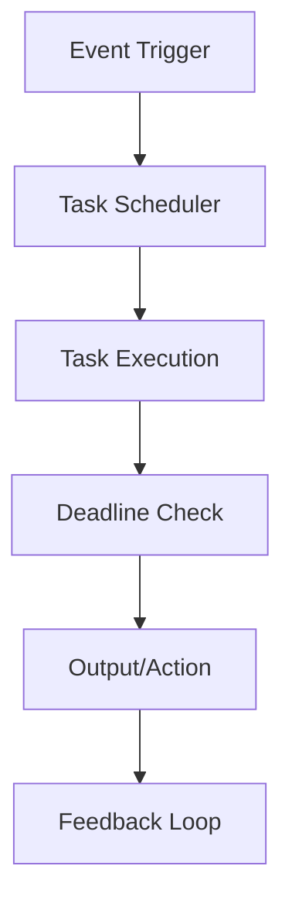

# Real-Time Systems

## Overview

Real-Time Systems are designed to process data and respond to events within strict time constraints. They ensure timely execution of tasks, critical for applications where delays can cause failures or safety issues.

## Detailed Explanation

### Key Components

1. **Task Scheduling**: Algorithms like Rate Monotonic Scheduling (RMS) or Earliest Deadline First (EDF) to prioritize tasks.

2. **Real-Time Operating Systems (RTOS)**: Kernels that provide deterministic timing and resource management.

3. **Fault Tolerance**: Mechanisms like redundancy and error recovery to handle failures without missing deadlines.

4. **Event Processing**: Handling asynchronous events with low latency using streams or queues.

5. **Resource Management**: Allocating CPU, memory, and I/O to meet timing requirements.

### Types of Real-Time Systems

- **Hard Real-Time**: Missing deadlines leads to catastrophic failures (e.g., avionics).
- **Soft Real-Time**: Occasional misses are tolerable but degrade performance (e.g., video streaming).
- **Firm Real-Time**: Deadlines are important but missing them renders results useless.



## Real-world Examples & Use Cases

- **Autonomous Vehicles**: Processing sensor data for immediate decisions.
- **Financial Trading**: High-frequency trading systems requiring microsecond responses.
- **Industrial Control**: Robotics and manufacturing automation.
- **Telecommunications**: Real-time voice and video communication.

## Code Examples

### Real-Time Task Simulation in Python

```python
import time
import threading

def real_time_task(task_id, deadline):
    start = time.time()
    # Simulate work
    time.sleep(0.1)
    end = time.time()
    if end - start > deadline:
        print(f"Task {task_id} missed deadline!")
    else:
        print(f"Task {task_id} completed on time.")

# Simulate multiple tasks
threads = []
for i in range(5):
    t = threading.Thread(target=real_time_task, args=(i, 0.15))
    threads.append(t)
    t.start()

for t in threads:
    t.join()
```

### Event Processing with Apache Kafka

```java
import org.apache.kafka.clients.consumer.ConsumerRecord;
import org.springframework.kafka.annotation.KafkaListener;
import org.springframework.stereotype.Service;

@Service
public class RealTimeProcessor {

    @KafkaListener(topics = "events", groupId = "real-time-group")
    public void process(ConsumerRecord<String, String> record) {
        long timestamp = System.currentTimeMillis();
        // Process event
        System.out.println("Processed event: " + record.value() + " at " + timestamp);
    }
}
```

## References

- [Real-Time Systems by Jane Liu](https://www.pearson.com/us/higher-education/program/Liu-Real-Time-Systems/PGM334025.html)
- [FreeRTOS Documentation](https://www.freertos.org/)
- [Kafka Streams Documentation](https://kafka.apache.org/documentation/streams/)

## Github-README Links & Related Topics

- [Event Streaming with Apache Kafka](./event-streaming-with-apache-kafka/README.md)
- [Distributed Tracing](./distributed-tracing/README.md)
- [Fault Tolerance in Distributed Systems](./fault-tolerance-in-distributed-systems/README.md)
- [Latency and Throughput](./latency-and-throughput/README.md)