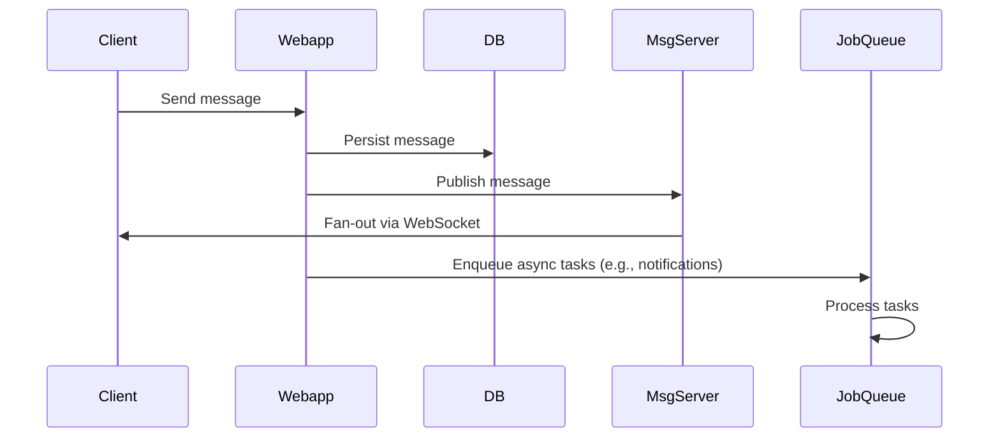

# Overview

Slack's messaging system is designed for real-time, scalable communication within and across organizations. It supports instant messaging, channels, threads, file sharing, and integrations, handling billions of messages daily. The architecture emphasizes low-latency delivery, high availability, and cross-workspace collaboration through shared channels. Key components include client-server communication via WebSockets, sharded databases for data partitioning, and event-driven systems for message fan-out.

# Detailed Explanation

## Architecture Overview

Slack employs a client-server model with the following core components:

- **Clients**: Web, desktop, and mobile apps connect via WebSockets for real-time updates.
- **Webapp Servers**: Handle HTTP requests, API calls, and business logic, interfacing with databases and job queues.
- **Real-time Message Servers**: Manage WebSocket connections, fan out messages, presence updates, and events to clients.
- **Databases**: Sharded by workspace for scalability, storing messages, channels, users, and metadata.
- **Job Queues**: Asynchronous processing for tasks like notifications and URL unfurls, using Kafka and Redis for durability and rate limiting.

```mermaid
graph TD
    A[Client] -->|WebSocket| B[Real-time Message Server]
    A -->|HTTP| C[Webapp Server]
    C --> D[Database Shard]
    C --> E[Job Queue (Kafka + Redis)]
    B --> F[Fan-out to Clients]
    E --> G[Async Tasks: Notifications, etc.]
```

## Message Flow

1. User sends a message via client API to webapp server.
2. Server validates, persists to database, and publishes to message server.
3. Message server fans out to all connected clients in the channel via WebSockets.
4. Asynchronous jobs handle side effects like push notifications.

For shared channels, messages are stored on the originating workspace's shard, with routing logic to access data across shards.

## Scalability and Reliability

- **Sharding**: Workspaces are assigned to database and server shards for horizontal scaling.
- **Job Queue**: Uses Kafka for durable buffering and Redis for execution, processing 1.4 billion jobs daily with rate limiting to prevent overload.
- **Fault Tolerance**: Replication, auto-scaling, and failure testing ensure availability.

# STAR Summary

- **Situation**: Slack needed to scale messaging for billions of messages while maintaining real-time delivery.
- **Task**: Design a system for instant, reliable messaging with cross-org collaboration.
- **Action**: Implemented WebSocket-based real-time servers, sharded databases, and Kafka-backed job queues.
- **Result**: Handles peak loads of 33,000 jobs/sec, supports shared channels across workspaces.

# Journey / Sequence



# Data Models / Message Formats

Messages are JSON objects stored in databases. Example structure:

| Field | Type | Description |
|-------|------|-------------|
| id | string | Unique message ID (e.g., 1234567890.123456) |
| type | string | Message type (e.g., "message") |
| channel | string | Channel ID |
| user | string | User ID |
| text | string | Message content |
| ts | float | Timestamp |
| thread_ts | float | Thread timestamp (if reply) |
| attachments | array | File or integration data |

Shared channels use a `shared_channels` table to link workspaces, overriding properties like name per workspace.

# Real-world Examples & Use Cases

- **Internal Collaboration**: Teams use channels for discussions, replacing email.
- **Shared Channels**: Cross-company collaboration, e.g., vendor-client projects without guest accounts.
- **Integrations**: Bots and apps post messages via APIs for notifications (e.g., CI/CD alerts).
- **Threads**: Organize conversations in busy channels, reducing noise.

# Code Examples

## Simple WebSocket Server for Real-time Messaging (Node.js)

```javascript
const WebSocket = require('ws');
const wss = new WebSocket.Server({ port: 8080 });

wss.on('connection', (ws) => {
  ws.on('message', (data) => {
    const message = JSON.parse(data);
    // Broadcast to all clients in channel
    wss.clients.forEach(client => {
      if (client.readyState === WebSocket.OPEN) {
        client.send(JSON.stringify(message));
      }
    });
  });
});

console.log('WebSocket server running on port 8080');
```

## Enqueue Job to Kafka (Pseudocode)

```python
from kafka import KafkaProducer

producer = KafkaProducer(bootstrap_servers='localhost:9092')
job = {'type': 'notification', 'user_id': 'U123', 'message': 'New message'}
producer.send('jobs', value=json.dumps(job).encode('utf-8'))
```

# Common Pitfalls & Edge Cases

- **Message Ordering**: Ensure timestamps and sequence IDs prevent out-of-order delivery.
- **Rate Limiting**: Prevent abuse; use job queues to throttle.
- **Cross-Workspace Access**: Shared channels require careful permission checks to avoid data leaks.
- **Scalability Bottlenecks**: Database sharding can lead to hot shards; monitor and rebalance.
- **Offline Messages**: Clients must sync missed messages on reconnect.

# Tools & Libraries

- **WebSockets**: For real-time client-server communication.
- **Kafka**: Durable message queuing for job processing.
- **Redis**: In-memory caching and queue execution.
- **Databases**: Sharded MySQL/PostgreSQL for persistence.
- **Consul**: Service discovery and configuration for rate limiting.

# References

- [Scaling Slack’s Job Queue](https://slack.engineering/scaling-slacks-job-queue/) - Details on Kafka and Redis integration.
- [How Slack Built Shared Channels](https://slack.engineering/how-slack-built-shared-channels/) - Architecture for cross-workspace messaging.
- [Slack API Documentation](https://api.slack.com/) - Official APIs for messaging.
- [High Scalability: Slack](http://highscalability.com/blog/2014/12/15/how-slack-built-their-architecture.html) - General architecture overview.

# Github-README Links & Related Topics

- [Event-Driven Architecture](../event-driven-architecture/)
- [Apache Kafka](../apache-kafka/)
- [Distributed Caching with Redis](../distributed-caching-with-redis/)
- [WebSocket Implementation](../websocket-implementation/)  # Assuming related topic exists
- [Database Sharding Strategies](../database-sharding-strategies/)