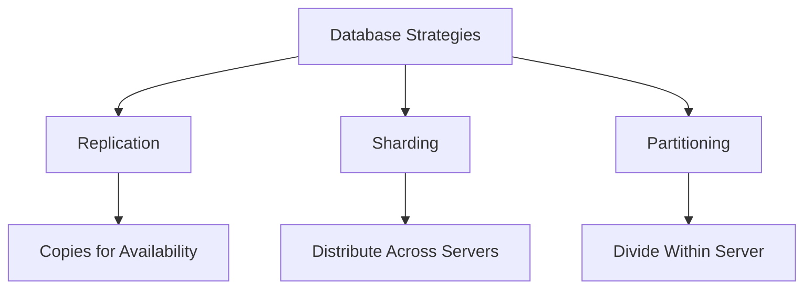

# Overview

In large-scale database systems, managing data growth and ensuring high availability, performance, and scalability is crucial. Replication, sharding, and partitioning are three fundamental strategies for distributing and managing data across databases. While they share the goal of improving database performance and reliability, they differ in approach and application:

- **Replication**: Creates multiple copies of data across servers for redundancy and read scalability.
- **Sharding**: Horizontally partitions data across multiple servers (nodes) to distribute load and enable massive scalability.
- **Partitioning**: Divides a single database table into smaller, more manageable pieces within the same server.

Understanding the differences helps in choosing the right strategy for specific use cases, such as handling high traffic, ensuring fault tolerance, or optimizing query performance.

# Detailed Explanation

## Replication

Replication involves creating and maintaining duplicate copies of data across multiple database servers. The primary goal is to improve availability, fault tolerance, and read performance by distributing read operations across replicas.

### Types of Replication
- **Master-Slave (Primary-Secondary)**: One master handles writes, slaves replicate data for reads. Slaves can promote to master if needed.
- **Master-Master**: Multiple masters allow writes on all nodes, with conflict resolution mechanisms.
- **Multi-Master**: Similar to master-master but with more complex synchronization.

### How It Works
Data changes on the primary server are logged and propagated to replicas asynchronously or synchronously. Synchronous replication ensures data consistency but may impact performance, while asynchronous allows for better performance at the cost of potential data lag.

### Benefits
- High availability and disaster recovery.
- Improved read performance by offloading queries to replicas.
- Fault tolerance: System continues operating if one replica fails.

### Challenges
- Increased storage costs due to data duplication.
- Potential for data inconsistencies in asynchronous setups.
- Complexity in managing conflicts in multi-master scenarios.

## Sharding

Sharding, also known as horizontal partitioning, splits a large database into smaller, independent pieces called shards, distributed across multiple servers. Each shard contains a subset of the data and operates independently.

### How Sharding Works
- **Shard Key**: A field (e.g., user ID) determines which shard stores a data row.
- **Shard Router**: Routes queries to the appropriate shard(s).
- **Shared-Nothing Architecture**: Shards don't share resources; each is self-contained.

### Sharding Methods
- **Range-Based Sharding**: Data is partitioned by ranges of the shard key (e.g., IDs 1-1000 on Shard 1).
- **Hash-Based Sharding**: A hash function distributes data evenly across shards.
- **Directory-Based Sharding**: A lookup table maps data to shards.
- **Geo-Sharding**: Data is sharded based on geographical location.

### Benefits
- Scales horizontally by adding more shards.
- Improves query performance by reducing data per server.
- Fault isolation: Failure of one shard doesn't affect others.

### Challenges
- Complex query routing and aggregation across shards.
- Rebalancing shards as data grows.
- Potential for hotspots if shard key isn't chosen well.

## Partitioning

Partitioning divides a large table into smaller, more manageable segments called partitions, all stored on the same server. Unlike sharding, partitions share the same physical resources.

### Types of Partitioning
- **Horizontal Partitioning**: Splits rows into partitions (e.g., by date ranges).
- **Vertical Partitioning**: Splits columns into separate tables (e.g., frequently accessed columns in one partition).

### How It Works
Partitions are defined by a partition key. The database automatically routes queries to the relevant partition, improving performance for targeted queries.

### Benefits
- Easier maintenance and backup of individual partitions.
- Improved query performance for partitioned data.
- Logical organization of data.

### Challenges
- Limited scalability compared to sharding (still bound to one server).
- Partitioning doesn't address hardware limitations directly.

## Key Differences

| Aspect          | Replication                          | Sharding                              | Partitioning                          |
|-----------------|--------------------------------------|---------------------------------------|---------------------------------------|
| **Purpose**    | Redundancy and read scalability     | Horizontal scalability               | Logical data organization            |
| **Data Copies**| Multiple identical copies           | Unique subsets across servers        | Subsets within one server            |
| **Scalability**| Vertical (more powerful servers) or limited horizontal | Horizontal (add servers)             | Vertical (within server)             |
| **Fault Tolerance** | High (replicas take over)       | Medium (shard failure isolates issues)| Low (single server failure affects all)|
| **Query Complexity** | Simple (reads from any replica)  | Complex (route to specific shards)   | Moderate (automatic routing)         |
| **Use Case**   | High availability, read-heavy loads | Massive datasets, global distribution| Large tables, time-based data        |



# Real-world Examples & Use Cases

## Replication
- **Amazon RDS Read Replicas**: Used for offloading read traffic from the primary database, improving performance for applications like e-commerce sites.
- **Financial Systems**: Ensures data consistency and availability for transaction logs, where downtime is costly.
- **Content Delivery Networks (CDNs)**: Replicate static content across global servers for faster access.

## Sharding
- **MongoDB Atlas**: Shards large collections (e.g., user data for social media platforms) across clusters to handle billions of documents.
- **Uber's Ride Data**: Shards trip data by geographic regions and time to manage real-time queries for millions of rides.
- **Instagram's Photo Storage**: Shards user photos and metadata across servers to scale with user growth.

## Partitioning
- **PostgreSQL Table Partitioning**: Partition sales data by month to improve query performance for historical reports.
- **E-commerce Order Tables**: Partition by customer ID or order date to speed up searches in large datasets.
- **Log Files in ELK Stack**: Partition logs by date for efficient archiving and querying.

# Code Examples

## Replication (PostgreSQL Streaming Replication)
```sql
-- On Master: Enable replication
ALTER SYSTEM SET wal_level = replica;
ALTER SYSTEM SET max_wal_senders = 3;

-- On Replica: Configure recovery
standby_mode = 'on'
primary_conninfo = 'host=master_ip port=5432 user=replicator'
```

## Sharding (MongoDB)
```javascript
// Enable sharding on database
sh.enableSharding("mydb")

// Shard a collection with hashed sharding
db.adminCommand({ shardCollection: "mydb.collection", key: { _id: "hashed" } })

// Insert data - MongoDB routes automatically
db.collection.insertOne({ _id: 1, data: "example" })
```

## Partitioning (MySQL Range Partitioning)
```sql
CREATE TABLE sales (
    id INT NOT NULL,
    sale_date DATE NOT NULL,
    amount DECIMAL(10,2)
) PARTITION BY RANGE (YEAR(sale_date)) (
    PARTITION p2020 VALUES LESS THAN (2021),
    PARTITION p2021 VALUES LESS THAN (2022),
    PARTITION p2022 VALUES LESS THAN (2023)
);

-- Query automatically targets relevant partition
SELECT * FROM sales WHERE sale_date BETWEEN '2021-01-01' AND '2021-12-31';
```

# References
- [AWS: What is Database Sharding?](https://aws.amazon.com/what-is/database-sharding/)
- [AWS: What is Database Replication?](https://aws.amazon.com/what-is/database-replication/)
- [GeeksforGeeks: Database Sharding vs Partitioning](https://www.geeksforgeeks.org/database-sharding-vs-partitioning/)
- [GeeksforGeeks: Partitioning Method in DBMS](https://www.geeksforgeeks.org/partitioning-method-in-dbms/)
- [GeeksforGeeks: Database Replication and Their Types](https://www.geeksforgeeks.org/database-replication-and-their-types/)
- [MongoDB Documentation: Sharding](https://www.mongodb.com/docs/manual/sharding/)

# Github-README Links & Related Topics
- [Data Partitioning Strategies](../data-partitioning-strategies/)
- [Database Sharding Strategies](../database-sharding-strategies/)
- [Distributed Transactions](../distributed-transactions/)
- [Load Balancing and Routing](../load-balancing-and-routing/)
- [Fault Tolerance Patterns](../fault-tolerance-patterns/)