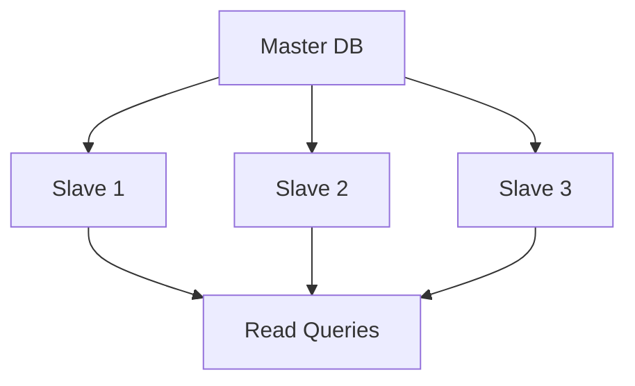
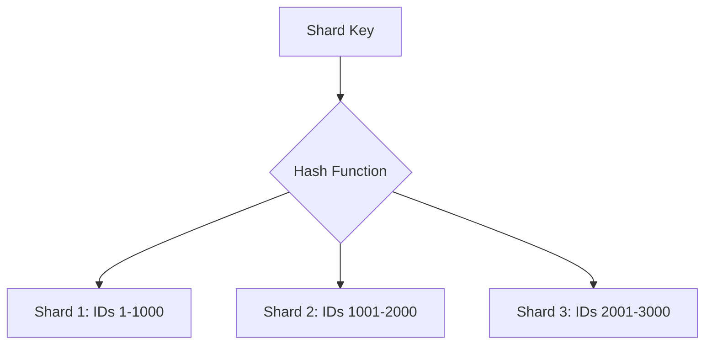

## Overview

Replication, sharding, and partitioning are fundamental techniques for scaling databases and ensuring data availability, consistency, and performance. Replication involves creating copies of data across multiple nodes, sharding distributes data across different servers, and partitioning divides data within a single database for better management.

## Detailed Explanation

### Replication
Replication creates multiple copies of the same data across different servers. It improves read performance and provides fault tolerance.

**Types:**
- Master-Slave: Writes go to master, reads from slaves
- Master-Master: Writes to any node, syncs between masters
- Multi-Master: Similar to master-master but with conflict resolution



### Sharding
Sharding (or horizontal partitioning) splits data across multiple databases or servers based on a shard key.

**Strategies:**
- Hash-based: Distribute evenly using hash of key
- Range-based: Split by value ranges
- Directory-based: Use lookup table for shard location



### Partitioning
Partitioning divides a single database table into smaller, more manageable pieces within the same server.

**Types:**
- Horizontal: Rows split across partitions
- Vertical: Columns split across partitions
- Composite: Combination of both

**Key Differences:**

| Aspect | Replication | Sharding | Partitioning |
|--------|-------------|----------|--------------|
| Data Copies | Multiple | Single (distributed) | Single (divided) |
| Scalability | Read scaling | Write scaling | Management |
| Consistency | Eventual | Strong (per shard) | Strong |
| Complexity | Medium | High | Low |

## Real-world Examples & Use Cases

### Replication
- **MySQL Replication**: Used in read-heavy applications like social media feeds
- **PostgreSQL Streaming Replication**: For high availability in financial systems
- **MongoDB Replica Sets**: Automatic failover in e-commerce platforms

### Sharding
- **Instagram**: Shards user data by user ID for photo storage
- **Uber**: Shards trip data by geographic regions
- **Twitter**: Shards tweets by user ID for timeline queries

### Partitioning
- **Time-series Data**: Partition sensor data by date ranges
- **E-commerce**: Partition order history by year
- **Logging Systems**: Partition logs by application or time

## Code Examples

### MySQL Replication Setup
```sql
-- On Master
CHANGE MASTER TO
  MASTER_HOST='master_host',
  MASTER_USER='repl_user',
  MASTER_PASSWORD='password',
  MASTER_LOG_FILE='mysql-bin.000001',
  MASTER_LOG_POS=0;

START SLAVE;
```

### MongoDB Sharding
```javascript
// Enable sharding on database
sh.enableSharding("mydb")

// Shard collection by user_id
sh.shardCollection("mydb.users", { "user_id": 1 })
```

### PostgreSQL Table Partitioning
```sql
-- Create partitioned table
CREATE TABLE sales (
    id SERIAL,
    sale_date DATE,
    amount DECIMAL
) PARTITION BY RANGE (sale_date);

-- Create partitions
CREATE TABLE sales_2023 PARTITION OF sales
    FOR VALUES FROM ('2023-01-01') TO ('2024-01-01');

CREATE TABLE sales_2024 PARTITION OF sales
    FOR VALUES FROM ('2024-01-01') TO ('2025-01-01');
```

## Common Pitfalls & Edge Cases

- **Replication Lag**: Monitor and handle eventual consistency issues
- **Shard Key Selection**: Poor choice leads to hotspots
- **Cross-shard Queries**: Expensive and complex
- **Rebalancing**: Moving data between shards during growth
- **Backup/Restore**: More complex with distributed data

## References

- [MySQL Replication Documentation](https://dev.mysql.com/doc/refman/8.0/en/replication.html)
- [MongoDB Sharding](https://docs.mongodb.com/manual/sharding/)
- [PostgreSQL Partitioning](https://www.postgresql.org/docs/current/ddl-partitioning.html)
- [Database Sharding: Concepts and Best Practices](https://www.cockroachlabs.com/blog/database-sharding/)

## Github-README Links & Related Topics

- [database-replication-strategies](../database-replication-strategies/)
- [database-sharding-strategies](../database-sharding-strategies/)
- [cap-theorem-and-distributed-systems](../cap-theorem-and-distributed-systems/)
- [high-scalability-patterns](../high-scalability-patterns/)
