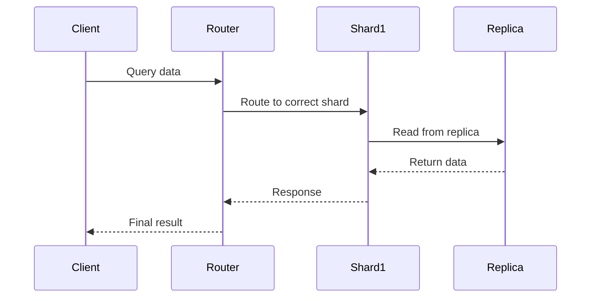

# Overview

This topic explores data distribution strategies in databases: replication for redundancy and read scalability, sharding for write scalability, and partitioning for manageability. Understanding these is crucial for designing scalable systems.

# STAR Summary

**SITUATION:** Databases face bottlenecks as data grows, requiring strategies to maintain performance.

**TASK:** Choose appropriate data distribution methods based on read/write patterns and consistency needs.

**ACTION:** Implement replication for high availability, sharding for horizontal scaling, and partitioning for logical data organization.

**RESULT:** Achieve scalable, fault-tolerant databases that handle large datasets efficiently.

# Detailed Explanation

**Replication:** Copies data across multiple nodes for redundancy. Types: Master-Slave (reads from slaves), Master-Master (bidirectional). Improves read performance and availability but can complicate writes due to consistency (e.g., eventual consistency in async replication).

**Sharding:** Splits data across multiple databases (shards) based on a key (e.g., user ID). Each shard is independent, enabling horizontal scaling for writes. Challenges: Cross-shard queries, rebalancing, data consistency.

**Partitioning:** Divides a table into smaller, manageable pieces within the same database. Types: Horizontal (rows), Vertical (columns). Improves query performance and maintenance but doesn't scale across machines like sharding.

Key Differences:

- Replication: Multiple copies, same data.
- Sharding: Different data subsets on different nodes.
- Partitioning: Logical division within a single system.

Use Cases: Replication for read-heavy apps; Sharding for massive scale; Partitioning for large tables.

# Real-world Examples & Use Cases

- **Replication:** Facebook uses replication for global data distribution, ensuring low-latency reads.
- **Sharding:** Instagram shards user data by ID for billions of users.
- **Partitioning:** E-commerce sites partition order tables by date for efficient archiving.

Case Study: Twitter's sharding for tweets, with replication for redundancy.

# Message Formats / Data Models

Example Sharding Key Distribution:

| Shard ID | Key Range | Node |
|----------|-----------|------|
| 1 | 1-1000 | Node A |
| 2 | 1001-2000 | Node B |

Replication Log Format (Simplified):

```json
{
  "operation": "INSERT",
  "table": "users",
  "data": {"id": 123, "name": "John"},
  "timestamp": "2025-09-26T10:00:00Z"
}
```

# Journey of a Data Query



# Common Pitfalls & Edge Cases

- **Hot Shards:** Uneven data distribution leading to overload.
- **Replication Lag:** Stale reads in async replication.
- **Cross-Shard Joins:** Complex queries spanning shards.
- **Rebalancing:** Data migration during shard changes.

# Tools & Libraries

- **Databases:** PostgreSQL for partitioning, MongoDB for sharding, MySQL for replication.
- **Tools:** Apache Kafka for replication streams.

Sample Code Snippet (Java - Sharding Logic):

```java
public class ShardRouter {
    public String getShard(int userId) {
        return "shard_" + (userId % 10);
    }
}
```

# Github-README Links & Related Topics

[[Database Sharding Strategies]]
[[Replication Strategies]]
[[Distributed Databases]]

# References

- https://www.mongodb.com/docs/manual/sharding/
- https://dev.mysql.com/doc/refman/8.0/en/replication.html
