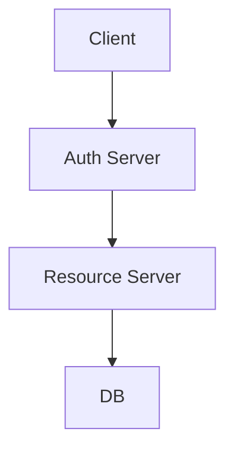
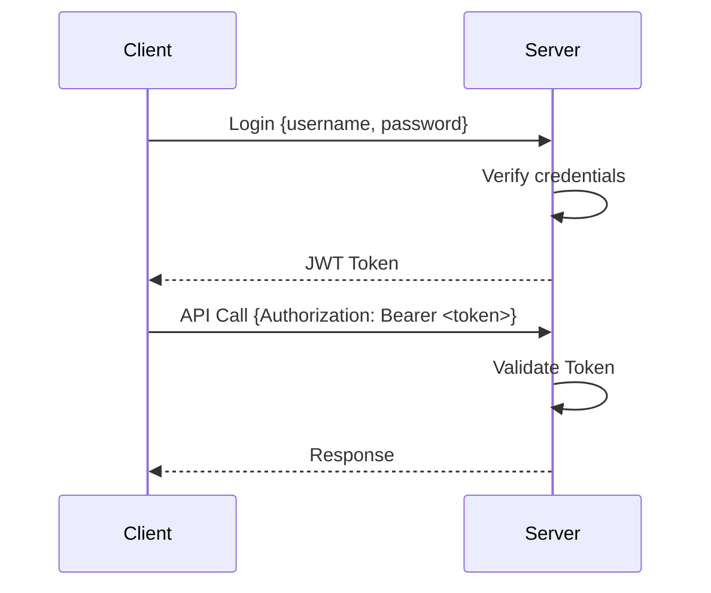

## Overview
Authentication verifies identity, authorization checks permissions. Tokens (JWT, OAuth) enable stateless auth. Secure systems use HTTPS, encryption, and least privilege.

## STAR Summary
**Situation:** Secured a banking API against breaches.  
**Task:** Implement robust auth.  
**Action:** Used JWT with RSA signing, role-based access.  
**Result:** Zero incidents, compliant with PCI-DSS.

## Detailed Explanation
AuthN: Passwords, biometrics, MFA. AuthZ: RBAC/ABAC. Tokens: JWT (header.payload.signature), OAuth2 flows. Threats: XSS, CSRF, token theft.

### High-Level Design (HLD)


### Capacity Planning
- 1M auth req/s, latency <100ms.

### Tradeoffs
- Security vs Usability: MFA adds friction but improves security.

### API Design
POST /login {username, password} -> JWT
GET /protected (with Bearer token)

### Deployment Notes
Use HTTPS, rotate secrets.

## Real-world Examples & Use Cases
- OAuth in Google login.
- JWT in microservices.

## Code Examples
### JWT Generation (Java)
```java
import io.jsonwebtoken.Jwts;
import io.jsonwebtoken.SignatureAlgorithm;
import java.util.Date;

public class JWTUtil {
    private static final String SECRET = "secret";

    public static String generateToken(String username) {
        return Jwts.builder()
                .setSubject(username)
                .setIssuedAt(new Date())
                .setExpiration(new Date(System.currentTimeMillis() + 86400000))
                .signWith(SignatureAlgorithm.HS256, SECRET)
                .compact();
    }
}
```
Dependency: `io.jsonwebtoken:jjwt:0.9.1`

## Data Models / Message Formats
### JWT Payload
```json
{
  "sub": "user123",
  "roles": ["admin"],
  "exp": 1638360000
}
```

## Journey / Sequence


## Common Pitfalls & Edge Cases
- Token expiration: Refresh tokens.
- Secret leakage: Use KMS.
- Man-in-the-middle: Always HTTPS.

## Tools & Libraries
- Java: Spring Security, JJWT.
- OAuth: Keycloak.

## Github-README Links & Related Topics
Related: [api-design-rest-grpc-openapi](../api-design-rest-grpc-openapi/README.md), [system-design-basics](../system-design-basics/README.md)

## References
- https://tools.ietf.org/html/rfc7519 (JWT)
- https://oauth.net/2/
- "Web Application Security" by OWASP.