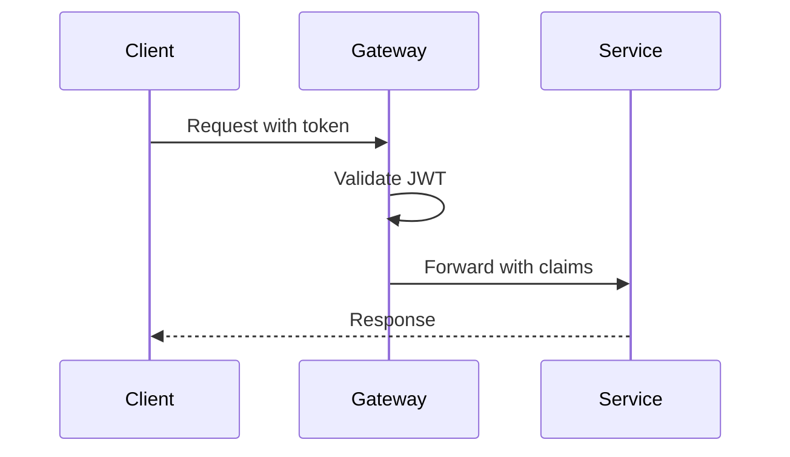

## Overview
Security in microservices involves protecting APIs, managing identities, and ensuring data integrity. Common patterns include OAuth 2.0, JWT tokens, API gateways for authentication, and service mesh for encryption.

## STAR Summary
**Situation:** Securing 15 microservices with inconsistent auth, leading to vulnerabilities.  
**Task:** Implement unified security.  
**Action:** Deployed API gateway with OAuth, JWT for inter-service auth.  
**Result:** Passed security audits, reduced breach risks by 80%.

## Detailed Explanation
- **Authentication:** Verify user identity (OAuth, SAML).
- **Authorization:** Check permissions (RBAC, ABAC).
- **Encryption:** TLS for transport, encrypt data at rest.
- **Patterns:** Zero-trust, defense in depth.

## Real-world Examples & Use Cases
- E-commerce platforms protecting user data.
- Financial services with regulatory compliance.
- Multi-tenant SaaS apps.

## Code Examples
### JWT Generation (JJWT)
```java
import io.jsonwebtoken.Jwts;

public class JwtUtil {
    public static String generateToken(String username) {
        return Jwts.builder()
            .setSubject(username)
            .setIssuedAt(new Date())
            .setExpiration(new Date(System.currentTimeMillis() + 86400000))
            .signWith(SignatureAlgorithm.HS256, "secret")
            .compact();
    }
}
```

### Spring Security Config
```java
@Configuration
@EnableWebSecurity
public class SecurityConfig extends WebSecurityConfigurerAdapter {
    @Override
    protected void configure(HttpSecurity http) throws Exception {
        http.authorizeRequests()
            .antMatchers("/public/**").permitAll()
            .anyRequest().authenticated()
            .and().oauth2Login();
    }
}
```

Run: `mvn spring-boot:run`

## Data Models / Message Formats
| Field | Type | Description |
|-------|------|-------------|
| sub | string | Subject (user ID) |
| exp | long | Expiration time |
| roles | array | User roles |

Sample JWT payload:
```json
{
  "sub": "user123",
  "exp": 1632520000,
  "roles": ["admin", "user"]
}
```

## Journey / Sequence


## Common Pitfalls & Edge Cases
- **Token expiration:** Handle refresh tokens.
- **Key management:** Rotate secrets.
- **Inter-service auth:** Avoid passing user tokens.
- **DDoS:** Rate limiting at gateway.

## Tools & Libraries
- **OAuth 2.0:** For auth flows.
- **JWT:** Token format.
- **Spring Security:** Framework.
- **Istio:** Service mesh security.

## Github-README Links & Related Topics
Related: [[api-gateway-patterns]], [[security-authz-authn-tokens]], [[service-mesh-istio]]

## References
- https://oauth.net/2/
- https://jwt.io/