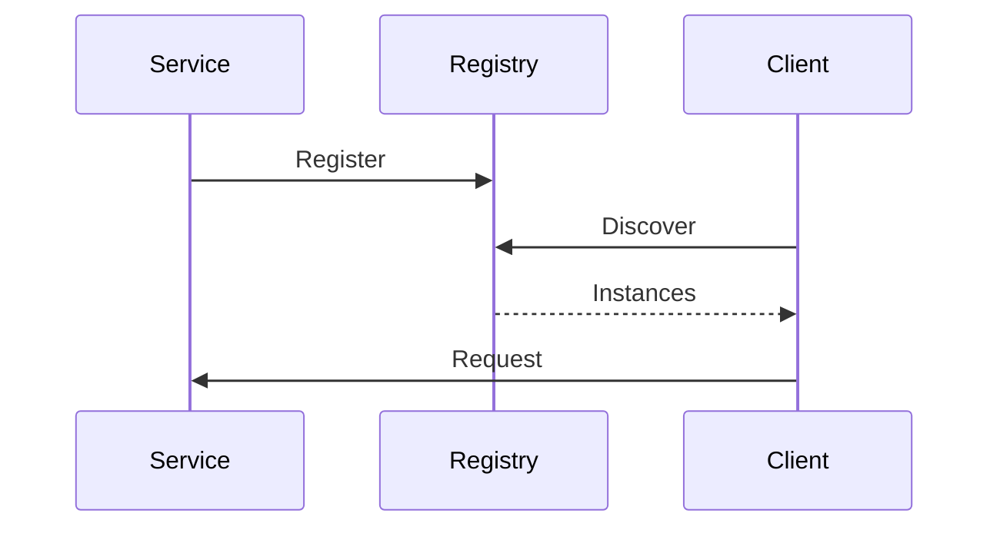

## Overview
Service discovery enables dynamic location of services in microservices architectures. Patterns include client-side (Eureka) and server-side (DNS) discovery for load balancing and failover.

## STAR Summary
**Situation:** Services scaled dynamically, IPs changed frequently.  
**Task:** Enable seamless communication.  
**Action:** Deployed Eureka for service registry.  
**Result:** Zero downtime during scaling, improved resilience.

## Detailed Explanation
- **Client-Side:** Services query registry for instances; e.g., Eureka.
- **Server-Side:** Load balancer queries registry; e.g., Kubernetes DNS.
- Tradeoffs: Client-side for control; server-side for simplicity.

## Real-world Examples & Use Cases
- Cloud apps: Auto-discover instances in auto-scaling groups.
- IoT: Devices register with central registry.
- APIs: Gateway discovers backend services.

## Code Examples
Eureka client in Spring Boot:
```java
@SpringBootApplication
@EnableEurekaClient
public class ServiceApplication {
    public static void main(String[] args) {
        SpringApplication.run(ServiceApplication.class, args);
    }
}

@RestController
public class HelloController {
    @GetMapping("/hello")
    public String hello() {
        return "Hello from " + InetAddress.getLocalHost().getHostName();
    }
}
```

Discovery call:
```java
@Autowired
private DiscoveryClient discoveryClient;

public void callService() {
    List<ServiceInstance> instances = discoveryClient.getInstances("other-service");
    // Call instance
}
```

## Data Models / Message Formats
| Service Name | Instances | Health |
|--------------|-----------|--------|
| order-service | [ip1:8080, ip2:8080] | UP |

## Journey / Sequence


## Common Pitfalls & Edge Cases
- Stale registrations; implement health checks.
- Network partitions; use multiple registries.
- Security; encrypt communications.

## Tools & Libraries
- Netflix Eureka.
- Consul by HashiCorp.
- Kubernetes service discovery.

## Github-README Links & Related Topics
Related: [[microservices-architecture]], [[load-balancing-and-routing]], [[container-orchestration-k8s]]

## References
- https://microservices.io/patterns/service-discovery.html
- https://github.com/Netflix/eureka