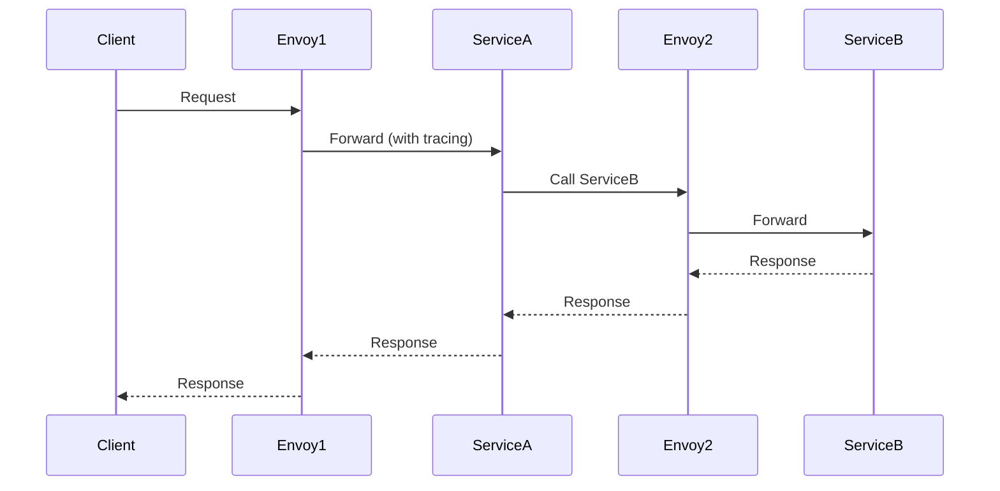

## Overview
Service mesh like Istio provides a dedicated infrastructure layer for handling service-to-service communication in microservices, offering traffic management, security, and observability without code changes.

## STAR Summary
**Situation:** A microservices platform faced unreliable inter-service calls and poor visibility.  
**Task:** Implement service mesh for 20+ services.  
**Action:** Deployed Istio on Kubernetes with Envoy sidecars.  
**Result:** Reduced latency by 30%, added circuit breakers, and enabled detailed tracing.

## Detailed Explanation
- **Components:** Data plane (Envoy proxies), Control plane (Pilot, Citadel, Galley).
- **Features:** Load balancing, circuit breaking, retries, mTLS, observability.
- **Traffic Management:** Virtual services, destination rules, gateways.

## Real-world Examples & Use Cases
- **E-commerce:** Route traffic for A/B testing.
- **Financial:** Secure inter-service communication with mTLS.
- **Cloud-native:** Observability in Kubernetes clusters.

## Code Examples
Istio VirtualService YAML:

```yaml
apiVersion: networking.istio.io/v1beta1
kind: VirtualService
metadata:
  name: reviews
spec:
  http:
  - route:
    - destination:
        host: reviews
        subset: v1
      weight: 90
    - destination:
        host: reviews
        subset: v2
      weight: 10
```

Java service with Istio annotations (no code change needed, but example):

```java
@RestController
public class ReviewController {
    @GetMapping("/reviews")
    public String getReviews() {
        return "Reviews from v1"; // Istio routes based on config
    }
}
```

## Data Models / Message Formats
Service graph (JSON):

```json
{
  "services": [
    {"name": "frontend", "calls": ["auth", "catalog"]},
    {"name": "auth", "calls": ["db"]}
  ]
}
```

## Journey / Sequence


## Common Pitfalls & Edge Cases
- **Performance Overhead:** Sidecars add latency; optimize with resource limits.
- **Configuration Complexity:** YAML sprawl; use GitOps.
- **Security:** Ensure mTLS is enabled; rotate certificates.
- **Edge Case:** Service mesh failures; design for fallback.

## Tools & Libraries
- **Istio:** istioctl, Kiali (dashboard)
- **Alternatives:** Linkerd, Consul
- **Integration:** Kubernetes, Helm

## Github-README Links & Related Topics
Related: [[microservices-architecture]], [[observability-logs-metrics-traces]], [[load-balancing-and-routing]], [[circuit-breaker-pattern]]

## References
- https://istio.io/
- https://istio.io/latest/docs/concepts/what-is-istio/
- https://kubernetes.io/docs/concepts/services-networking/service-mesh/