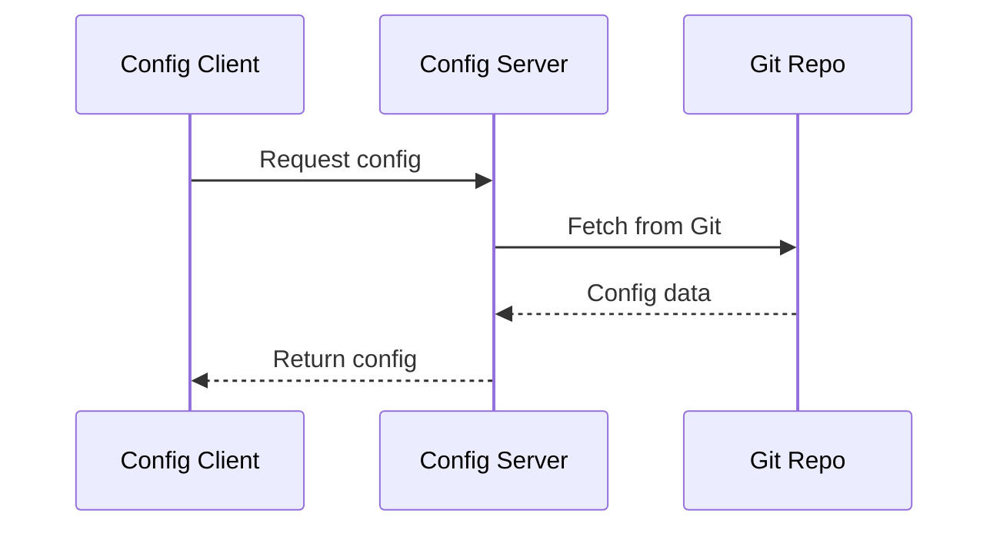

# Spring Cloud Config

## Overview

Spring Cloud Config provides server and client-side support for externalized configuration in distributed systems. It allows centralized management of application configuration properties across multiple environments.

## Detailed Explanation

The Config Server serves configuration from a Git repository or other backends. Clients fetch configuration at startup. Supports profiles, encryption, and dynamic refresh.

### Components

- **Config Server**: Serves configuration from Git, SVN, etc.
- **Config Client**: Integrates with Spring applications to fetch config.
- **Refresh Mechanism**: Actuator endpoint to refresh config without restart.

### Flow Diagram



## Real-world Examples & Use Cases

- Managing configuration for multiple microservices in different environments (dev, staging, prod).
- Centralized secrets management with encryption.
- Dynamic configuration updates in running applications.

## Code Examples

### Config Server

```java
@SpringBootApplication
@EnableConfigServer
public class ConfigServerApplication {
    public static void main(String[] args) {
        SpringApplication.run(ConfigServerApplication.class, args);
    }
}
```

### application.yml for Server

```yaml
server:
  port: 8888
spring:
  cloud:
    config:
      server:
        git:
          uri: https://github.com/myorg/config-repo
```

### Config Client

```java
@SpringBootApplication
public class ConfigClientApplication {
    public static void main(String[] args) {
        SpringApplication.run(ConfigClientApplication.class, args);
    }
}
```

## References

- [Spring Cloud Config Documentation](https://spring.io/projects/spring-cloud-config)
- [Official Guide](https://docs.spring.io/spring-cloud-config/docs/current/reference/html/)

## Github-README Links & Related Topics

- [Configuration Management](../configuration-management/README.md)
- [Microservices Architecture](../microservices-architecture/README.md)
- [Eureka Service Discovery](../eureka-service-discovery/README.md)