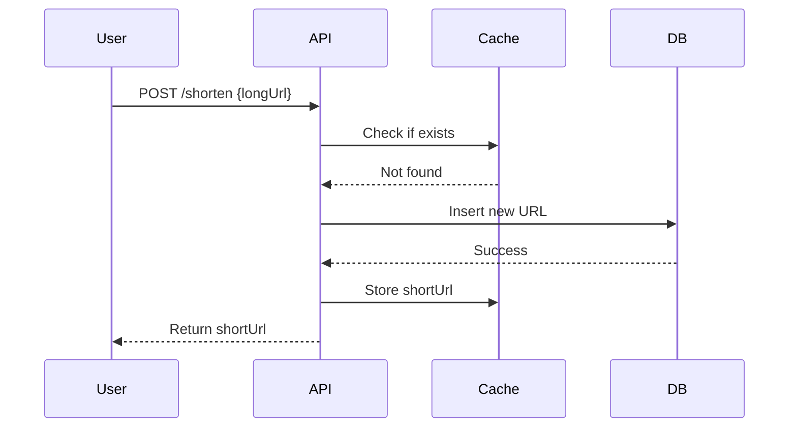

# System Design Interview Cases

## Overview
System design interviews at MAANG focus on designing scalable, reliable systems. This topic covers canonical cases like URL shortener, rate limiter, news feed, and chat system. Emphasizes HLD, capacity planning, tradeoffs, and API design.

## STAR Summary
**Situation:** Designed a URL shortener for a startup handling millions of requests.  
**Task:** Ensure high availability, low latency, and scalability.  
**Action:** Used hash-based shortening, Redis for caching, and database sharding.  
**Result:** System handled 10M requests/day with <100ms latency.

## Detailed Explanation
Key principles: Scalability (horizontal/vertical), Reliability (fault tolerance), Performance (latency/throughput), Security. Use CAP theorem for consistency tradeoffs. Design APIs with REST/GraphQL, estimate capacity (e.g., 1M users, 10 req/user/day = 10M req/day).

Canonical prompts:
1. Design a URL shortener.
2. Design a rate limiter.
3. Design a news feed system.
4. Design a chat application.

### High-Level Design (HLD)
```mermaid
graph TD
    A[Client] --> B[Load Balancer]
    B --> C[API Gateway]
    C --> D[Application Servers]
    D --> E[Cache (Redis)]
    D --> F[Database (Sharded)]
```

### Capacity Planning
- 1B URLs, 100M req/day, 1000 req/s.
- Storage: 1KB/URL * 1B = 1TB.
- Throughput: 1000 req/s, latency <50ms.

### Tradeoffs
- Consistency vs Availability: Eventual consistency for reads.
- Cost vs Performance: Sharding increases complexity but scales.

### API Design
POST /shorten {url: string} -> {shortUrl: string}
GET /expand/{shortUrl} -> {url: string}

### Deployment Notes
Use Kubernetes for scaling, CDN for global distribution.

## Real-world Examples & Use Cases
- Twitter's tweet system (news feed).
- Bitly (URL shortener).
- Stripe's rate limiting.
- WhatsApp (chat).

## Code Examples
### Simple URL Shortener (Java with in-memory store)
```java
import java.util.HashMap;
import java.util.Random;

public class URLShortener {
    private HashMap<String, String> urlMap = new HashMap<>();
    private HashMap<String, String> shortMap = new HashMap<>();
    private String chars = "abcdefghijklmnopqrstuvwxyzABCDEFGHIJKLMNOPQRSTUVWXYZ0123456789";
    private Random rand = new Random();

    public String shorten(String longUrl) {
        if (shortMap.containsKey(longUrl)) return shortMap.get(longUrl);
        String shortUrl;
        do {
            shortUrl = generateShort();
        } while (urlMap.containsKey(shortUrl));
        urlMap.put(shortUrl, longUrl);
        shortMap.put(longUrl, shortUrl);
        return shortUrl;
    }

    public String expand(String shortUrl) {
        return urlMap.get(shortUrl);
    }

    private String generateShort() {
        StringBuilder sb = new StringBuilder();
        for (int i = 0; i < 6; i++) {
            sb.append(chars.charAt(rand.nextInt(chars.length())));
        }
        return sb.toString();
    }
}
```
Run: `javac URLShortener.java && java -cp . URLShortener`

## Data Models / Message Formats
### URL Entity
```json
{
  "shortUrl": "abc123",
  "longUrl": "https://example.com",
  "createdAt": "2023-01-01T00:00:00Z",
  "expiresAt": null
}
```

## Journey / Sequence


## Common Pitfalls & Edge Cases
- Collision handling in shortening.
- Expiration and cleanup.
- DDoS on short URLs.
- International URLs (encoding).

## Tools & Libraries
- Java: Spring Boot for APIs, Redis for caching, PostgreSQL for DB.
- Libraries: Jedis (Redis client), Hibernate (ORM).

## Github-README Links & Related Topics
[[system-design-basics]], [[caching-strategies]], [[database-design-and-indexing]], [[load-balancing-and-routing]]

## References
- "Designing Data-Intensive Applications" by Martin Kleppmann.
- https://github.com/donnemartin/system-design-primer
- https://www.systemdesigninterview.com/
