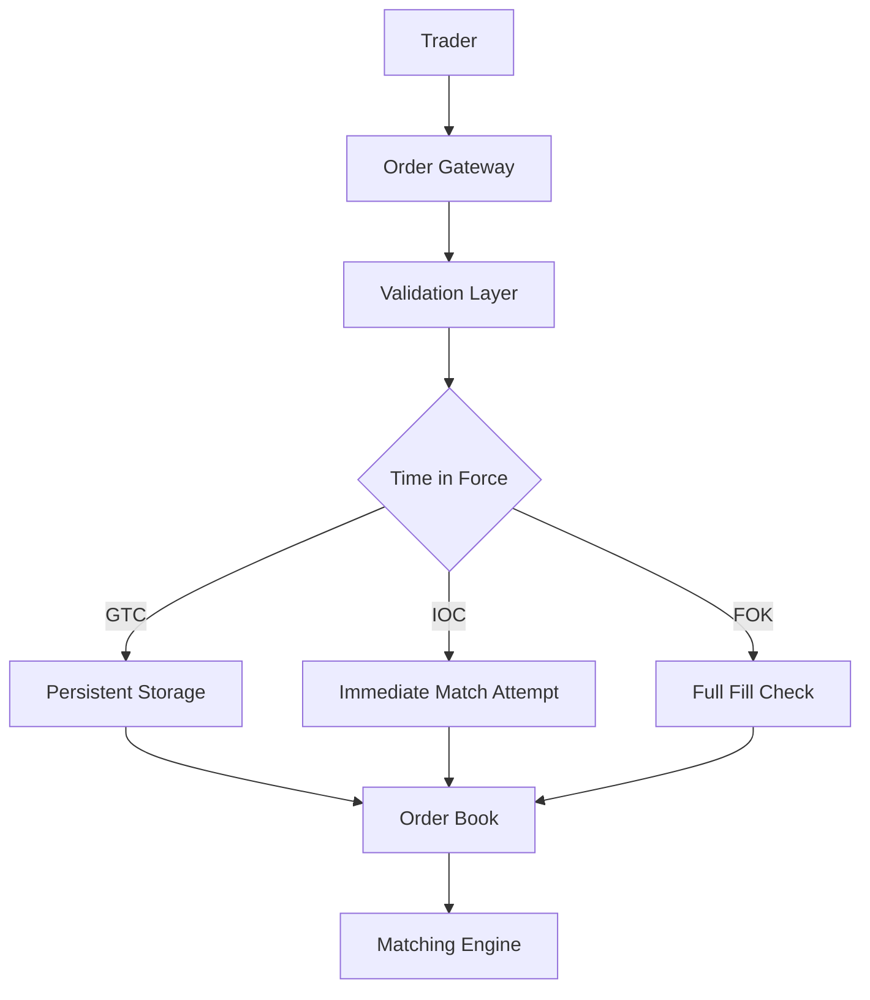
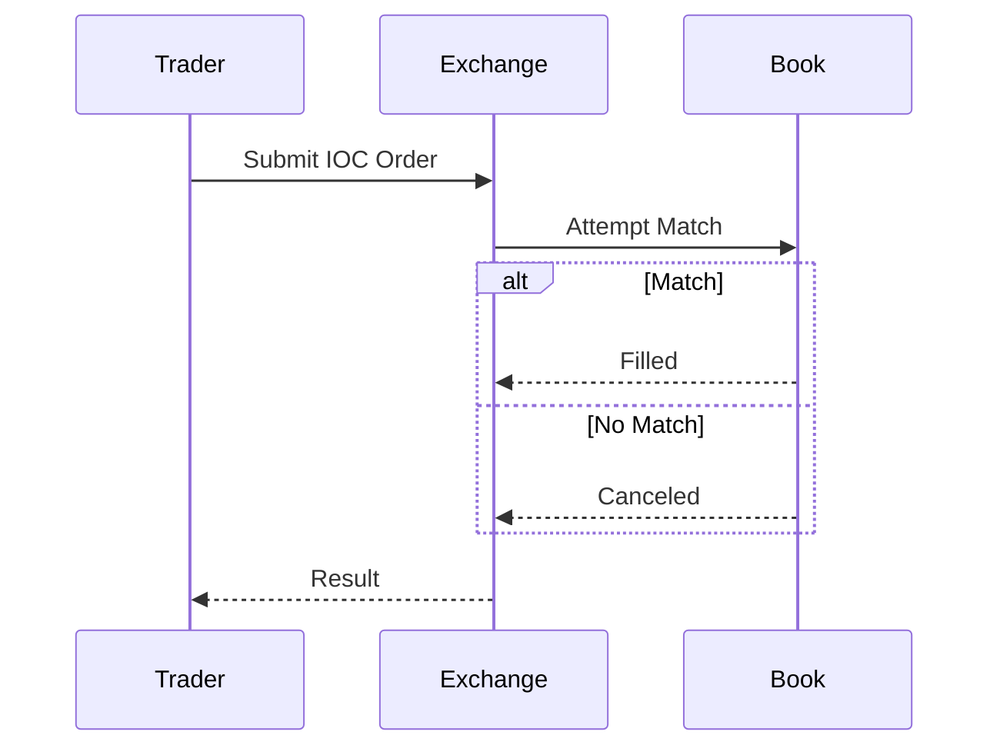

# Overview

Time-in-force semantics across exchanges: GTC, IOC, FOK, etc.

# STAR Summary

**Situation:** Implemented order types for trading platform.  
**Task:** Support various TIF for compliance.  
**Action:** Added TIF logic in order engine.  
**Result:** Passed regulatory audits.

# Detailed Explanation

## High-Level Design



## Capacity and Throughput Targets

- Handle 10k orders/second with TIF logic.
- Latency: <10ms for IOC/FOK validation.

## Tradeoffs

- GTC: Persistent but storage intensive.
- IOC/FOK: Immediate but may reject orders.
- Flexibility vs Simplicity: More TIF options increase complexity.

## API Design Examples

Order submission: `POST /orders` with `tif: "IOC"`

## Deployment Notes

Integrate TIF in order engine, use databases for GTC persistence.

# Real-world Examples & Use Cases

Stock trading platforms.

# Code Examples

```java
enum TimeInForce {
    GTC, IOC, FOK
}

class Order {
    TimeInForce tif;
    // logic based on tif
}
```

# Data Models / Message Formats

Order with TIF field.

# Journey / Sequence



# Common Pitfalls & Edge Cases

- Partial fills for IOC  
- Expiration handling

# Tools & Libraries

Exchange APIs.

# Github-README Links & Related Topics

[[order-book-modeling]], [[matching-algorithms]]

# References

- https://www.investopedia.com/terms/t/timeinforce.asp