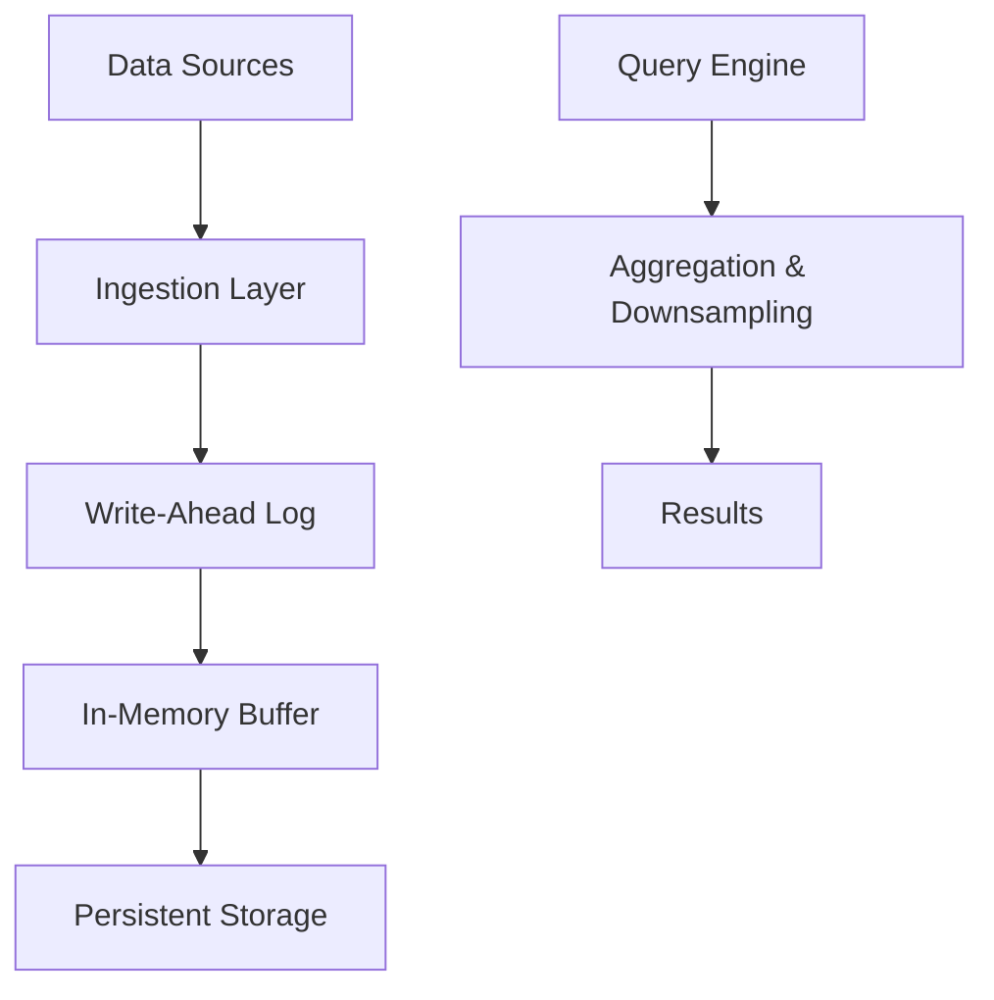

# Time Series Databases

## Overview

Time series databases (TSDBs) are specialized databases designed to handle time-stamped data points efficiently. They are optimized for high ingestion rates, fast queries over time ranges, and storage of metrics, logs, sensor data, and events. Unlike general-purpose databases, TSDBs use compression, indexing, and retention policies to manage large volumes of sequential data. Key features include automatic downsampling, aggregation functions, and support for continuous queries. Popular TSDBs like InfluxDB, Prometheus, and TimescaleDB power monitoring, IoT, and analytics applications.

## Detailed Explanation

Time series data consists of measurements or events tagged with timestamps. TSDBs store this data in a way that allows efficient retrieval and analysis over time.

### Key Components
- **Data Model**: Series of data points with timestamps, measurements, and tags (key-value pairs for filtering).
- **Ingestion**: High-throughput writes, often via protocols like Graphite, StatsD, or custom APIs.
- **Storage**: Time-partitioned storage with compression (e.g., Gorilla compression in Prometheus).
- **Indexing**: Optimized for time-based queries; tags enable multi-dimensional filtering.
- **Retention and Downsampling**: Automatic data expiration and aggregation to reduce storage.

### Architecture
TSDBs often use a write-ahead log (WAL) for durability, in-memory buffers for recent data, and disk-based storage for historical data. Distributed TSDBs (e.g., InfluxDB Enterprise) shard data across nodes.



### Querying
Queries use time ranges (e.g., "last 1 hour") and aggregations (e.g., mean, sum). SQL-like languages (e.g., InfluxQL, PromQL) or APIs enable complex operations.

## Real-world Examples & Use Cases

| Use Case | Example | Database |
|----------|---------|----------|
| Monitoring | Server CPU usage | Prometheus |
| IoT | Sensor readings from devices | InfluxDB |
| Financial | Stock prices over time | KDB+ |
| Logs | Application events | Elasticsearch (with time series extensions) |
| Analytics | User behavior tracking | TimescaleDB |

- **DevOps**: Track system metrics for alerting and dashboards.
- **IoT**: Store sensor data for predictive maintenance.
- **Business Intelligence**: Analyze sales trends or website traffic.

## Code Examples

### InfluxDB with Python

Install: `pip install influxdb-client`

```python
from influxdb_client import InfluxDBClient, Point
from influxdb_client.client.write_api import SYNCHRONOUS

# Connect
client = InfluxDBClient(url="http://localhost:8086", token="your-token", org="your-org")
write_api = client.write_api(write_options=SYNCHRONOUS)

# Write data
point = Point("temperature").tag("location", "room1").field("value", 23.5)
write_api.write(bucket="sensors", org="your-org", record=point)

# Query
query_api = client.query_api()
query = 'from(bucket: "sensors") |> range(start: -1h) |> filter(fn: (r) => r._measurement == "temperature")'
result = query_api.query(query=query, org="your-org")
for table in result:
    for record in table.records:
        print(record.get_value())
```

### Prometheus with Go

```go
package main

import (
    "context"
    "log"
    "time"

    "github.com/prometheus/client_golang/api"
    "github.com/prometheus/client_golang/api/prometheus/v1"
    "github.com/prometheus/common/model"
)

func main() {
    client, err := api.NewClient(api.Config{Address: "http://localhost:9090"})
    if err != nil {
        log.Fatal(err)
    }
    v1api := v1.NewAPI(client)

    // Query
    ctx, cancel := context.WithTimeout(context.Background(), 10*time.Second)
    defer cancel()
    result, warnings, err := v1api.Query(ctx, "up", time.Now())
    if err != nil {
        log.Fatal(err)
    }
    if len(warnings) > 0 {
        log.Printf("Warnings: %v", warnings)
    }
    log.Printf("Result: %v", result)
}
```

## References

- [InfluxDB Documentation](https://docs.influxdata.com/influxdb/)
- [Prometheus Docs](https://prometheus.io/docs/)
- [TimescaleDB](https://docs.timescale.com/)
- [Time Series Databases Explained](https://www.influxdata.com/time-series-database/)

## Github-README Links & Related Topics

- [Monitoring and Logging](monitoring-and-logging/README.md)
- [Database Design Patterns](database-design-patterns/README.md)
- [IoT Architecture](iot-architecture/README.md)