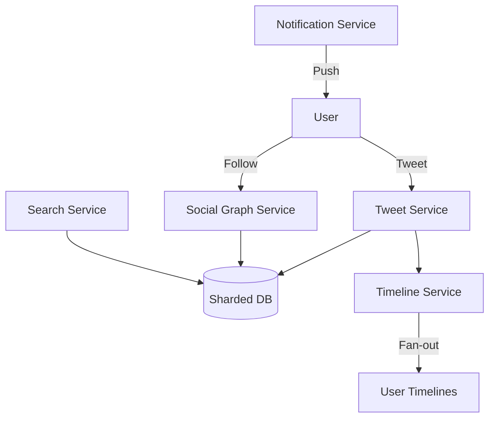

# Twitter System Design

## Overview

Twitter's platform manages billions of tweets, follows, and real-time feeds. It uses fan-out on write for timelines, sharding for data, and push/pull for notifications. Challenges include high write volumes, real-time delivery, and content moderation.

Key features:
- Tweet posting with media.
- Follower-based timelines.
- Real-time notifications.
- Search and trending topics.

## Detailed Explanation

### Architecture Overview

Twitter's architecture scales with sharding and caching:

- **Web/API Layer**: Handles requests.
- **Tweet Service**: Manages tweet creation and storage.
- **Timeline Service**: Builds user timelines.
- **Notification Service**: Push notifications.
- **Search Service**: Elasticsearch for queries.
- **Database**: MySQL sharded by user ID.



### Tweet Posting

1. User posts tweet.
2. Store in DB.
3. Fan-out to followers' timelines.
4. Send notifications.

### Timeline Generation

- **Pull Model**: Fetch recent tweets from followed users.
- **Push Model**: Pre-compute timelines for active users.

### Scalability

- **Sharding**: By user ID for tweets.
- **Caching**: Redis for timelines.
- **Queues**: Kafka for async processing.

## Real-world Examples & Use Cases

- **Twitter**: 500 million tweets daily.
- **Mastodon**: Decentralized Twitter-like.
- **LinkedIn**: Professional feeds.
- **Use Cases**:
  - News dissemination.
  - Event live updates.
  - Influencer marketing.

## Code Examples

### Tweet Posting (Node.js)

```javascript
const express = require('express');
const app = express();

app.post('/tweet', (req, res) => {
    const { userId, content } = req.body;
    // Store tweet
    db.insertTweet(userId, content);
    // Fan-out to followers
    const followers = db.getFollowers(userId);
    followers.forEach(follower => {
        timeline.addTweet(follower, tweetId);
    });
    res.send('Tweet posted');
});
```

### Timeline Fetch (Python)

```python
def get_timeline(user_id, page=0):
    # Pull model
    followed = db.get_followed(user_id)
    tweets = []
    for uid in followed:
        tweets.extend(db.get_recent_tweets(uid, limit=10))
    tweets.sort(key=lambda x: x.timestamp, reverse=True)
    return tweets[page*20:(page+1)*20]
```

### Social Graph (SQL)

```sql
CREATE TABLE follows (follower_id INT, followee_id INT, PRIMARY KEY (follower_id, followee_id));
INSERT INTO follows VALUES (1, 2);  -- User 1 follows 2
```

## Common Pitfalls & Edge Cases

- **Timeline Staleness**: Balance push vs pull.
- **Spam**: Rate limiting and ML detection.
- **High Follower Counts**: Celebrity problem.
- **Real-time Lag**: Optimize fan-out.
- **Edge Cases**: Tweet deletions, blocks, global events.

| Pitfall | Mitigation |
|---------|------------|
| DB hotspots | Sharding |
| Notification overload | Batching |
| Search latency | Indexing |

## Tools & Libraries

- **Database**: MySQL, Cassandra.
- **Cache**: Redis, Memcached.
- **Queue**: Kafka.
- **Search**: Elasticsearch.
- **Real-time**: WebSockets.

## References

- [Twitter Engineering Blog](https://blog.twitter.com/engineering)
- [How Twitter Scales](https://www.infoq.com/articles/twitter-scaling/)
- [Fan-out on Write](https://www.allthingsdistributed.com/2010/01/twitter.html)

## Github-README Links & Related Topics

- [Message Queues and Kafka](../message-queues-and-kafka/README.md)
- [Database Sharding Strategies](../database-sharding-strategies/README.md)
- [Caching Patterns](../caching-patterns/README.md)
- [Event Driven Architecture](../event-driven-architecture/README.md)
- [Search Engine Design](../google-search-engine/README.md)